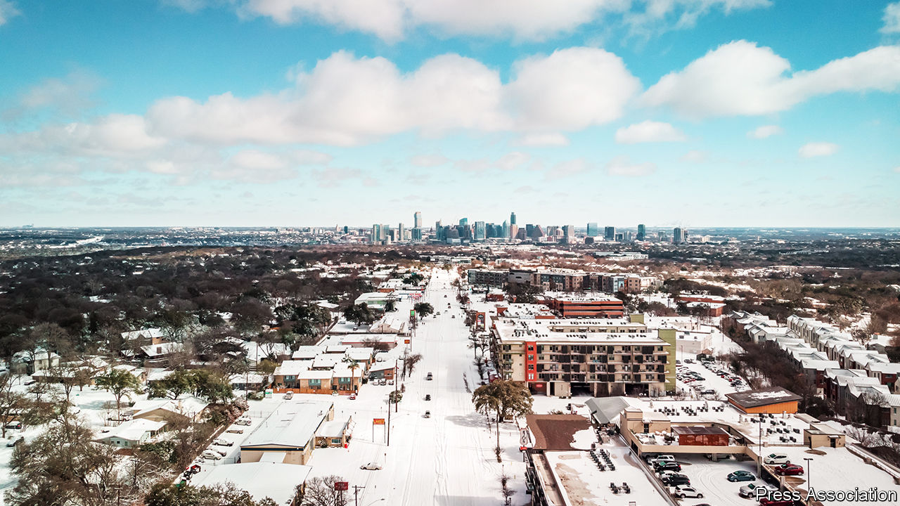
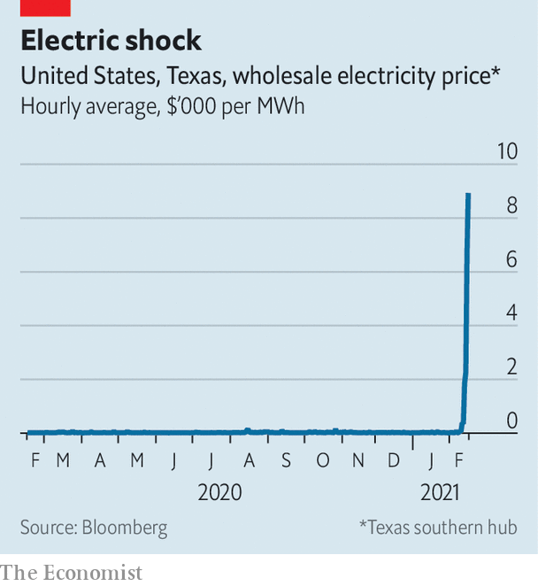

###### Light a candle for the kids

# The freeze in Texas exposes America’s infrastructural failings 

##### You ain’t foolin’ nobody with the lights out 

 

> Feb 17th 2021 


WHEN IT RAINS, it pours, and when it snows, the lights turn off. Or so it goes in Texas. After a winter storm pummelled the Lone Star State with record snowfall and the lowest temperatures in more than 30 years, millions were left without electricity and heat. At the worst moment on February 16th, 4.5m Texan households were cut off from power, as providers were overloaded with demand and tried to shuffle access to electricity so the entire grid did not collapse.


Whole skylines, including Dallas’s, went dark to conserve power. Some Texans braved the snowy roads to check into the few hotels with remaining rooms, only for the hotels’ power to go off as they arrived. Others donned skiwear and remained inside, hoping the lights and heat would come back on. Across the state, what were supposed to be “rolling” blackouts lasted for days. It is still too soon to quantify the devastation. More than 20 people have died in motor accidents, from fires lit for warmth and from carbon-monoxide poisoning after using cars to get warm. The storm has also halted deliveries of covid-19 vaccines and may prevent around 1m vaccinations from happening this week. Several retail electricity providers are likely to go bankrupt, after being hit with surging wholesale power prices. 


Other states, including Tennessee, were also covered in snow, but Texas got the lion’s share and ground to a halt. Texans are rightly furious that residents of America’s energy capital cannot count on reliable power. Everyone is asking why.


The short answer is that the Electric Reliability Council of Texas (ERCOT), which operates the grid, did not properly forecast the demand for energy as a result of the storm. Some say that this was nearly impossible to predict, but there were warnings of the severity of the coming weather in the preceding week, and ERCOT’s projections were notably short. Brownouts last summer had already demonstrated the grid’s lack of excess capacity, says George O’Leary of Tudor, Pickering, Holt &amp; Co (TPH), an energy investment bank.

 


Many Republican politicians were quick to blame renewable energy sources, such as wind power, for the blackouts, but that is not fair. Some wind turbines did indeed freeze, but natural gas, which accounts for around half of the state’s electricity generation, was the primary reason for the shortfall. Plants broke down, as did the gas supply chain and pipelines. The cold also caused a reactor at one of the state’s two nuclear plants to go offline. Transmission lines may have also iced up, says Wade Schauer of Wood Mackenzie, a research firm. In short, Texas experienced a perfect storm of equipment failure. 


Some of the blame falls on the unique design of the electricity market in Texas. Of America’s 48 contiguous states, it is the only one with its own stand-alone electricity grid—the Texas Interconnection. This means that when power generators fail, the state cannot import electricity from outside its borders. 


The state’s deregulated power market is also fiercely competitive. ERCOT oversees the grid, while power generators produce electricity for the wholesale market. Some 300 retail electricity providers buy that fuel and then compete for consumers. Because such cold weather is rare, energy companies do not invest in “winterising” their equipment, as this would raise their prices for consumers. Perhaps most important, the state does not have a “capacity market” to ensure that there was extra power available for surging demand. Such systems elsewhere act as a sort of insurance policy so the lights will not go out, but it also means customers pay higher bills.


For years the benefits of Texas’s deregulated market structure were clear. At 8.6 cents per kilowatt hour, the state’s average retail price for electricity is around one-fifth lower than the national average and about half the cost of California’s. In 1999 the state set targets for renewables, and today it accounts for around 30% of America’s wind energy.


This disaster is prompting people to question whether Texas’s system is as resilient and well-designed as people previously believed. Greg Abbott, the governor, has called for an investigation into ERCOT. This storm “has exposed some serious weaknesses in our free-market approach in Texas”, says Luke Metzger of Environment Texas, a non-profit, who had been without power for three full days when The Economist went to press. 


Wholly redesigning the power grid in Texas seems unlikely. After the snow melts, the state will need to tackle two more straightforward questions. The first is whether it needs to increase reserve capacity. “If we impose a capacity market here and a bunch of new cap-ex is required to winterise equipment, who bears that cost? Ultimately it’s the customer,” says Bobby Tudor, chairman of TPH. The second is how Texas can ensure the reliability of equipment in extreme weather conditions. After a polar vortex in 2014 hit the east coast, PJM, a regional transmission organisation, started making higher payments based on reliability of service, says Michael Weinstein of Credit Suisse, a bank. In Texas there is no penalty for systems going down, except for public complaints and politicians’ finger-pointing. 


Texas is hardly the only state to struggle with blackouts. Parts of California, which has a more tightly regulated power market, are regularly plunged into darkness during periods of high heat, winds and wildfires. Unlike Texas, much of northern California is dependent on a single utility, PG&amp;E. The company has been repeatedly sued for dismal, dangerous management. But, as in Texas, critics have blamed intermittent renewable power for blackouts. In truth, California’s blackouts share many of the same causes as those in Texas: extreme weather, power generators that fail unexpectedly, poor planning by state regulators and an inability (in California, temporary) to import power from elsewhere. In California’s blackouts last year, solar output naturally declined in the evening. But gas plants also went offline and weak rainfall lowered the output of hydroelectric dams.


In California, as in Texas, it would help to have additional power generation, energy storage to meet peak demand and more resilient infrastructure, such as buried power lines and more long-distance, high-voltage transmission. Weather events that once might have been dismissed as unusual are becoming more common. Without more investment in electricity grids, blackouts will be, too. ■


For more coverage of climate change, register for The Climate Issue, our fortnightly , or visit our 

