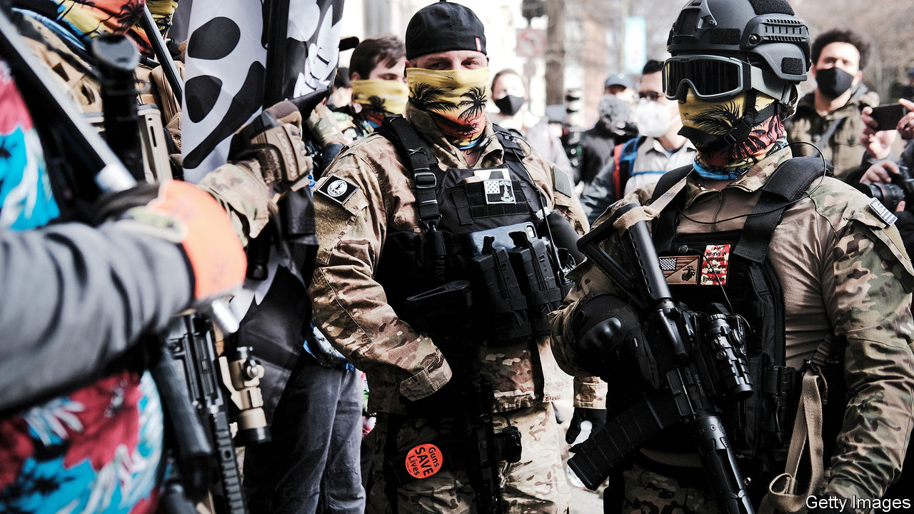

###### Deadly inspirations

# What their chosen reading says about America’s far-right 

##### Neo-Nazis and Trumpist radicals have a growing corpus of literature 

 

> Feb 20th 2021 


PANDEMICS CAN have unexpected side-effects. One of them, according to a report last year by the New York Federal Reserve, may be a surge in support for extremist ideas. It observed how cities in Germany that suffered the most deaths from influenza by 1920 then voted in unusually large numbers for extreme-right parties, such as the Nazis, by the early 1930s. In the past year, too, according to studies in Britain and America, there has been a spurt in online searches for extremist content. Anger over lockdowns or loss of trust in government could be driving new interest.


What texts might people be turning to? Researchers study literary habits of the far-right by monitoring reading lists traded on social media, texts promoted on podcasts or recited by enthusiasts as audiobooks on YouTube, output from right-fringe publishing houses and, most extreme, the diatribes that serve as manifestos of those who commit atrocities. Together they suggest several strands of hateful writing. Brian Hughes of American University in Washington, DC says that the sheer availability of online extremist ideology is, in part, “responsible for the elevated rates of extremist mobilisation”.


French writers have been strikingly influential, including those in the “Nouvelle Droit” movement. Alain de Benoist, an illiberal thinker, inspired members of America’s alt right such as Richard Spencer, a white supremacist. The works of a philosopher, Jean Renaud Gabriel Camus, also stand out. Ideas drawn from his book “The Great Replacement” (2011), are often repeated by those who say non-white immigration threatens Western countries. The book has been cited by mass shooters.


The work of another French writer, Jean Raspail, is championed by anti-immigrant activists in America. His dystopian novel from 1973, “The Camp of the Saints”, imagines the violent overrun of France by brown-skinned migrants. It is a “weaponised retelling” of an apocalyptic biblical parable, says Chelsea Stieber of Catholic University. “The French understand it as literature,” she says, whereas in America “it gets to be this reality that could happen.” Leading Republicans have promoted it, she points out, including Steve Bannon and Stephen Miller, both erstwhile close advisers of Donald Trump, as well as Steve King, a noxious ex-congressman from Iowa.


Apocalyptic writing is especially popular among a strand of the far-right known as “accelerationists”, meaning those who believe civilisation (or at least liberal democracy) will soon collapse. They hope the end can be hastened by violent acts or even civil war. In this vein an Italian fascist writer, Julius Evola, is also cited by Mr Bannon and Mr Spencer and lauded in far-right circles, along with his call for “blowing everything up”. He promoted an idea of heroic men who “rise above” history (Mussolini was a fan). Memes of him in his monocle are shared online by adoring followers.


Extremists turn to such writers because they justify using violence to clear the way for a supposed new golden age to begin. Others tell them how to achieve that. “Siege”, a book by James Mason of the American Nazi party, purports to be a guide to violent revolution. It had little impact when it was published in 1992, notes Graham Macklin of the Centre for Research on Extremism, in Oslo. But its rediscovery by neo-Nazis roughly five years ago has led to a surge of interest. PDFs of it are now shared widely online; the hashtag “readSiege” spreads periodically on social media. “Now, it’s everywhere,” he says.


The study of such writing matters, even if one researcher admits he feels like “projectile vomiting” while tackling some especially violent or cruel texts. Ideas can have deadly consequences, says Joanna Mendelson of the Anti-Defamation League. “People are quoting and referencing books as a kind of reassurance that they are validated in their extremist views,” she says. Many of the same ones reappear repeatedly among anti-Semitic and other extremist factions. A few, such as the “Protocols of the Elders of Zion” (an anti-Semitic conspiracy originating from Russia in 1903), or the racist, eugenics-based writing of Lothrop Stoddard in the 1920s, are repeatedly rediscovered or reinterpreted by new writers. What used to be called eugenics, for example, is today dressed up as “race realism”.


One book is still considered the “bible” of the far right. The “Turner Diaries”, a barely readable novel from the 1970s by William Pierce, another American Nazi, imagines an insurrection by a group called “Order” against a government that promotes egalitarian values and gun control. It has supposedly sold 500,000 copies. One avid reader was Timothy McVeigh, who bombed a federal building in Oklahoma City in 1995, killing 168 people. (He used a lorry full of fertiliser and explosives, a method depicted in the novel.) Others were inspired to form a real-world paramilitary group, also called the “Order”.


Jared Holt, who researches domestic extremism at the Atlantic Council in Washington, says such books are still powerful. Veteran members of groups pass them on to younger ones. They are used to build ties between adherents, to test new initiates and ease the “anxiety” of some by giving a sense of purpose to their lives. He notes, too, how younger readers are finding new writing. One rambling, self-published book called “Bronze Age Mindset”, for example, has won a cult following, reportedly including staffers at Mr Trump’s White House. It draws on ideas from Nietzsche and tells readers to prepare for the military rule that will soon begin in America. For some readers such bilious writing is appealing. Finding out why is a first step towards confronting it.■

