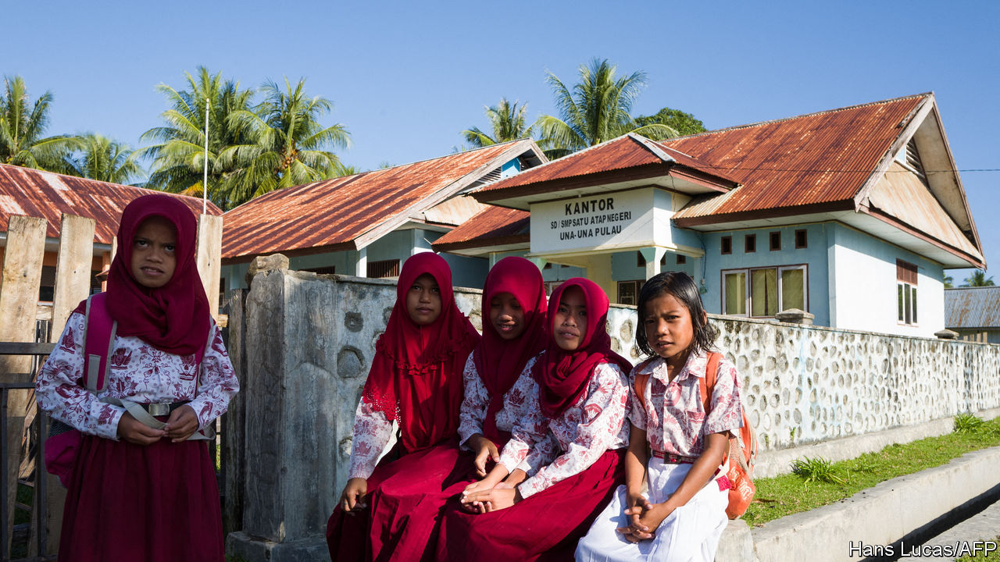

###### Breaking cover

# Indonesia’s government pushes back against Islamic dress codes 

##### Many non-Muslim schoolgirls resent being forced to wear a hijab 

 

> Feb 27th 2021 


MOST TEENAGERS starting at a new school want to fit in. But not Jeni Hia. On her first day at a public high school in Padang, the capital of West Sumatra province, the 16-year-old was the only girl whose hair was uncovered. Indonesia has the world’s largest population of Muslims: 235m, some 87% of its citizens. Among them is Fauzi Bahar, who in 2005, as Padang’s mayor, made jilbabs, the regional version of the hijab that covers the head, neck and chest, compulsory for all female Muslim students. The rule is widely applied to non-Muslim girls, too. But Ms Jeni, who is Christian, refused. In January the school’s vice-principal summoned her parents to a meeting, which her father live-streamed. “If I force my child to wear hijab, that will betray my child’s identity,” he said. “Where are my religious rights? This is a public school.” The video went viral.


Since 2001 local governments in Indonesia have passed at least 60 bylaws ruling that women should cover their heads. Female civil servants who refuse to do so have been demoted or sacked, according to Andreas Harsono of Human Rights Watch, a pressure group. He thinks that most of Indonesia’s 300,000 public schools require Muslim girls to wear jilbabs, and that non-Muslim girls are often “bullied” into veiling. The SETARA Institute, a think-tank in Jakarta, the capital, counts at least seven instances of Christian students forced to wear jilbabs between 2016 and 2018. Henny Supolo of Yayasan Cahaya Guru, a foundation that trains teachers, says many female teachers feel pressure to cover their heads.


On paper, Indonesia is a pluralist country. Its constitution enshrines the right to follow one of six religions. Yet over the past two decades many local governments have passed laws inspired by Islamic teaching. Michael Buehler of the School of Oriental and African Studies at the University of London counts at least 1,000 such laws, but suspects there are many more. They emerged after Indonesia became a democracy in 1999, when politicians suddenly forced to court popularity sought to appeal to devout voters. Between 1999 and 2012 nearly a tenth of religiously inspired regulations in staunchly Muslim provinces concerned dress codes.


The central government, however, takes a more liberal approach. On February 3rd it gave local governments and school principals until March 5th to revoke all regulations requiring women to wear jilbabs—even those relating only to Muslim women. It also reiterated the right of all women to wear what they choose.


The government’s willingness to wade into such a charged debate is striking. In 2016 mass protests led by a populist Islamist movement brought down the Christian governor of Jakarta after he was (falsely) accused of insulting the Koran. For some time after that Joko Widodo, the president, popularly known as Jokowi, was wary of angering conservative Muslims. But in 2019 Jokowi was re-elected for a second and final term, and proceeded to neutralise most of his opponents by welcoming them into his cabinet.


“Because now he has control over almost all the opposition forces, he feels more emboldened to counter Islamists head-on,” says Alexander Arifianto of the S. Rajaratnam School of International Studies in Singapore. Jokowi has also outlawed the rabble-rousing Islamic Defenders Front and arrested its leader on flimsy pretexts. The government’s stance on hijabs is best seen in this light, says Mr Arifianto: a blow against “political opponents who happen to be Islamists”, rather than against Islamism.


Local politicians are talking tough. Mr Fauzi, who instituted the jilbab rule in Padang, has called on all district heads to “reject this decree at all costs”. So far three have done so, among them the mayor of Pariaman, a West Sumatran city 50km from Padang, who argues that “local wisdom” trumps diktats from the central government. Even the Indonesian Ulama Council, the country’s foremost Muslim clerical body, which is chaired by Jokowi’s vice-president, has asked for the decree to apply only to non-Muslims.


If the dispute is unresolved, the government’s options are limited. It can issue warnings against local district heads and cut off funding to schools in their areas, says Mr Arifianto. But he thinks local politicians will be less concerned about paying for children’s education than about alienating Islamic groups that might campaign against them at election time. Moreover, it is unclear whether the government’s decree can in fact override local ordinances such as the regulation in Padang, says Kevin O’Rourke of Reformasi Information Services, a risk-analysis firm. The decree was issued jointly by the ministries of education, religion and home affairs, the last of which was stripped of its power to repeal bylaws in 2017 by the Constitutional Court.


For Ms Jeni, at least, it feels like a victory for liberalism, even if small and possibly temporary. Her school’s principal has backed down and apologised. The 22 other non-Muslim girls in the school have discarded their jilbabs, too. ■

