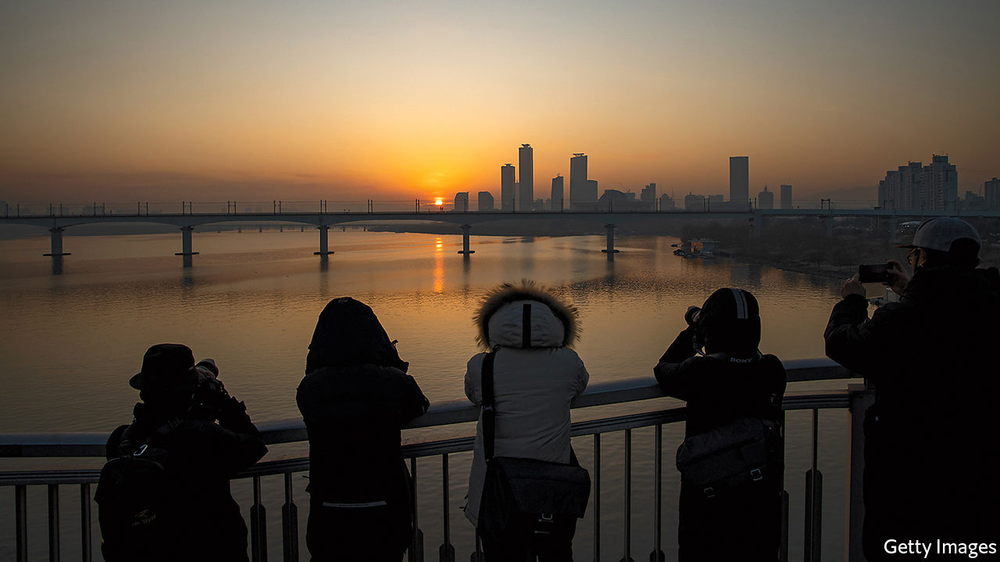

###### Get me a flat—or else

# South Korea’s government has failed to make housing cheaper 

##### Voters are not happy 

 

> Feb 25th 2021 


THE NEIGHBOURHOOD around Nowon station, on the north-eastern edge of Seoul, looks much like any other suburb of South Korea’s capital. Multi-storey buildings house cramming schools, coffee shops and fast-food stalls that sell tteokbokki (spicy rice cakes) to hungry students during their short study breaks. There is a multi-screen cinema and a cluster of banks. Hole-in-the-wall shops peddle vegetables and pickles. “It’s a great place for bringing up children,” says a contented local mother. “Good schools, low crime, few distractions.”


Unassuming districts like Nowon have caught the full blast of a house-price boom that is reverberating around Seoul. In the second half of last year the price of an average family flat in the surrounding apartment complexes rose by around 30%, sending them beyond the reach of many aspiring first-time buyers. Apartment prices in Seoul as a whole rose by 58% in the three years to December 2020, according to KB Kookmin, a bank. The price of the average flat in the city is about 16 times the median household income, compared with around 12 in London.


Several factors have fuelled the boom, which has spread beyond Seoul to satellite towns in the surrounding province of Gyeonggi. South Korean households tend to hold most of their wealth in property. Ultra-low interest rates intended to cushion the economic impact of the covid-19 pandemic have spurred demand. The supply of flats in the crowded capital region has failed to keep up. And the government’s attempt to remedy things may have made matters worse.


The government’s first instinct was to declare war on “speculators”. Since taking office in 2017 it has taken more than 20 steps to curb demand, including restricting mortgage lending, raising taxes on homeowners and penalising the rapid “flipping” of recently purchased properties. It also improved protection for tenants. All this has yet to cool the market, however, partly because borrowing is so cheap and partly because the extra taxes may have induced potential sellers to take their properties off the market.


“The government has misunderstood how the property market works,” says Kim Jun-hyung of Myongji University. “Politically, they are obsessed with the problem of speculation, but actually there just aren’t enough high-quality apartments to match the demand.” Meanwhile, the reforms have annoyed both homeowners and the aspiring first-time buyers whom they were supposed to help. “You cannot believe how much they are increasing taxes,” says a woman who owns a flat in Apgujeong, a prosperous neighbourhood in southern Seoul. “I feel like I’m being punished for owning a place. My two children both want to get married and buy a flat, but they can barely afford a place to rent.”


A government scheme to help provide affordable homes for newly-weds has not been met with unequivocal enthusiasm. “It’s like they don’t want people to buy homes,” says Choi Ho, a 36-year-old who wants to get married and buy a flat with his fiancée. “The places are all too small or in really bad neighbourhoods.” Even young renters with no intention of buying are frustrated. “There just isn’t anywhere to live,” says Jenna Kim, a 24-year-old who managed to scrape together 15m won ($13,500) as a deposit for a small rented studio on Seoul’s eastern outskirts.


Byeon Chang-heum, the land minister, has admitted that many people in Seoul “live in units in inferior conditions”. He is right to be contrite. Both Mr Choi and the flat-owner in Apgujeong say they voted for the ruling party, but would not do so again. Since last summer the property market has been the main grumble of those who told pollsters that they disapproved of the current government—and they have been a majority since July.


This has prompted the government to change tack. It will make sure that more than 600,000 flats are built in the capital area by 2025, Mr Byeon has announced, if necessary by building them itself. That is in addition to plans announced last year to expand public housing and to build more flats for single households. But homeowners already upset about the tax rises may be further riled by the prospect of a surge in supply. What is more, the new housing will inevitably take several years to materialise, but there are mayoral elections in April and presidential ones next year. ■

