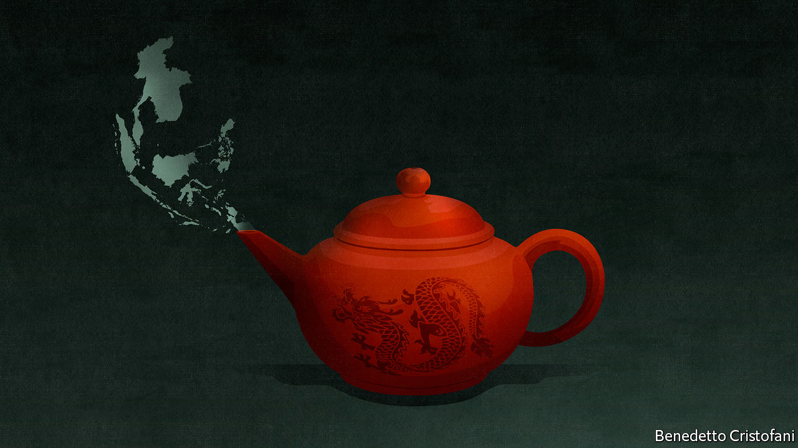
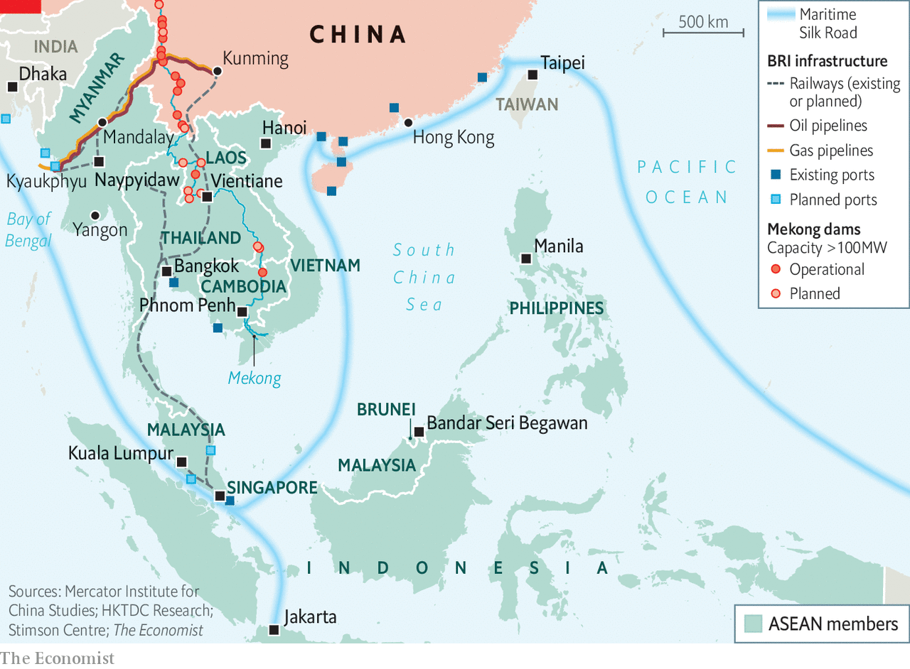

###### Tea and tributaries

# In no region is China’s influence felt more strongly than in South-East Asia 

##### The region has a complex relationship with its giant neighbour 

 

> Feb 27th 2021 


LAST YEAR a remarkable if informal confederacy formed online across Asia, in scarcely the time it takes to boil a kettle: the Milk Tea Alliance. Its members were young activists, mostly in South-East Asia. All had disparate agendas at home. But they united in pushing back at a perceived growing menace—authoritarian China’s overweening presence in the region.


It began when a Thai heart-throb, Vachirawit Chivaaree, star of “2gether”, a drama popular across Asia, retweeted a collection of cityscapes that innocently described Hong Kong as a country. Thousands of jingoist Chinese internet trolls called for a boycott of Mr Vachirawit’s show. He apologised. But the trolls found an old Instagram post from Mr Vachirawit’s girlfriend that seemed to indicate her support for Taiwan as a country separate from China. It further nourished their rage.


Soon Thai netizens were fighting back with witty memes. Chinese patriots responded by insulting the Thai king and prime minister, who had come to power in a coup, as inept. The Thai gadflies were jubilant: they could not agree more. Their deft turning back of Chinese criticisms brought applause from young people in Hong Kong and Taiwan, who are no strangers to China’s heavy hand. Others in South-East Asia resentful of strongman rule, such as that of President Rodrigo Duterte in the Philippines, also cheered.


Thus the alliance was born, named because of popular variations of tea drunk across Asia. In mainland China tea is drunk without milk. But Taiwan’s best-known beverage is milky boba tea with chewy tapioca balls; Hong Kongers drink tea with milk, a British holdover; and Thailand’s tawny tea is sweetened with condensed milk. Others have since joined. After Chinese soldiers fought a deadly brawl with Indians guarding their two countries’ disputed border, Indian netizens added masala chai to the brew. And after the army seized power in a coup in Myanmar on February 1st, photos of laphet yay, Burmese milk tea, flooded social media.


The Milk Tea Alliance is far from cohesive, or purely anti-China. Lambasting China is part of a critique of domestic authoritarian rule, says Frank Netiwit, a young Thai activist at the forefront of protests calling for more democracy. In Myanmar the anger is overwhelmingly directed at Gen Min Aung Hlaing and the army.


China has long had the backs of the region’s autocrats. It described the coup in Myanmar—in which Aung San Suu Kyi, the country’s leader, and hundreds more were arrested—as a “major cabinet reshuffle”. It has growing investments in South-East Asia and seeks political influence to protect them. But South-East Asian rulers are prickly and nationalistic. Most chafe at any suggestion that they are in China’s pocket.


The Milk Tea phenomenon underscores how, for all that South-East Asians often welcome China’s economic engagement, it also comes with added complications to which China’s leaders often appear oblivious. South-East Asia, Murray Hiebert argues in “Under Beijing’s Shadow”, is a microcosm of China’s global ambitions—signalling how its diplomats, corporations and even its armed forces might operate elsewhere in future.


More than anywhere, South-East Asia is bound to feel China’s presence. South-East Asia begins where China leaves off—in the mountainous border regions of northern Vietnam, Laos and Myanmar. Many groups that make up modern South-East Asia’s mosaic of ethnicities have their origins farther north. Imperial China claimed primacy over the rulers of South-East Asia. Vietnam, Thailand and Burma (now Myanmar) were important tributaries.


Tributary relations fostered trade, including in exotics such as jade that have come to define Chinese taste. Emigrants (mainly men) from southern China began to seek livelihoods in the European settlements of Batavia (now Jakarta) and Manila. In the 19th and early 20th centuries they flocked to British and French rubber plantations and tin mines, or sought fortunes in the entrepots of Singapore and Rangoon (now Yangon). Sojourners at first, most stayed. Today, some 33m South-East Asians claim Chinese ethnicity. In Malaysia and Indonesia, they form significant minorities—and in Singapore the majority. In Cambodia, Thailand and elsewhere, distinctions are often absurd—the Thai royal family is of recent Chinese descent.

Crazy rich South-East Asians


South-East Asia’s “overseas Chinese”, Charlotte Setijadi of Singapore Management University points out, have played crucial roles in the story of modern China. They were key backers of those seeking the overthrow of the imperial Qing dynasty and the establishment of a modern republic. More recently, South-East Asian nationals of Chinese descent helped kick-start China’s own industrial transformation.


The commercial success of many overseas Chinese families is notable—and in part a result of the political marginalisation of ethnic Chinese in colonial and successor independent states. China welcomed their capital and managerial nous following its opening after 1978. Today the ten-country Association of South-East Asian Nations (ASEAN) is a key link in the supply chains of a China-centred electronics sector. A third of China’s integrated circuits come from South-East Asia, along with three-fifths of computer imports. Now capital is flowing the other way, from China to South-East Asia. Investment has grown almost 30-fold in the past decade, to nearly $40bn. South-East Asia’s ethnic-Chinese tycoons are still intermediaries in the region’s economic relationship with China. But the Chinese state is also asserting itself, in ways that South-East Asians recognise carry benefits—but also risks.


China’s economic interaction with South-East Asia has happened chiefly by sea. That is changing. China’s industrial centre of gravity is shifting away from the coast towards the south-west and its borders with Myanmar, Laos and Vietnam. For this new heartland, nearby South-East Asia is an obvious market, a source of inputs, and a ready route to the sea.


The chief obstacles to a push south are geographical—the impassable borderlands. To overcome them, China has engaged South-East Asia in a frenzy of cross-border infrastructure (see map): new roads, a gas pipeline through Myanmar to a deepwater port at Kyaukphyu on the Bay of Bengal, and a planned high-speed rail through Laos eventually connecting Kunming with Singapore. Most of these projects are presented as part of President Xi Jinping’s Belt and Road Initiative. In South-East Asia China presents its plans as commensurate with ASEAN’s own desire for regional integration. The Asian Development Bank calculates that if developing Asia is to keep up growth, eliminate poverty and deal with the effects of climate change, then it will need to invest $1.7trn a year in infrastructure over 15 years.

 


Mr Xi and other Chinese leaders harp on about the “win-win” benefits of economic co-operation—as well as emphasising China’s non-interference in others’ affairs. That is balm to the region’s authoritarians. South-East Asia’s post-colonial states are young and insecure. Their leaders bridle at any perceived challenge to sovereignty—or to their right to rule.


Yet, for all the advantages, many South-East Asians find the Chinese presence sometimes overwhelming and the protestations of non-interference insincere. Chinese investment comes with strings attached. Lenders and construction firms insist on Chinese workers. Contracts are often opaque and grossly overpriced (some to include bribes needed to win them).


China-linked corruption was a factor in the electoral defeat in 2018 of Malaysia’s prime minister, Najib Razak, and his party, which had ruled since independence. So, too, was the Chinese ambassador’s appearing to campaign openly for the ethnic-Chinese party in the ruling coalition—so much for non-interference. Meanwhile, under-the-table donations to political parties in Malaysia and Indonesia, says a senior diplomat from the region, are often an entry ticket for doing business. Chinese money is assumed to have been behind Mr Duterte’s successful bid in the Philippines for the presidency in 2016.


Some Chinese-backed projects, above all the high-speed railway for tiny, impoverished Laos, have little economic rationale and the environmental costs can be high. An exceptional drought in 2019 in the lower Mekong was exacerbated by Chinese dam-building interrupting the river’s seasonal flows, on which millions of Cambodian and Vietnamese fishermen depend. In Cambodia, Laos and Myanmar, Chinese land-grabs mean deforestation.


As for China coming in peace, how, policymakers ask in private, to square that with sweeping maritime and territorial claims in the South China Sea, bringing China into dispute with Brunei, Indonesia, Malaysia, the Philippines and Vietnam? In 2016 an arbitral court in The Hague dismissed China’s claims, in a case brought by the Philippines. When Singapore called for China to abide by the tribunal’s rulings, China’s diplomats savaged the government. By contrast, tiny Cambodia, which has prioritised loyalty to China over ASEAN solidarity, has been rewarded with loans.


Yet appeasing China does not guarantee rewards. Mr Duterte set The Hague ruling aside in hopes of attracting Chinese investment. Mr Xi promptly promised him billions for infrastructure. But little investment has materialised. Meanwhile, on the South China Sea, Chinese aggression persists. As Bilahari Kausikan, formerly Singapore’s top diplomat, puts it: “Only the irredeemably corrupt or the terminally naive take seriously Beijing’s rhetoric about a community of common destiny.”


Not long ago the border ranges of northern Laos were impenetrable. Today the boundary is being blurred and geography reshaped by Chinese infrastructure projects and wildcat Chinese enterprise. As Chinese development moves south, hundreds of thousands of Chinese move too.


These are China’s xin yimin, the country’s “new” migrants or sojourners. They are the shock troops of China’s growing economic presence. Many have come to work in South-East Asia on belt-and-road projects. Others follow in their wake to chance their luck. Where China’s strategy ends and individual initiative begins is rarely clear. Either way, Chinese power and presence is being extended.


The presence is starkest in Cambodia, Laos and Myanmar, small or weak states, two with porous borders with China. Several hundred thousand mainland Chinese operate in Myanmar, many carrying forged citizenship cards. In the “Golden Triangle Special Economic Zone”, where Laos meets Myanmar and Thailand, a Chinese city of gambling, smuggling and sleaze is rising up. The centrepiece is a pink neoclassical confection of a casino that attracts Chinese high-rollers—gambling is banned in mainland China. The town’s currency is the Chinese yuan. The security force was recruited in China. The signage is in the simplified Chinese of the mainland.


Much farther from China’s borders, in Manila, the capital of the Philippines, Chinese online gambling operations known as POGOS occupy more office space than the country’s international call centres. At their peak, before the coronavirus pandemic, perhaps 500,000 Chinese operated in Manila, many overstaying their visas. Chinese-run agencies arrange everything for new arrivals, from work visas to accommodation to massages and sex.


Across Asia the same chorus of complaints is heard: that the xin yimin keep to themselves, take local jobs, import their own supplies and push up the price of local housing. In Vientiane, Mandalay and Manila, the same dark joke is deployed: welcome to China’s newest province.


To tar all xin yimin with the same brush is misleading. Thousands of middle-class Chinese have been a boon for Malaysia’s private schools. Many migrants are well-trained professionals. In Singapore, young Chinese who study, work and apply for nationality are bright, energetic and willing to work hard in their new home.


Yet the presence of xin yimin often complicates the supposedly warm “people-to-people” relations that Mr Xi trumpets. Criticism of Chinese initiatives is proof of insincerity, malign intentions or Western meddling, Chinese officials suggest. Mr Kausikan attributes the attitude to “imperial hauteur”—a conviction that lesser states owe deference to China.


One striking dimension is China’s increasingly possessive language towards the Chinese diaspora. Any suggestion by officials, however ambiguous, that China has an extraterritorial claim over ethnic Chinese in South-East Asia, no matter how long ago their ancestors left the motherland, is dangerous ground.


In theory, the Chinese language distinguishes between huaqiao, Chinese nationals abroad, and huaren, anyone with Chinese ancestry regardless of their citizenship. Yet in a speech in 2014 Mr Xi conflated the two by referring to haiwai qiaobao—“overseas sojourner-siblings”. The point of working with haiwai qiaobao, Mr Xi said, “is to promote the revival of the Chinese nation.” He reiterated this in an address in February marking the Chinese New Year.


To emphasise its importance, in 2018 outreach to overseas Chinese was handed to the Communist Party’s united front department. Dozens of operations around in the world aim to build support for the party and to neutralise political enemies. A key mission is to ensure that, as Bill Hayton puts it in “The Invention of China”: “regardless of how long ago someone’s ancestors left home, or for how many generations they have been citizens of another country, they…still have obligations to the ancestral nation.”

 


It is an overtly racial understanding of Chineseness, about blood, not citizenship, that puts many Chinese South-East Asians in a bind. It is rarely hard to whip up anti-China feeling. China’s backing for communist insurgencies was grounds in Malaysia and Indonesia to exclude ethnic Chinese from power—and worse. In May 1998 decades of cronyism under Indonesia’s dictator, Suharto, triggered a paroxysm of violence against the regime and those seen to have profited from it—above all, the country’s ethnic-Chinese minority. Hundreds of ethnic Chinese were killed and dozens of women and girls raped. Glodok, Jakarta’s Chinatown, was left a charred hulk.


With democratisation following Suharto’s fall, the fate of Chinese Indonesians improved. But progress, as Evan Laksmana of the Centre for Strategic and International Studies in Jakarta, puts it, “came screeching to a halt” in 2017 with the arrest, trial and imprisonment on trumped-up blasphemy charges of Basuki Tjahaja Purnama, or Ahok, the gruff Chinese Indonesian governor of Jakarta (and a Christian in a majority-Muslim country). Some Islamic leaders decry the likes of Ahok as the beachhead of a new Chinese communist infiltration. The paranoia is no less strong for a lack of evidence. Playing the Chinese conspiracy card either in politics or as a businessman cut out of a lucrative deal rarely does the cardplayer any harm.


Too often, China’s Communist Party is blind to the risks of using influence campaigns with Chinese South-East Asians as a tool of nation-building. As Reynard Hing, a Chinese-Filipino who runs an NGO in Manila, puts it: “Are you trying to co-opt overseas Chinese as part of the propaganda machinery? That would be very bad for Chinese-Filipinos. It would give credence to the notion of a fifth column.”

A shot in the arm


It is against China’s complex backdrop of engagement in South-East Asia that it now is gearing up for perhaps its biggest influence campaign ever: vaccine diplomacy. As the promised supplier of most of the region’s vaccines, it intends not only to wipe from people’s minds the memory of China as the origin of covid-19 but also to engender a wave of gratitude for ending the pandemic. Its diplomats are making clear to South-East Asian governments that part of the deal is lavish praise for China.


Yet none of China’s vaccines has yet completed all trials, and results to date are patchy. Perhaps more troubling, South-East Asian suspicion of China has translated into vaccine hesitancy. President Joko Widodo, known as Jokowi, received Indonesia’s first shot, of the Sinovac jab, in January. The same month Indonesia’s top Islamic body declared the Chinese vaccine to be halal, and thus permissible for Muslims. That came as a relief to Jokowi, who has promised herd immunity in 15 months. Yet vaccine hesitancy in Indonesia is running high, especially around Chinese ones.


If the programme of Chinese vaccines falls short in South-East Asia, says Dr Setijadi of Singapore Management University, “that could massively backfire in terms of China’s influence.” It would do no favours for Chinese South-East Asians to be tarred with the same brush as China. Can China be expected to be sensitive to these dynamics? On past performance, perhaps not. ■

