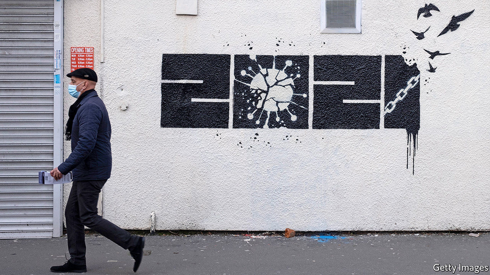

###### Pencil it in

# Boris Johnson manages expectations with England’s covid-19 plan 

##### The cautious timetable gives him plenty of room to bring forward a few freedoms 

 

> Feb 27th 2021 


BORIS JOHNSON is rarely more than a couple of sentences away from a metaphor. So it was with his announcement on February 22nd of a timetable for easing the latest lockdown. “The crocus of hope is poking through the frost and spring is on the way,” he burbled. Though the language was familiar, the content was not. In contrast to previous pledges to “send the virus packing” and ensure a speedy return to normality, Mr Johnson mooted only a gradual unwinding of restrictions in England (other parts of the UK set their own plans). If all goes to plan, schools will re-open on March 8th, followed by shops in April. Pubs without outdoor spaces will have to wait until May; the remaining rules will stay until June 21st. The crocus of hope must be a rare summer-flowering variety.


At first blush, this caution is surprising. Britain’s lockdown is one of the tightest in Europe, even though its vaccination programme is racing ahead. More than a quarter of Britons have already had a jab, compared with about 4% in France and Germany. By the middle of April, all over-50s and others particularly vulnerable to the virus should have been offered one. Surely that calls for a pint?


The trouble is, about 17,000 Britons are in hospital with the virus, thanks to a big spike in cases in January. Another jump in infections or the emergence of a new variant could overwhelm the health service. And a hefty minority who cannot or choose not to have the jab remain at risk. Even a relatively cautious approach could add 30,000 deaths to Britain’s current tally of 122,000, according to models pored over by the government’s scientific advisers.


The politics favour caution, too. Britons are keener on harsh public-health measures than their European neighbours: 70% support cancelling large events, for instance, compared with less than half of Italian and French voters. A plurality think Mr Johnson is going at about the right pace; more think his timetable too fast than too slow. Though a loud minority of Tory MPs fancy a speedier exit, the opposition Labour Party, which has repeatedly accused the prime minister of recklessness, will not grumble. And, though the government denies that it will do so, the plan gives it plenty of scope to bring forward a few freedoms to cheer voters just in time for the local elections on May 6th. That crocus may yet bloom sooner than billed. ■


Dig deeper


All our stories relating to the pandemic and the vaccines can be found on our . You can also listen to , our new podcast on the race between injections and infections, and find trackers showing ,  and the virus’s spread across  and .

