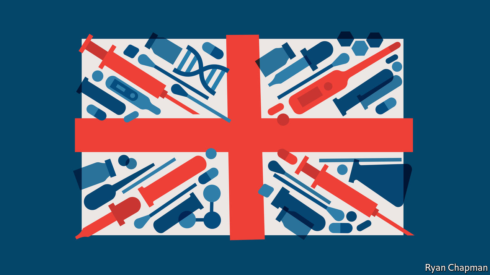
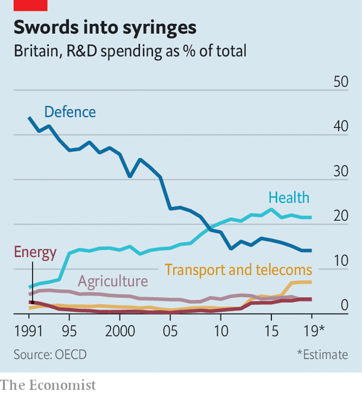

###### Covid-19

# How British science came to the rescue 

##### Elite institutions, streamlined regulation and big datasets are a potent combination 

 

> Feb 27th 2021 


ON FEBRUARY 28TH last year Martin Landray, an Oxford University professor, sent an email to Sir Jeremy Farrar, the director of the Wellcome Trust, a medical-research charity. At the end, as an aside, he added a question: was anyone thinking about randomised trials for covid-19 treatment? “Because if we don’t, then lots of drugs will get thrown at lots of patients,” Dr Landray recalls writing, “and we will be none the wiser about whether any of them work or don’t, or are even causing harm.”


In less than a fortnight a protocol was ready. In less than three weeks patients had been recruited. In less than four months the trial had found the first successful treatment for covid-19: a cheap steroid called dexamethasone (which one estimate finds has so far saved 650,000 lives across the world). In less than a year it had found another, tocilizumab, and ruled out four more, including hydroxychloroquine, a drug promoted by Donald Trump.


Britain’s scientific response to the pandemic has been a mirror image of its political one. Although the government’s scientific advisers share blame for the original sin—the delayed response in March—they have since run a world-leading campaign. Alongside vast clinical trials, the country has been home to most of the world’s genetic sequencing, the development of a successful jab and its fast roll-out. Elite institutions, streamlined regulation and big datasets are a potent combination—as, it turns out, are close links between business, academia and government.


It is not hard to find evidence for the importance of path dependency. Most sequencing is done at the Wellcome Sanger Institute (named after Frederick Sanger, twice winner of the Nobel Prize in Chemistry); a vaccine was discovered at Oxford’s Jenner Institute (named after Edward Jenner, inventor of vaccination). As well as four excellent life-science universities, the country is home to deep-pocketed charities (the Wellcome Trust disburses more than £1bn, or $1.6bn, a year) and two big pharmaceutical firms (GlaxoSmithKline and AstraZeneca, which was recruited to manufacture Oxford’s vaccine).


Compared with other rich countries, the British state spends little on research and development. But what it does spend is concentrated on health (see chart)—which is in turn concentrated in leading institutions. Over half of government and charity spending on biomedical research goes to just three places: Oxford, Cambridge and west London (home to Imperial College London). British science is less hierarchical than much of Europe and more cosmopolitan. Researchers are enthusiastic international collaborators, working across borders more often than peers in America.

 


Recent governments have been keen to turn this powerful research base into jobs. Britain struggles to produce the big biotech firms that flourish in America thanks to the mix of funding, agglomeration and venture capital found in Boston and Cambridge, Massachusetts. So in 2014 David Cameron set up the Office for Life Sciences, which sits between the business and health departments. “The thesis was that investment in life sciences is particularly effective,” says Nicole Mather, its first director, now at IBM, “because not only do you create jobs, but the NHS can also benefit from the products that are developed.” Three years later Theresa May’s industrial strategy put life sciences front and centre.


This focus on life sciences has delivered some concrete benefits. The Vaccine Manufacturing Innovation Centre (VMIC) in Harwell, Oxfordshire—a collaboration between three universities and two pharmaceutical firms—will soon churn out doses. But it also offers more subtle ones. As Stian Westlake, a former adviser to three science ministers, puts it: “If you tested every government on how well they understood life sciences, I bet the UK would score well.”


Sir John Bell, Oxford’s regius professor of medicine who led the life-sciences industrial strategy, is a regular in Downing Street. Sir Patrick Vallance, the government’s chief scientific adviser, was hired from GlaxoSmithKline. Kate Bingham, who led the vaccine taskforce, is a venture capitalist. Below them are civil servants with commercial experience. “Ten years ago people would have said, ‘The Americans are really good at people coming in and out of government from either science or industry’,” says a minister. “Well, we’ve now got that.”


The government has deferred to this expertise. Ms Bingham was given the freedom needed to strike deals. Sir Patrick was given a “fight fund”, which supported Dr Landray’s RECOVERY trial and COG-UK, a group of academics responsible for genetic sequencing. “Before we even met he was saying, ‘sequencing is important,’” says Sharon Peacock, who runs COG-UK. “And then by the time we met and got an application, they were ready to fund it very, very quickly.” Funding councils slashed approval times, working through the night, and created a single approval process to avoid duplication.


The ability to move quickly was particularly important to the RECOVERY trial. The World Health Organisation and the European Medicines Agency also stressed the need for big clinical trials. The difference, Dr Landray says, is that his team got in early: before the first wave had hit and treatment was set in stone. Britain’s chief medical officers wrote to every hospital urging them to take part, which they did.


“With vaccine development you can tell your classic great-man-of-history, out-there-creative-genius story,” says a funding-council director. RECOVERY, though, “was modern science, this was distributed, this was interdisciplinary, it was across lots of institutions and you had public engagement, you had volunteers.” The paper on dexamethasone in the New England Journal of Medicine was authored by the “RECOVERY Collaborative Group”; an appendix credits hundreds of researchers. COG-UK is another broad effort.


RECOVERY made use of something the NHS has long promised, but rarely delivered: patient data. The health service collects gallons of the stuff. But it is balkanised, leaving researchers hamstrung by data-sharing rules and interoperability problems. The government eased these rules, enabling both the RECOVERY trial and the OpenSAFELY one, which studied covid-19’s demographic impact. When the PRINCIPLE trial, which looks at pre-hospital treatment, was struggling to recruit, researchers teamed up with the test-and-trace system to bring in patients. Health Data Research UK, an outfit set up along with the industrial strategy, helped smooth data transfer for RECOVERY and COG-UK.


Ms Bingham has said that the pitch to pharmaceutical firms was that Britain could offer manufacturing, packaging and distribution, along with clinical trials. The country had little manufacturing capacity pre-pandemic—just two vaccine factories—but the UK BioIndustry Association, a trade group, was quick to find facilities that could be converted. Capacity has grown through the year, with firms lured by Ms Bingham’s offer, and will be further boosted by the VMIC in the autumn.


Much of this work has been aided by something less desirable: plenty of patients. As the funding-council director notes: “You can’t run a clinical trial in Taiwan or in New Zealand.” Similarly, the civil service’s early bumbling inspired the establishment of the vaccines and therapeutics taskforces.


Luck played a part, too. “If what happened at the start of 2020 was a coronal mass ejection that had knocked out the entire technology stack, we would probably be saying, ‘Goodness, if only we had more electrical engineers,’” says Mr Westlake. But the advantage of funding excellent research is that when a crisis hits, the government is more likely to have experts to hand. And as the example of covid-19 shows that is worth quite a lot. ■


Dig deeper


All our stories relating to the pandemic and the vaccines can be found on our . You can also listen to , our new podcast on the race between injections and infections, and find trackers showing ,  and the virus’s spread across  and .

