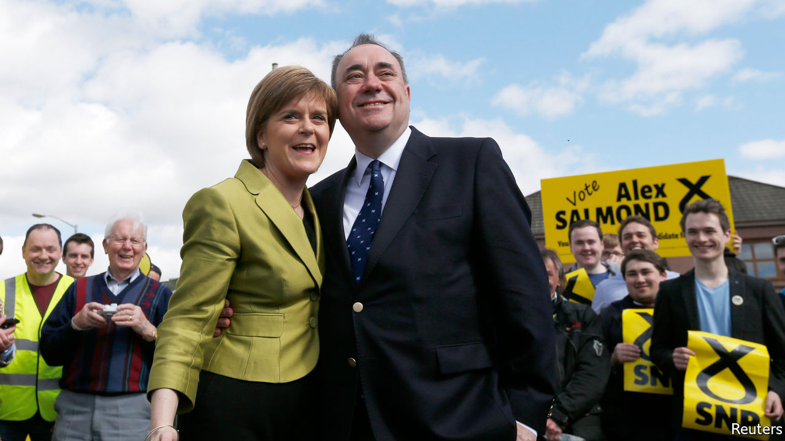

###### Scotland

# The feud within the Scottish National Party 

##### It reveals much about how Scotland is governed 

 

> Feb 27th 2021 


ALEX SALMOND and his successor, Nicola Sturgeon, turned the Scottish National Party from a fringe cause into a ruthless election-winner that reduced the Scottish Labour Party to a rump and in a referendum in 2014 came close to fulfilling its aim of breaking up the United Kingdom. It may yet succeed: independence leads in the polls. If it fails, the feud in which it is now locked may be partly to blame.


On February 22nd, Mr Salmond’s evidence to a committee of lawmakers was published. In it, he claimed that Ms Sturgeon’s inner circle ran a “deliberate, prolonged, malicious and concerted effort” to damage his reputation “even to the extent of having me imprisoned”. Ms Sturgeon, he says, misled the Scottish Parliament and broke the ministerial code, which would be grounds for resignation. She calls it a conspiracy theory.


In January 2018, in the wake of #MeToo movement, the Scottish government received two complaints of sexual misconduct against Mr Salmond, dating back to his tenure as First Minister. It upheld them. Mr Salmond sued and in January 2019 won. The judge called the probe “tainted with apparent bias”.


Later that month, police charged Mr Salmond with 14 offences against ten women, including attempted rape and sexual assault. In his trial, the court heard that there was an informal policy of not letting women civil servants work in his residence alone at night; his defence portrayed him as a “tactile, touchy-feely” man who in a “victims’ world” had been branded a criminal. He was acquitted.


He is now seeking revenge. A committee of the Scottish Parliament is investigating how Ms Sturgeon’s government handled complaints, and an inquiry by James Hamilton, a lawyer, is examining whether she breached the ministerial code.


The #MeToo movement has exposed flaws in every organisation it has touched. In the SNP’s case, the closeness of those who have dedicated themselves to independence makes the feuding especially vicious. Mr Salmond served as leader for a total of 20 years. Ms Sturgeon, his deputy for a decade, first met him as a teenage volunteer. Peter Murrell, her husband, whom Mr Salmond identifies as a major plotter, was his bag carrier and is now the party’s chief executive. Such intimacy, once an SNP strength, has become a liability: dirt accumulates and resentments brew. The battle deepens policy rifts, over trans rights and when to hold a second referendum.


The charge that Ms Sturgeon knew more about Mr Salmond than she admits has stuck, because she is so dominant in her party and takes personal control of so much government business. “This government has been very much a centraliser. Under Nicola Sturgeon, the cabinet just rubber-stamps things,” says James Mitchell, professor of public policy at the University of Edinburgh. A Sturgeon loyalist blames a dearth of talent. “It’s the same under Nicola as it was under Alex—a very small group of the smartest people run the show and, you know what? We’ve won a lot of elections that way.”


The Scottish civil service has emerged looking weak. Leslie Evans, the permanent secretary, has apologised for the first botched probe. She and Ms Sturgeon are accused of pushing on with the subsequent doomed legal action. Lawmakers have found her evidence evasive and forgetful. The impression is of a machine that lacked the grip to handle complaints, and in which party and government business were too easily blurred.


The Scottish Parliament has also been embarrassed. The committee inquiry, chaired by an SNP lawmaker, has been chaotic: appearances by Mr Salmond and Ms Sturgeon have been repeatedly delayed amid tussles over evidence. Having published Mr Salmond’s accusations against Ms Sturgeon’s circle, the committee retracted and redacted his statement at the request of the public prosecutor.


Farce feeds conspiracism, which is rampant among nationalists. Mr Salmond’s case is that the internal probe was not merely bungled by officials determined to rise to the challenge of the #MeToo moment, but that it was a state hit-job. His backers speak of “dark forces” and MI5. The women concerned have been identified and hounded online. Rape Crisis Scotland, a charity, says the fracas may discourage women from making complaints against powerful men.


Ms Sturgeon will survive. She has no clear successor. An SNP hand reckons support for independence would drop by ten points if she went. But the party will be damaged. In May’s elections, she will seek a mandate for a second independence referendum, and ask Scots to believe her government is ready for divorce negotiations of remarkable complexity with the British government. It is a lot to ask. ■

