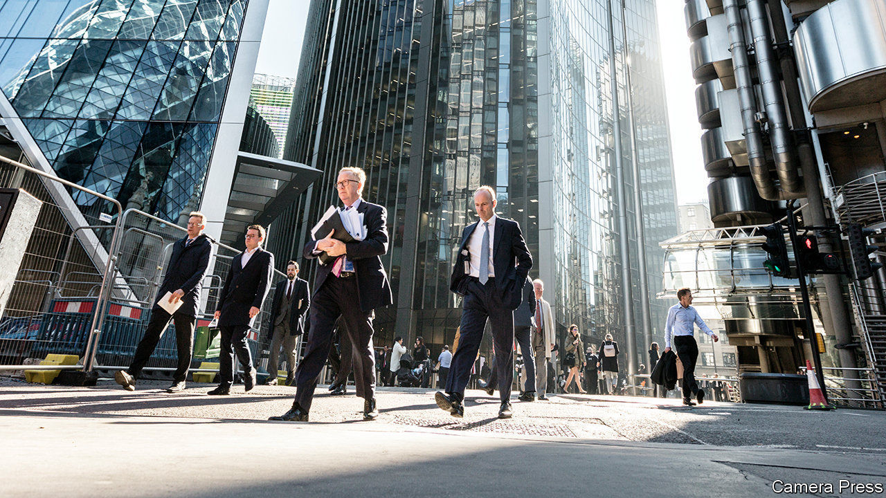

###### Bank debt

# The government’s loan programme may create a lot of zombie companies 

##### Good news for the banks may be bad news for the economy 

 

> Feb 27th 2021 


ON FEBRUARY 24th Lloyds reported its results for 2020, completing the set of big high-street lenders. As with Barclays, HSBC and NatWest, Lloyds’ profits dropped sharply last year, but its hopes for this year are higher. That is partly because it reckons losses on loans will be smaller than it had been expecting. All the big banks have cut their provisions for losses arising from bad loans in the coming year. Lloyds took an impairment charge (a reduction in the value of its loan book to account for the chance of defaults) of £4.2bn ($5.9bn) in 2020 compared with £1.3bn in 2019. It expects the charge to drop back to pre-pandemic levels this year.


Although GDP dropped by a tenth last year, the number of firms going bust was down by a fifth. The fall in bankruptcies in Britain has been one of the largest in a big economy. That is why the IMF has warned of “pent up” insolvencies. Yet the banks do not see a wave of bankruptcies heading towards them. That is because of the way the government has designed its corporate-loans programme.


In March last year, soon after the first national lockdown began, Rishi Sunak, the chancellor, pledged to support up to £330bn-worth (around 15% of GDP) of loans to firms hit by the pandemic. The loans were to be made by the banks; the government would guarantee 80% of them. But even though they were on the hook only for a fifth of any losses, banks were reluctant to extend credit to firms that might fail. Take-up was therefore slow. So, in April, the Treasury turbocharged the lending by offering to absorb 100% of the losses on loans of up to £50,000 to small firms. Since then around £45bn has been lent to almost 1.5m small businesses.


Some bankers suspect that many of the firms that have received funding under the scheme would have struggled to get a loan even before the pandemic. But with a 100% government guarantee, applications were waved through with little due diligence. A small-business adviser ruefully notes that many one-man-band firms he advises used the cash to buy a flash new car. Many of those loans will never be fully repaid. The Office for Budget Responsibility, the government’s fiscal watchdog, expects around a third of the total to be written off eventually.


The loan scheme may prove both costly to the taxpayer and a drag on the economy. The generous terms—not just a total guarantee to lenders, but also a 2.5% interest rate with no payments due for the first year—may have created an incentive for banks to keep zombie firms on their books. The process for resolving debt problems at over-leveraged small firms usually starts when banks, as the largest creditors, initiate insolvency proceedings. But with the government carrying all the risk they will never have to make provisions for the loans going bad, and instead will be tempted to keep firms alive for as long as possible to collect interest payments for them. Good news for banks is not necessarily good news for the economy. ■

