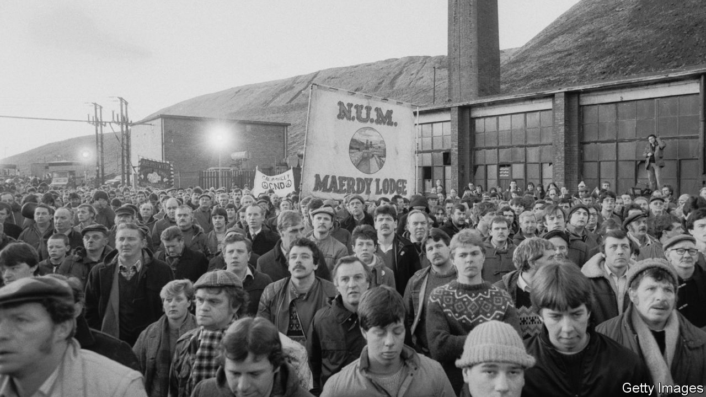

###### Class and ideology

# Why “red wall” Tories want to open a coal mine 

##### The Tory party wants to prove its working-class credentials 

 

> Feb 27th 2021 


IN OCTOBER 1984, at the height of the miners’ strike, Margaret Thatcher penned her most controversial conference speech. She wrote that militant miners resisting pit closures were “the enemy within” who had successfully hijacked the Labour Party. An IRA bomb, which ripped through her Brighton hotel, meant that the speech was scrapped, but the phrase nonetheless came to define the Conservative Party’s approach to mine closures.


Thatcher would probably be surprised to learn that on February 18th, a group of 47 Conservative MPs and northern party leaders wrote to Stewart Young, the Labour leader of Cumbria County Council, calling for a controversial new coal mine to be opened. Woodhouse Colliery, which would dig up coking coal for steel production from under the Irish Sea, would be England’s first deep coal mine since 1987. The mine has been granted planning permission three times since 2017, including most recently in October, but the council wants to think again in light of the government’s plans to cut carbon emissions. The irony that it is Tories who are fighting to open a coal mine has not been lost on one of the MPs involved. “It’s unbelievable,” he says.


An Australian private-equity firm, EMR Capital, has invested at least £29m ($41m) in the scheme and reckons that the mine would be able to serve the British steel industry with local coal replacing some supplies currently shipped in from America. That, they argue, would not only create up to 500 jobs in Cumbria but also reduce carbon emissions by cutting back on transporting the stuff. Steel industry bosses acknowledge that a local coal supply might help their profit margins, but also note that they can easily buy it elsewhere. Campaigners are sceptical about the claims of a reduced carbon footprint, saying that increasing coal supply would lower prices and thus increase demand.


From the point of view of Tory MPs in northern “red wall” seats, the mine has a different purpose. It is a tool to fight a class war against Labour. Since the miners’ strike of 1984-85, only the radical left has shown much interest in reopening coal mines. Even Jeremy Corbyn, Labour’s most left-wing leader, dismissed the idea. Labour opposes the new mine. Ed Miliband, the shadow business secretary, has argued that it goes against Britain’s climate targets and won’t save the steel industry. Red wall MPs are keen to paint their resistance as metropolitan snobbery. “They’ve never had a proper job in their life, they’ve never got their hands dirty,” says Lee Anderson, a former miner and Labour activist who became the Conservative MP for Ashfield in 2019. “Now they’re telling people in Cumbria, ‘You can’t have a job in a coal mine at 60 grand a year’.”


Backing the mine, Mr Anderson believes, will prove to Labour voters in former mining towns that the Conservative Party represents the working class. But their protest risks looking like industrial cosplay. Ian Lavery, a former president of the National Union of Mineworkers and a rare Labour MP who backs the new pit, points out that a Labour council approved the mine and it was Tory climate pledges that scuppered their plans. “This is a political con job,” he says.


Opening a coal mine while preparing to host the UN climate-change conference in November seems hypocritical. Boris Johnson, who hopes to use COP26 to forge an alliance with President Biden, has kept his nose out, saying it is a local issue. But Alok Sharma, president of COP26, was said to be apoplectic that Robert Jenrick, the communities secretary, approved the mine.


Such contradictions are not unusual in the Tory party. Its northern seats want big spending, its southern ones low taxes. Some Tories favour anti-immigration policies, others liberal cosmopolitanism. Labour, which has always been more serious about ideas and less hungry for power, struggles to contain contradictions. For the Tories, Woodhouse Colliery and COP26 may sit uncomfortably together, but they help keep the party in power. ■


For more coverage of climate change, register for The Climate Issue, our fortnightly , or visit our 

