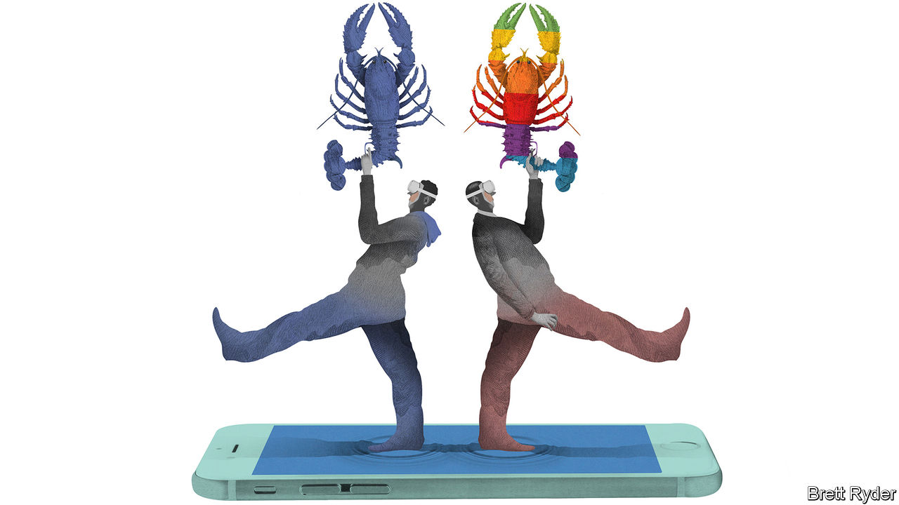

###### Schumpeter

# Apple’s duel with Facebook is a new form of big-tech rivalry 

##### One day, will it be headsets v handsets? 

 

> Feb 27th 2021 


LAST WEEKEND Mark Murrell, the founder of Get Maine Lobster, bought an Oculus virtual-reality (VR) headset. It is a plaything, but he quickly thought of business. “I can’t wait until everybody has one,” he says. “If only I could have an ad in one of those.” His business is delivering lobsters, at an average $190 a box, to homes across America. In his fantasy VR world, he would take customers via their headsets out on boats to see the catches, or give them cooking lessons—all while gently nudging them to place orders. Since his business started in 2009, its primary means of reaching new customers has been through ads on Facebook. It is not lost on him that Oculus is also owned by the social-media giant. “I was like ‘wow, watch out!’,” he says. 


As one of the biggest online-advertising platforms, Facebook understands the hidden depths of the digital world like a lobster fisherman knows the topography of the sea floor. But Mark Zuckerberg does not set the rules in all the places where his company lurks. The most lucrative hunting grounds are those controlled by Apple, maker of the iPhone, whose users last year spent on average almost five times as much per person buying stuff on its iOS operating system as those on devices using Android, its (Google-owned) rival. Apple has said that this spring it will upgrade iOS to toughen restrictions on the way advertising platforms access data, including by requiring apps to ask users for permission to track them across apps and websites owned by other firms. Those that rely on Apple’s individual-device identifiers for data-tracking will be affected. Facebook, the tracker-in-chief, has most to lose. 


Apple justifies its actions as part of a commitment to protect its users’ privacy. Facebook says it is resisting on behalf of millions of its small and medium-sized business clients that rely on its data-hunting algorithms to reach customers. On the surface it looks like a typical territorial dispute of privacy versus access. Mr Murrell’s Oculus fantasies provide a glimpse of why it goes much deeper than that.


The giants’ efforts to portray their positions as high-minded and altruistic are self-serving. But each has a point. Apple’s boss, Tim Cook, is right, in his thinly veiled attacks on Facebook, to lament the way polarisation and disinformation keep people glued to their screens to enable sites to exploit more data. Mr Zuckerberg is right to deride Mr Cook’s assertion that advertising does not need personalised data because it survived for decades without them. That system was skewed in favour of big companies with pots of money to spend on adverts. Smaller firms’ ability to reach customers with cheap online ads is one of the great novelties of the digital age. Get Maine Lobster, which pays Facebook about $45 for every crustacean-craver it lands, thrives because of it. 


More privacy will hurt but not kill the personalised-ad model. Some Apple users, preferring targeted ads to random ones, will opt to allow data-tracking. Google, which has split loyalties because of its own online-ad juggernaut, may make its Android platform privacy-lite. That would create a bifurcated web: on the one side, a privacy-focused, gentrified iOS system; on the other, a freer-for-all Android one. Ad-supported social-media sites, from Facebook to Snapchat and TikTok, will compete to develop technologies, such as artificial intelligence, to combine personalisation with more privacy. Ultimately, they could even pay people to track their data (though Apple’s rules currently forbid this). Omdia, a media consultancy, says the iOS upgrade will cause iOS in-app advertising revenue to drop by almost a fifth this year. But it expects it to rebound by 2024. 


Facebook’s insinuations about the dark motives behind Apple’s iOS upgrade are probably overstated. Even though services are a fast-growing source of Apple’s revenue, attempting to rig the market in favour of its App Store and mine it for better advertising data would make a mockery of its privacy campaign, which it sees as paramount for attracting customers. More likely, Apple is changing the rules in favour of more privacy because it can. It controls its integrated stack of hardware and software. Facebook does not. That gives Apple the freedom to assert its power.


But it is also a demonstration of paranoia. Facebook has growing ambitions to become a direct competitor to Apple. One way would be for Facebook to combine its namesake social network with its Instagram photo-sharing app and WhatsApp messenger into a “super-app” akin to Tencent’s WeChat in China, melding social media, messaging, e-commerce, gaming and payments. That would give it more freedom to offer personalised ads, since Apple cannot control data-tracking within the Facebook family of apps.

Subtracting ads


Another way would be to start a new hardware craze that overtakes the iPhone. Overshadowed by Mr Zuckerberg’s prickly attacks on Apple are revelations of what he calls his dream, “since I was a kid”, to build a new computing platform. Following a tradition that started with mainframes, then PCs, then browser-based computing, then mobile phones, he hopes to develop “immersive computing”, based on virtual and augmented reality. Oculus is a start, especially for gaming. Augmented-reality glasses are in the future. This year Facebook plans to launch “smart glasses” in partnership with Luxottica, which makes Ray-Bans. If they do not suffer the fate of ungainly Google Glass, they could start an arms race. Reportedly, Apple is working on a VR headset and glasses. Samsung, a South Korean smartphone-maker, may be working on augmented eyewear, too. And VR is not the only potential breakthrough. Smart speakers and cars are other contenders. 


Whatever comes next, even Facebook acknowledges that privacy will need to be an important component. Many people, like lobsters, crave their nooks and crannies. The more so knowing that, thanks to firms like Facebook, merchants have become ever better at luring them into their pots. ■

