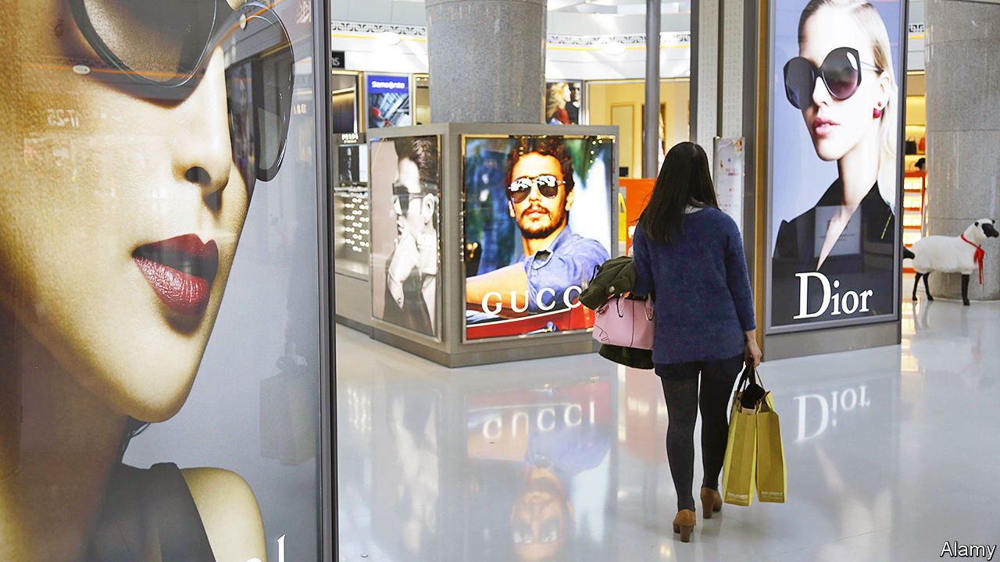
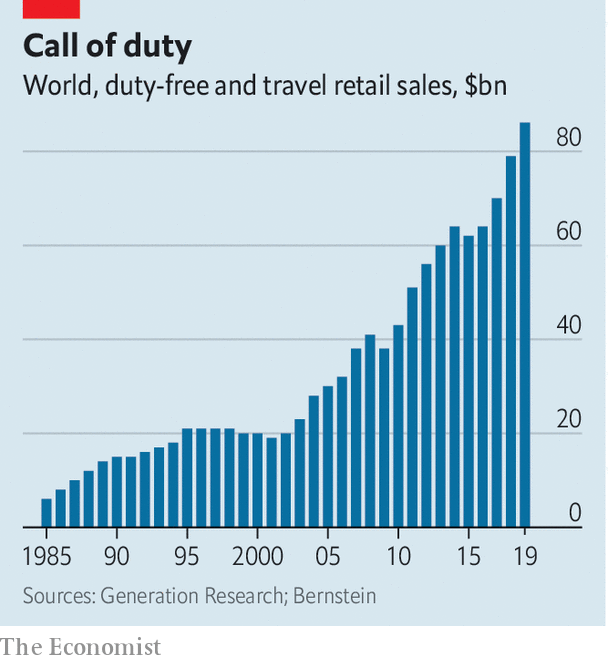

###### Continental drift

# Duty-free retail is finding new ways to grow 

##### The pandemic is pushing the industry further away from cigarettes, booze and airports, and towards China 

 

> Feb 25th 2021 


HAINAN, A TROPICAL island 450km (280 miles) south-west of Hong Kong, used to be a sleepy backwater populated by budget resorts catering to Chinese tourists unable to afford a trip to Hawaii. Today it draws travellers with considerably fatter wallets. Buying a Gucci gown or a Tiffany trinket in one of its giant, posh malls feels no different from shopping on Fifth Avenue in New York or Avenue Montaigne in Paris—until the tills are rung. Instead of walking out with their bling, visitors from mainland China pick up their items at the airport on their way home, or get them dispatched there directly. Under rules devised a decade ago, which mean that for duty purposes Hainan is treated as a separate zone from mainland China, they are exempt from certain taxes and duties. Savings can reach 30% as a result.


Duty-free shopping conjures up images of crowded airport terminals. As covid-19 has emptied these of passengers around the world, the shops inside have suffered commensurately. After reaching $86bn in 2019, according to Generation Research, a consultancy, duty-free sales collapsed by two-thirds last year. Mauro Anastasi of Bain, another consultancy, forecasts that travel-retail sales will not reach those levels again in real terms before the second half of the decade. Intercontinental passengers and business travellers, the biggest spenders, are likely to take longest to return to the skies. Chinese tourists, by far the most prized by duty-free operators, are shunning countries with poor records of handling the pandemic.


Shoppers will one day return to airports. Yet when it emerges from the current crisis, duty-free shopping will have been transformed: unabashedly focused on luxury, less connected to travel and closer to Asian high-rollers. Hainan points the way.

 


Before covid-19, selling stuff to travellers had been one of the few bright spots in the brick-and-mortar retail world. The practice has been popular ever since cruise ships on the high seas plied their passengers with booze and cigarettes free of government levies. In 1950 Ireland applied the principle to aviation. As mass tourism took hold, airports the world over turned themselves into tax-free shopping malls with departure gates. Annual growth of around 8% in recent pre-pandemic years—twice the figure for other shops—was fuelled by sales of cognac, sunglasses, handbags and other knick-knacks. Sales have grown eight-fold since the late 1980s. Excited marketers referred to duty-free shops as “the sixth continent”.


Covid-19 has deflated that enthusiasm. It has also, as in many other areas, accelerated pre-existing trends that were reshaping the duty-free business. The first has to do with the mix of stuff sold in duty-free. Alcohol and, particularly, cigarettes have dwindled over the years. Posh brands became mainstays of airport concourses as they realised that these were good places to pitch to wealthy people, particularly Asian passengers. Luxury goods, perfumes and cosmetics now dominate travel retail, accounting for two-thirds of sales.

Rebate tectonics


The second development is the shift away from airports. Although the terminal remains its natural habitat, duty-free shopping has in recent years expanded farther afield. Spending per passenger in airports was sagging even before the coronavirus swept the globe.


At the same time, specialised downtown shops in tourist hotspots have lured visitors eligible for tax discounts if they repatriate what they buy. These outlets, particularly popular in Asia, now represent nearly 40% of all sales. Rules vary globally, but some allow shopping even by those with a tenuous link to travel, for example a ticket booked for several months hence.


Tax-exempt outlets are popping up across mainland China, catering to domestic travellers who have returned from overseas (and, soon, who plan to travel there in future). Chinese shoppers in Hainan, for example, now enjoy a duty-free allowance of 100,000 yuan ($15,500), thanks to a recent tripling of the tax break.


The final trend, also on display in Hainan, is duty-free’s eastward drift. In 2011 Asia-Pacific overtook Europe as the largest regional market. (America, where most flights are domestic, has always been a laggard.) Before the pandemic Seoul’s Incheon, a two-hour flight from Beijing, became the biggest airport shop in the world. Revenues for Prada and Hermès in Asia excluding Japan have jumped by over 40% in 2020, owing partly to splurges in Hainan. Industry sales there are reported to have reached $5bn last year, more than doubling from 2019. Some predict they could grow five-fold within a decade.


Although the Chinese have been the world’s biggest luxury buyers for years, accounting for a third of global sales, brands were reluctant to consider places like Hainan as top-tier luxury venues. Two-thirds of Chinese spending on handbags, watches and other fripperies took place overseas.


The Communist Party wants to change that. The ever-more-generous tax breaks for the well-heeled are “the key tenet of a long-term government mission to maximise domestic consumption and repatriate travel-related shopping from abroad”, says Martin Moodie of the Moodie Davitt Report, a travel-retail newsletter. Daniel Zipser of McKinsey, a consultancy, expects the overseas share of luxury spending to decline. As a consequence of these developments, luxury groups’ attitudes towards venues like Hainan “have changed dramatically”, says Cherry Leung of Bernstein, a broker.


If the Chinese continue to buy their baubles at home, that will suck more business away from the duty-free operators that have historically dominated non-Chinese airports. These include Dufry of Switzerland and DFS, part of the LVMH luxury empire. Last year China Duty Free, a state-controlled group, overtook Dufry as the world’s largest purveyor of tariff-free luxury goods. The market capitalisation of China Duty Free’s Shanghai-listed arm has more than tripled over the past year to $112bn, making it one of the most valuable retailers in the world.


In an acknowledgment of the shifting balance of spending power, some travel retailers from Europe are trying to muscle in on Hainan. Dufry has sold a stake to Alibaba, hoping that China’s e-commerce giant can improve its fortunes there. Last month Lagardère Travel Retail, part of a French conglomerate, launched a second shop on the island.


Airports will remain good places to find well-off shoppers. Bored people waiting for their flights to be called are perfect marks for luxury brands. Most retailers spend fortunes attracting customers to their shops or websites, points out Julián Díaz González, boss of Dufry. “For us it is just moving them from the corridor to the shops.” As the industry continues to evolve, Mr Díaz may increasingly find it is a matter of moving the duty-free shops to the customers. ■

