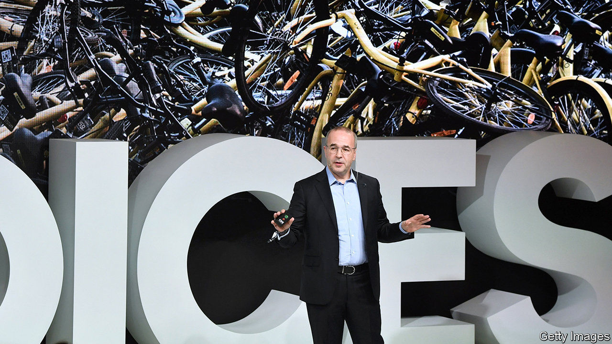
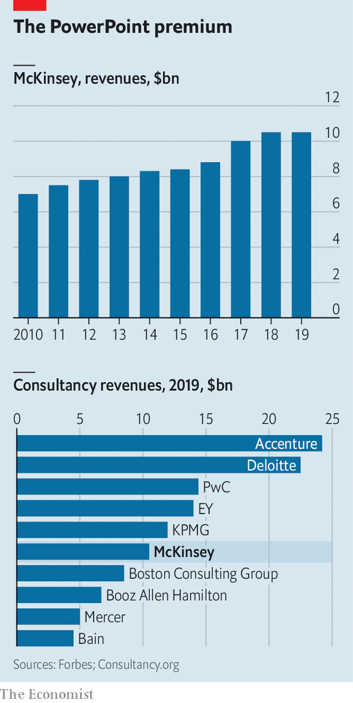

###### Loss of Sneadership

# McKinsey casts off its managing partner 

##### In an unusual rebuke, the consultancy’s partners have voted out Kevin Sneader 

 

> Feb 27th 2021 

 


ON FEBRUARY 24th the Financial Times reported that 650 senior partners at McKinsey voted Kevin Sneader, the consultancy’s managing partner since 2018, out of office. The Scotsman’s predecessors typically served two consecutive terms. The vote is seen as a rebuke of his handling of a series of crises, the bulk of which predated his tenure, most recently over McKinsey’s work for opioid producers in America.

