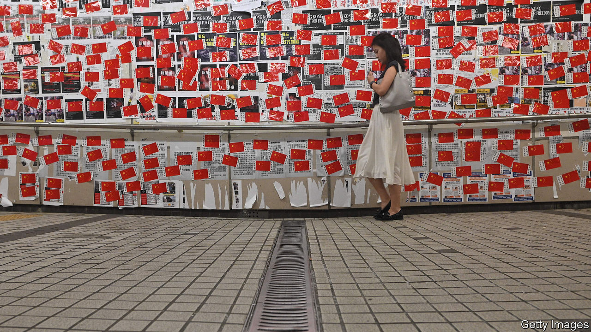

###### Time for some holistic love

# China is mulling changes to Hong Kong’s electoral system 

##### It wants to make sure that only “patriots” can win 

 

> Feb 27th 2021 


IN 1984, AS the British and Chinese governments moved closer to signing a historic agreement on the future of Hong Kong, one word worried some residents of the British colony. China was suggesting that the territory could stay capitalist, but had to be run by “patriots”. What did that mean? China’s then leader, Deng Xiaoping, gave a reassuring response. “We don’t demand that they be in favour of China’s socialist system,” he said. “We only ask them to love the motherland and Hong Kong.” Now officials have made it clear that this is no longer the case. Supporting the Communist Party is a must.


In a speech in Beijing on February 22nd, China’s official responsible for Hong Kong affairs, Xia Baolong, set out China’s new definition of the patriotism requirement, and gave a clear indication that this would involve a different way of managing politics in Hong Kong. Patriots, he insisted, must support China’s political system. “In this country where we practise socialist democracy, we can allow different political opinions,” he said. “But there is a red line—we absolutely cannot allow any acts that will harm this basic system, namely the socialist system led by the Chinese Communist Party.”


Such a definition of patriotism would be no surprise to people living on the Chinese mainland, where officials have always combined the notions of “loving the country and loving the party”. But Mr Xia’s comments caused a stir in Hong Kong, which China still claims it rules by the principle of “one country, two systems”. A day after Mr Xia’s speech Erick Tsang, Hong Kong’s official in charge of mainland and constitutional affairs, reinforced the message. “You cannot say that you are patriotic but you do not love the leadership of the Chinese Communist Party or you do not respect it, this does not make sense,” he said. “Patriotism is holistic love.”


This is not merely an issue of semantics. In June 2020 China imposed a sweeping national-security law on Hong Kong in order to crush opposition to the local government that had engulfed the city in protests in the previous year. A person’s view of that law became a test of suitability for membership of the Legislative Council, commonly called Legco. In July, 12 politicians, including four members of Legco, were disqualified from taking part in upcoming Legco polls, in some cases because they objected to the law (the elections were later postponed—because of the pandemic, the government said). Since 2016 several pro-democracy politicians have also been barred from standing in elections or expelled from Legco for refusing to express support for the Basic Law—Hong Kong’s mini-constitution—or mangling oaths of loyalty to it. Mr Xia’s speech on patriotism strongly implied that new tests would be applied in order to weed out “anti-China elements who cause chaos in Hong Kong”. He said “refinements” were urgently needed in the territory’s electoral system in order to prevent such people “entering organs of political power”.


The mood has changed dramatically since early last year. Then, fresh from a dramatic victory in district-level elections in November 2019 and buoyed by popular support that was displayed in abundance during the anti-government unrest, democrats felt they had a fighting chance of gaining control, or at least hugely influential shares, of seats in all three of Hong Kong’s main elected bodies: the district councils which they had just swept, Legco and the Election Committee that chooses the chief executive (it will next convene in 2022). Now the door is being slammed on them, although democrats had already vanished from Legco. After the barring of the four who had planned to stand for re-election, the rest of Legco’s pro-democracy camp resigned in protest. When patriotism tests are introduced, elections will become perfunctory. More than ever, power will be exercised by mainland officials through proxies in Hong Kong.


One immediate change will be a new oath for holders of public office. Mr Tsang said a bill concerning this will be presented to Legco in March. It will require the swearing of allegiance to the central government, in addition to the previous need to swear loyalty to Hong Kong. According to local media, China’s leaders may also change the way that seats are allocated on the 1,200-member Election Committee. At present, 117 of them are given to district councillors—a group long dominated by pro-establishment politicians but which will be controlled by the opposition camp as a result of their gains in 2019. These seats may be given instead to local Communist Party supporters, such as members of the Chinese People’s Political Consultative Consultative Conference, an advisory body in Beijing. To help loyalists win more seats in Legco, changes will be made to constituencies and electoral procedures, say local press reports. Legco elections are already designed to give them a huge advantage, with only half of the legislature directly elected by citizens. 


There are other ominous rumblings, too. Mr Xia said senior posts in the judiciary must also be held by patriots. Officials have said as much before, but Communist-controlled media suggest that China may establish a high-level committee that will determine whether holders of public office are genuinely loyal to the central government. There is speculation that some of these reforms may be discussed at the annual meeting in Beijing of China’s rubber-stamp legislature, which begins on March 5th and lasts about ten days.


As well as tightening its grip on Hong Kong’s politics, China is steadily strangling freedoms in other areas, too. On February 19th the local government ordered Radio Television Hong Kong (RTHK), the city’s public broadcaster, to submit to tighter scrutiny by government-appointed advisers. RTHK has remained remarkably independent under Chinese rule. Earlier this month, however, it announced that it would stop rebroadcasting BBC World Service programmes because of alleged BBC bias in its coverage of atrocities in Xinjiang. As the Communist Party strengthens control, many democrats in the city feel they are having to choose between keeping quiet about their beliefs, or emigrating. ■

