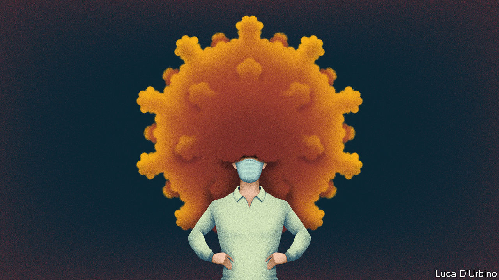

###### Secret snips

# How brave German hairdressers won a battle for human dignity 

##### Hair salons will reopen before most other places 

 

> Feb 27th 2021 


“HUMAN DIGNITY shall be inviolable.“ The first article of Germany’s constitution turns out to have surprisingly broad application. For while much of Germany’s service sector remains in the deep freeze, on March 1st Germany’s 80,000 hair salons will be allowed to reopen. Some politicians frowned at the decision, taken in mid-February. But it has “something to do with dignity”, argued Markus Söder, Bavaria’s premier.


Germany required hairdressers to close before Christmas. During this long winter many mop-headed Germans immersed themselves in distinctly undignified self-cutting Instagram tutorials, or made hair-raising dashes to salons in Luxembourg. Others went underground. Frauke (not her real name), a Berlin-based stylist, has been visiting clients for a secret snip “on the down low”, albeit with precautions. Lockdown fatigue has set in, she reckons. When hairdressers first closed last spring, almost all her regulars cancelled. This time a good 80% of them are willing to risk fines to maintain a decent trim.


"Our profession has social relevance," argues Jörg Müller of the Central Association of the German Hairdressing Trade. Yet its special treatment has inspired snippy comments from owners of locked-down hotels, shops and restaurants. What explains it? A slick lobbying effort by Big Hair helped. Politicians cite "personal hygiene" and the needs of the elderly. Frauke says her clients think the "old, white men" who run the country have grown tired of looking scruffy.


Either way, Germany's hairdressers have timed their return well. The decline in covid-19 numbers has stalled, and vaccination is proceeding at the pace of a leisurely perm. That means the (presumably well-coiffed) state and national leaders who will meet on March 3rd may not be able to offer German citizens and businesses the easing of restrictions they crave. When it comes to leaving lockdown, there can be no short cuts.


Dig deeper


All our stories relating to the pandemic and the vaccines can be found on our . You can also listen to , our new podcast on the race between injections and infections, and find trackers showing ,  and the virus’s spread across  and .

