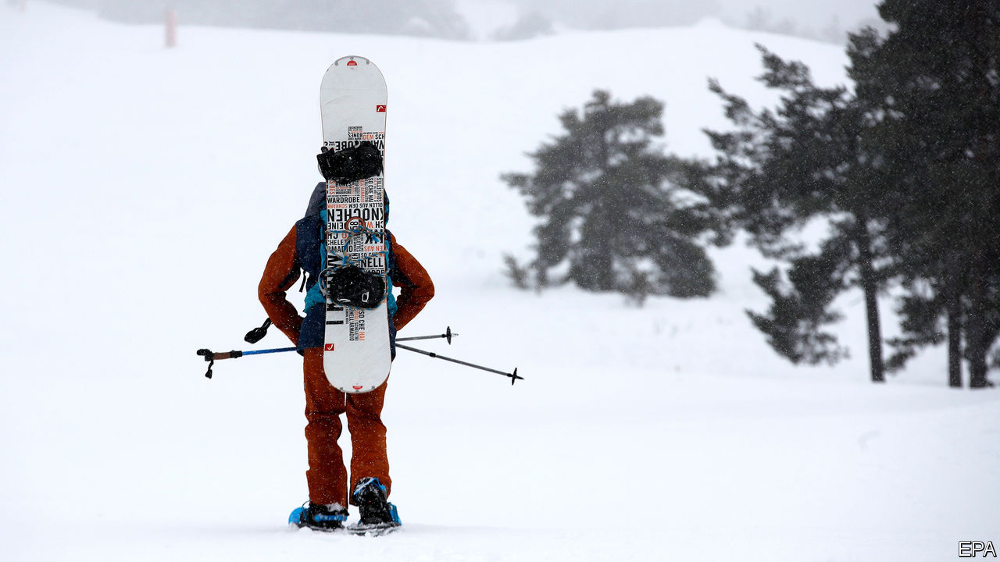

###### Uphill struggle in the snow

# Skiing without lifts in France 

##### Winter sports in a time of pandemic 

 

> Feb 27th 2021 


THE MECHANICAL clatter of chairlifts and the bass beat of high-altitude bars are familiar soundtracks in an Alpine ski resort every winter. So the quiet of the mountains this season is startlingly strange. French ski resorts are instead alive to different sounds: children tobogganing, huskies pulling sledges, defiant enthusiasts trudging uphill on skis with skins. Late last year, when the French government decided to clamp down on covid-19 once more, it shut all uphill transport but kept resorts open. This means the French can still go skiing—but without lifts.


Some solutions are punishing. Ski touring, or uphill skiing, involves struggling up the slopes on foot, with grips attached to the bottom of the skis. The Alpine village of Saint-Martin-de-Belleville, part of the Trois Vallées ski domain north-east of Grenoble, has opened a couple of runs for those with the stamina to reach the top. But skiers have become a minority. Husky-sledding is fully booked. Kit for trekking on raquettes (snow shoes) has sold out. “Everything we had has been pre-booked and rented,” says the owner of a ski-hire shop in Saint-Martin. At an altitude of 2,000 metres, hardy tourists can even go ice-diving through a hole in a frozen lake.


The French ski for almost as many days in total every year as Americans, who are five times as numerous. With little prospect of lifts opening this season, and most neighbouring ski areas also shut, France’s 325 resorts have had to diversify. This may help them lure more non-skiers to the mountains in future. Meanwhile, those who usually make beds, serve drinks, maintain the lifts or teach ski school in the Alps are either furloughed or out of work. Foreign tourists are stuck at home.


Saint-Martin-de-Belleville’s tourist office says it has only 30% occupancy, less than half its normal rate in February. In the high-altitude French resorts, purpose-built for skiing and often charmless, the rate has dropped to 25%, says the National Association of Mayors of Mountain Resorts (ANMSM).


The government has unveiled a “mountain plan” costing €4bn ($4.8bn) to help keep people and businesses going. But the squeeze is being felt. Some small shops and firms usually earn two-fifths of their yearly income in February. Revenues across the ski industry may be half the €10bn expected in a normal year. Village town halls, which depend on their share of lift-pass or car-park income, fear for their budgets. “The mountain is an ecosystem,” says Joël Retailleau of the ANMSM. “It’s easy to just press a button and close the lifts, but it has knock-on effects, not only in the resorts, but down into the valleys. This affects hundreds of thousands of people.”


Local anger at the government’s decision may be vented in regional elections in June. Laurent Wauquiez, a Republican who is president of Auvergne-Rhône-Alpes, was the favourite even before the lifts were shut. Marine Le Pen’s nationalist party was lying second without even picking a candidate. The government is unlikely to reopen ski lifts before the season ends. If anything, as infection rates start to rise again, it may have to tighten up. Neighbouring Italy had planned to reopen ski resorts this month, but changed its mind.


Ski lifts transformed the poor mountain valleys of France into playgrounds for Europe’s rich, but also created glaring inequality. Locals now find themselves missing the tourists, even if the mountains are gloriously peaceful without them. ■


Dig deeper


All our stories relating to the pandemic and the vaccines can be found on our . You can also listen to , our new podcast on the race between injections and infections, and find trackers showing ,  and the virus’s spread across  and .

