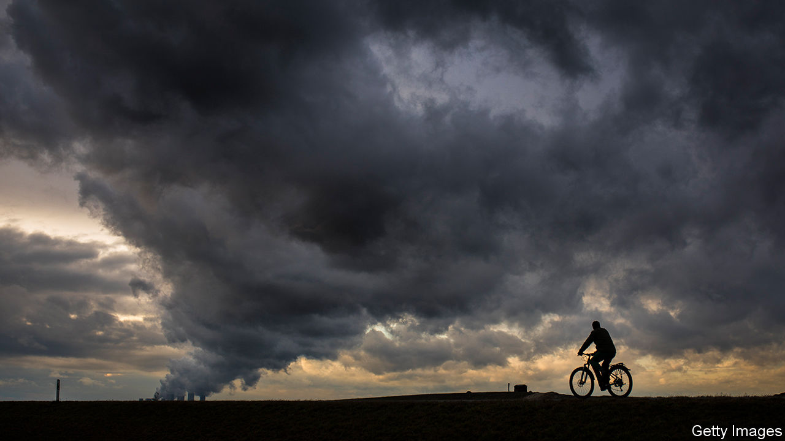
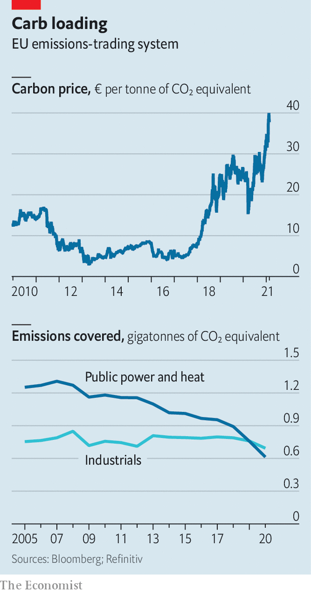

###### Coming into its own

# Prices in the world’s biggest carbon market are soaring 

##### Investors are paying attention; many see it as a one-way bet 

 

> Feb 24th 2021 


AS FINANCIAL MARKETS become cheerier about the pace of vaccinations and the chances of a speedy economic recovery, the prices of stocks, commodities and all sorts of assets are rising. So too are carbon prices in Europe, home to the world’s largest emissions-trading system. Prices have surged by 60% since November; on February 12th they hit a record high of nearly €40 ($49) per tonne of carbon-dioxide equivalent (see chart).


Last year the value of global carbon markets hit a record €229bn, a five-fold increase from 2017. The EU’s emissions-trading system (ETS) accounts for nearly nine-tenths of both that value and that growth (China’s is just starting up; see next page). In 2020 around €1bn-worth of emissions allowances changed hands a day, as well as lots of options and futures contracts. There are now clear signs that the market is joining the financial mainstream, with hundreds of investment firms trading in it.


For a long time after it was launched in 2005, the ETS barely functioned; a glut of allowances (which give the holder the right to emit an amount of greenhouse gases) kept prices close to zero. But after the European Commission sucked out excess permits in 2019, the market began to thrive.

 


It is an odd market. The commission auctions allowances nearly every day; it caps the overall supply of permits based on the EU’s politically determined emissions targets. Demand, meanwhile, comes from three types of participant. Power and heating utilities, such as Germany’s RWE and France’s Engie, have the most appetite. They buy allowances to cover the emissions from current projects or to hedge against future price increases. Next come industrial firms, such as ArcelorMittal, a steelmaker. Most of these receive free permits, so that the ETS does not encourage producers to move abroad.


The third, and growing, source of demand is financial firms, including banks, such as Goldman Sachs and Morgan Stanley, and hedge funds, such as Lansdowne Partners and Northlander Advisors. These are not required to hold allowances; instead they hope to profit, either by trading on behalf of utilities or by speculating in the futures or options markets.


The recent spike in prices reflects both supply and demand. A shift to a new platform delayed some auctions in January, meaning fewer allowances were sold. And on December 11th EU leaders agreed to speed up cuts to emissions, bringing them down by 55% by 2030 compared with 1990 levels, rather than by 40%. That signalled a lower emissions cap, meaning eventually fewer permits and a higher price.


The expectation of higher carbon prices may have prompted industrial firms to start hedging their emissions early this year. That added to demand for allowances—as did unusually cold weather, which boosted the demand for heating (the ETS does not cover boilers in homes, but it includes large ones, such as those that heat many buildings). Speculators may have accelerated the price rise, by buoying futures prices. Around 230 investment funds hold futures linked to allowances, up from 140 in 2019. They account for only about 5% of the futures market, but it is a growing, bullish share. Long positions, or bets that the price will rise, have doubled since November. Aje Singh Rihel of Refinitiv, a research firm, notes that this measure closely correlates with recent price changes.


One reason for investors’ enthusiasm is that carbon seems like a one-way bet. Many analysts expect that the EU’s 55% target will require the number of allowances to fall and prices to rise, perhaps towards €80 per tonne. That could be good news for investors. When in 2018 it became clear the commission was going to intervene to limit supply, allowances became the best-performing commodity of the year.


Buy and hold is not the only strategy. Casey Dwyer of Andurand Capital notes that carbon prices are largely uncorrelated with those of other assets, so some investors hold them to diversify their portfolios. They could also be used to hedge against inflation: a higher carbon price is generally accompanied by higher consumer prices.


The presence of financial firms has changed how the market works. Federico Di Credico of ACT Financial Solutions, which specialises in green markets, says that the dynamics used to revolve mostly around the commission’s meetings. Now economic indicators, such as new GDP figures, play a role too. Some analysts argue that speculation causes volatility; others say the result is more liquidity. Most, though, expect financial flows to grow.


“Once investors start to see it as an ESG trade [that takes into account environmental, social and governance factors], funds will allocate more money to the carbon markets,” predicts Ulf Ek of Northlander Advisors. And unlike many forms of ESG investing, Europe’s carbon price, where it is applied fully, seems to benefit the environment directly. Emissions from utilities have fallen by roughly half since the launch of the ETS. By contrast, the industrial sector, which is cushioned by free allowances, has seen little improvement. 


What next for the ETS? Some elements, including the overall cap, will be reviewed in June. And the commission has expansion in its sights. One idea is to connect the ETS to other regions through a carbon border tax. In theory, that would protect European industry from carbon-intensive, overseas competitors. And it may link the ETS to other markets, such as Britain’s soon-to-be-launched ETS, and California’s cap-and-trade scheme. Complications around design and geopolitics abound, though. Few think the commission’s aim for a border tax by 2023 is realistic. 


More likely is expansion within Europe. The scheme covers only 45% of the continent’s emissions. Shipping is expected to join in the next few years. Road transport and buildings may get separate markets. If done well, that expansion should attract more capital and perhaps lead to higher prices. But as the market’s early years show, much depends on implementation. For all its growing sophistication, the ETS is still a political project at heart. ■


For more coverage of climate change, register for The Climate Issue, our fortnightly , or visit our 

