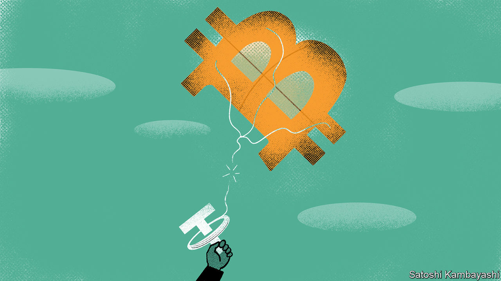

###### UnTethered

# Tether is fined by regulators in New York 

##### A “stablecoin” is branded anything but, adding to jitters in crypto-markets 

 

> Feb 23rd 2021 


AHEALTHY CORRECTION, or the first signs of a crypto-crash? On February 21st bitcoin hit a new high of more than $58,000, double its price at the start of the year, after several big firms and investors, led by Tesla, signalled that they were starting to take the cryptocurrency seriously. Within two days, though, the price had tumbled by over a fifth (before recovering slightly), jangling the nerves of HODLers, as bitcoin diehards are known. A trigger for the fall was Elon Musk, Tesla’s boss and bitcoin’s cheerleader-in-chief, musing that its price “seems high”. The news that Tether, an integral component of crypto-markets, had fallen foul of American regulators hardly helped calm the faithful.


Tether is a so-called stablecoin. Its issuer, a company of the same name, has long claimed that Tethers—of which more than 34bn are in circulation—are backed one-to-one by dollars. One purported advantage of such pegging is lower volatility; bitcoin’s price, by contrast, is notoriously erratic. Another is that stablecoins make it easier to move between cryptocurrencies and the ordinary sort.


Doubts have long swirled around Tether’s claim to be a sort of digital dollar. Critics say the one-to-one-backing claim looks flaky. They also suspect that Tether has been used—not least on Bitfinex, a cryptocurrency exchange owned by some of the same people—to manipulate bitcoin; one academic study found that purchases with Tether were “timed following market downturns and result in sizeable increases in bitcoin prices”. A related concern is the degree of control that Tether’s owners have over supply. Whereas only a fixed number of bitcoin are available to be “mined”, Tethers can be issued at will, giving those behind the stablecoin central-bank-like printing powers.


The growing queasiness spurred investigators on. New York’s attorney-general, Letitia James, has spent two years unpicking Tether’s opaque operations and its relationship with Bitfinex. On February 23rd she branded the firms “fraudulent”, fined them $18.5m and ordered them to end trading activity with New Yorkers. Bitfinex and Tether said they “admit no wrongdoing”.


Ms James’s charge-sheet is damning. Tether, she says, lied about its dollar backing. Its “self-proclaimed verification”—after an external audit had been abandoned—was allegedly a sham: the cash ostensibly backing the Tethers had been put there that morning, the probe concluded, and some of it was moved elsewhere soon after. Moreover, Bitfinex was not upfront about hundreds of millions of dollars that went missing through a third-party payments processor reportedly based in Panama. The attorney-general says Bitfinex falsely claimed it knew where all the money was when questioned about it. As part of the settlement, Bitfinex and Tether have agreed to submit to mandatory reporting.


This will ensure a light is shone on a dark but surprisingly large part of the cryptocurrency world. Though Tether is nowhere near as much of a household name as bitcoin, its influence has grown enormously. A recent analysis found that the majority of bitcoin purchases on several crypto-exchanges, including Binance, Bit-Z and HitBTC, are made using Tether. (By contrast, on Coinbase, a smaller but more transparent exchange that is soon to list on the stockmarket, they are mostly paid for with dollars, euros and sterling.)


According to the analysis, more than two-thirds of all bitcoin bought on all crypto-exchanges in one 24-hour period studied were purchased with Tether. In other words, Tether makes up far more than just a corner of the market. Indeed, its rampant minting—hundreds of millions were reportedly once pumped out in a single day—has led to jokes: in one popular meme, an armoured truck sporting the Tether logo hurtles by, money billowing out of its open rear door.


That is why the outcome of the New York investigation—along with reports of other probes, growing talk of a regulatory crackdown on opaque trading, and the market’s latest wobbles—is likely to make many punters in the $1.4trn cryptocurrency market nervous. Strategists at JPMorgan Chase, a bank, summed up the risk in a recent note: “Were any issues to arise that could affect the willingness or ability of both domestic and foreign investors to use Tether, the most likely result would be a severe liquidity shock to the broader cryptocurrency market.” An unTethered market is a scary prospect for many. ■

