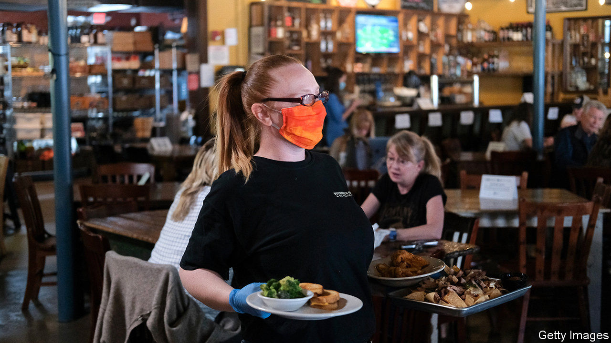
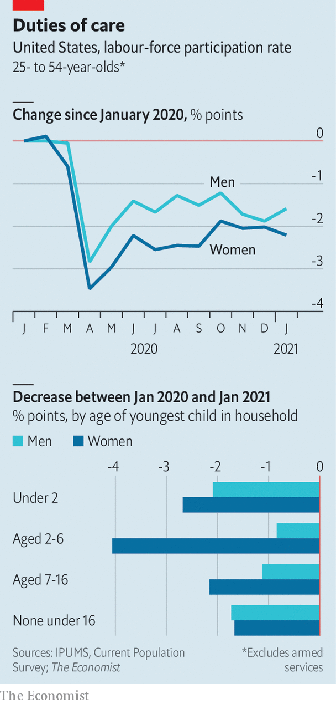

###### Not having it all

# The pandemic has pushed working mums out of the labour force 

##### American women have fared worse than those in other rich countries 

 

> Feb 27th 2021 


LAST SPRING, when covid-19 first began to spread in America, employment sank like a stone. The number of 25- to 54-year-olds in work shrank by 13% between January and April 2020. By January this year it was still 5% lower than a year ago, with larger falls among low-income and black households. The effect on women has been disproportionate, too. Millions have left the labour force altogether. And American women have fared worse than those in other rich countries. The drop in their participation rate, relative to the male rate, is one of the biggest among the members of the OECD, a club of mostly rich countries.


In January last year there were more 25- to 54-year-old (or “prime-age”) men than women in employment in America. Had job losses been spread evenly across those groups, around 300,000 more men than women would have lost work over the year. In fact, the number of women in employment fell by around 220,000 more than the number of men did. That is in contrast to the pattern in previous recessions.


There are two potential reasons why working women have fared especially badly during the pandemic. The first is because they are concentrated in the services industries most affected by pandemic-related restrictions. The second is because they are more likely to have to care for children. According to a survey of mothers who used formal child-care arrangements in January 2020 conducted by the Bipartisan Policy Centre, a think-tank, 42% of child-care centres used by respondents were closed in December 2020, 21% were open but were restricting hours and 23% were limiting places. 


A forthcoming study by Simeon Djankov, Penny Goldberg and Eva Zhang of the Peterson Institute for International Economics, another think-tank, and Marie Hyland of the World Bank examines 44 economies and finds that there is a correlation across countries between employment patterns and the gender gap in participation during the pandemic. Covid-19 seems to have had its most unequal effect in places where more women work in the services sector, and where part-time workers have fewer legal protections.


In America, though, it appears that the impact of gendered jobs has been surprisingly small. Analysis by The Economist of the Current Population Survey suggests that women’s distribution across different industries may explain only a small part of the gender difference in job losses, about 50,000 jobs, compared with a scenario where men and women were divvied up evenly across industries. Although women are (slightly) overrepresented in leisure and hospitality, where employment fell by 24%, their presence in the health sector, which went relatively unscathed, has offered some protection. So too has the fact that relatively few of them work in manufacturing, which has been hit harder.


More obvious are the burdens of child care, which have detached women from the workforce altogether. The share of women participating in the labour force (ie, either in work or looking for a job) fell by 2.2 percentage points in the year to January 2021, or 0.6 percentage points more than for men. But it fell by more than four percentage points among prime-age mothers whose youngest child was aged between two and six, about three percentage points more than fathers of similarly aged children (see chart). Analysis by Ernie Tedeschi of Evercore ISI, a consultancy, found that school closures in September were associated with 1.6m fewer mothers participating in the labour market.

 


Delve deeper into the figures, and it becomes clear that gender inequality is interacting with America’s racial inequality. By January the gender gap in the hit to employment rates of prime-age white people had closed, whereas the difference was still a yawning two percentage points for black men and women. One survey by Catalyst, a charity that promotes gender equality in the workplace, found that even if in-person classroom instruction resumed, only 25% of black and 42% of Latino mothers would send their children to school, compared with 59% of white mothers. That could be because the schools are more likely to be in covid-19 hotspots, or because they are worried about receiving proper care if they fall ill.


As the economy recovers, many women will return to work. Figures from the Household Pulse Survey suggest that in January 9% of women aged between 25 and 54 were not working because covid-19 led their employer to shut up shop; almost 3% said they weren’t working because they had covid-19 symptoms themselves. Once vaccines and jobs become more plentiful, they should be able to return. But the danger is that the women who have left the workforce, and have been out of it for some time, find it harder to return—further entrenching existing inequalities. ■

