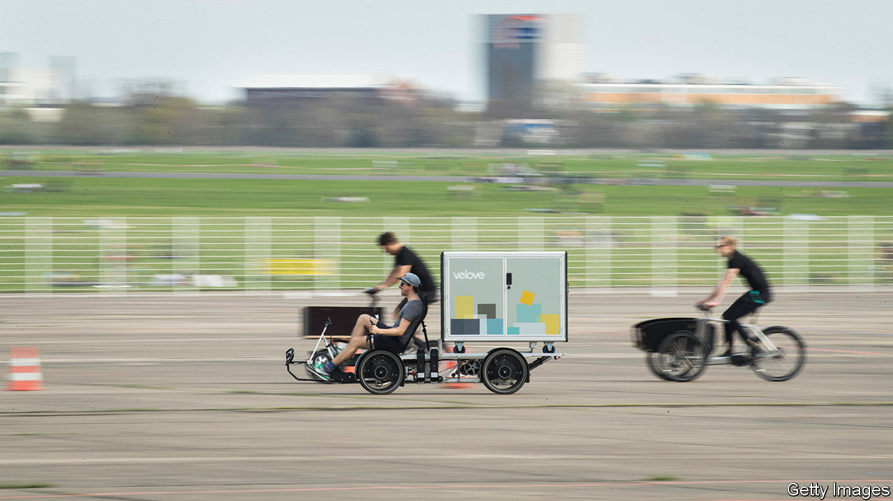
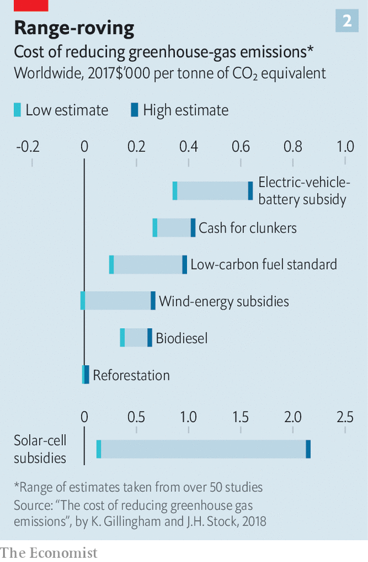
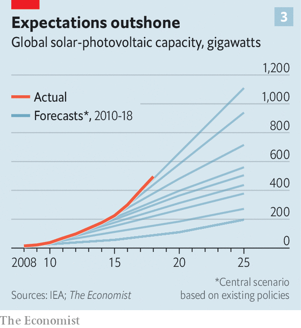

###### Giving up carbs

# What is the cheapest way to cut carbon? 

##### Bill Gates is the latest to grapple with a thorny question 

 

> Feb 22nd 2021 


IN THE TRENDIER parts of Berlin, cargo bikes are the rage. Locals use the bicycles, which have a wheelbarrow-sized box at the front, to do the weekly shop or ferry children around. Because they cut carbon-dioxide emissions, local authorities are subsidising the craze. But the well-intentioned schemes look pricey when you consider how much carbon is abated. One such scheme costs the city €370,000 ($450,000), but is expected to reduce emissions by only seven tonnes a year. That works out at over €50,000 per tonne abated. The equivalent figure for schemes that support the sale of low-carbon heating systems, by contrast, is €200 per tonne.


More than 100 countries and 400 cities (including Berlin) have promised to get to net-zero emissions by 2050 or before. Investors and regulators are encouraging companies to do the same. To meet these goals policymakers and bosses will have to pick from a menu of policies, from building wind farms to subsidising low-carbon jet fuel. That raises an important question: what is the cheapest way to cut carbon? 


One way to discern the answer is to impose a price on carbon, either as a tax or a cap-and-trade scheme. This would encourage firms and consumers to find the cheapest ways to abate. But setting a price is difficult politically. Only a fifth of the world’s emissions are covered by an explicit price. Even in Europe, the world’s biggest liquid carbon market, free credits still allow many industries to maintain emissions. 


So other tools are needed, too. In his new book, “How to Avoid a Climate Disaster”, Bill Gates suggests using a “green premium”, or the gap between the price of clean activities and dirty ones, as a guide. Where the premium is low, zero-carbon alternatives exist, and consumers have no reason not to use them. Where the premium is high, more innovation is needed.


A similar approach, popular in climate circles for the past decade or so, is to consider the marginal costs of abatement. Like green premiums, these compute the costs of a climate intervention (including operating costs and upfront spending). But it compares them with the emissions that the policy is expected to abate. Plotting the costs and emissions abated on a curve shows the policies that provide the most bang for the buck (see chart 1).

 


Such curves have been computed by a number of forecasters over the years, including McKinsey and the Boston Consulting Group, two consultancies; Goldman Sachs, a bank; and Britain’s Climate Change Commission, which advises Parliament. As a rule, most show that the biggest bang comes from making buildings more energy-efficient, say by installing insulation or smart cooling and heating systems. Often these have negative costs: analysts think they will eventually save consumers money through cheaper bills.


The next-best bang for the buck tends to be replacing power plants that burn natural gas or coal with renewable-powered ones. There is less agreement about what the next-best option is after that. But the most expensive areas of the economy to decarbonise tend to be transport (planes and ships), heavy industry (steel and cement) and agriculture (cows belching methane). In these cases clean, cheap, scalable alternatives do not yet exist.


Just as abatement-cost curves provide a rough guide for policymakers, they also show how difficult the maths is. Estimates of costs vary widely, for instance (see chart 2). A paper by Kenneth Gillingham of Yale University and James Stock of Harvard University compares the marginal costs of policies across 50-odd studies. The cost of wind-energy subsidies can range from more than $260 per tonne of carbon dioxide avoided, to next to nothing.

 


This is partly because a technology’s abatement potential can vary from place to place. Some countries, such as Britain, are blessed with high winds and shallow seas that are ideal for offshore wind farms. In other places, wind energy will provide scant abatement.


Working out costs is tricky, too. The International Energy Agency (IEA), for instance, has routinely underestimated the pace of deployment of renewables. And because economies of scale drive down prices, that means it has overestimated the costs of switching, too. In 2010 the lowest the IEA expected solar prices to drop to over the next decade was about $195 per megawatt hour. Today the price in America and Europe is $30-60 (see chart 3).

 


Nor do abatement-cost curves show how technologies interact. Hydrogen is rarely produced without emissions. But if it were, the Hydrogen Council reckons, it could be used in 35 different green applications, from storing energy to heating buildings. Ignoring this could lead to underinvestment in hydrogen power today.


Interactions also affect how much interventions reduce emissions. Consider two things needed to decarbonise the economy: converting the grid to low-carbon power, and electrifying transport. The order in which you do these matters. According to a model developed by the Massachusetts Institute of Technology and others, if transport were electrified, there would be less demand for oil to fill tanks with petrol. Yet, as the demand for dirty power for electricity would surge, overall emissions would drop by only 2% by 2050 (compared with a business-as-usual baseline). If the grid were cleaned up first, though, then emissions would fall by about 30%.


Faced with all these difficulties, forecasters are taking a more sophisticated approach, rather than simply working their way along the marginal-cost curve. Goldman Sachs is incorporating different scenarios and a wider range of costs into its analysis. Others are turning to “energy-systems” modelling, which estimates models over and over again with different assumptions. That lets technologies interact, and means that forecasts rely less on one set of assumptions for, say, prices.


This type of analysis lets you sort climate actions into three categories, says Jesse Jenkins of Princeton University, all of which require funding. The first are what he calls “robust” interventions, such as improving energy efficiency, which are valuable across lots of scenarios. Next come “shaping” interventions, such as investing in hydrogen and batteries, which improve the likelihood of arriving at a low-carbon future. Then come “hedging” strategies: long-shot options to develop, just in case, such as direct-air-capture, which sucks carbon dioxide from the atmosphere. The result is a more complex framework better suited to deal with the complex, ever more urgent task of decarbonisation. ■


For more coverage of climate change, register for The Climate Issue, our fortnightly , or visit our 

