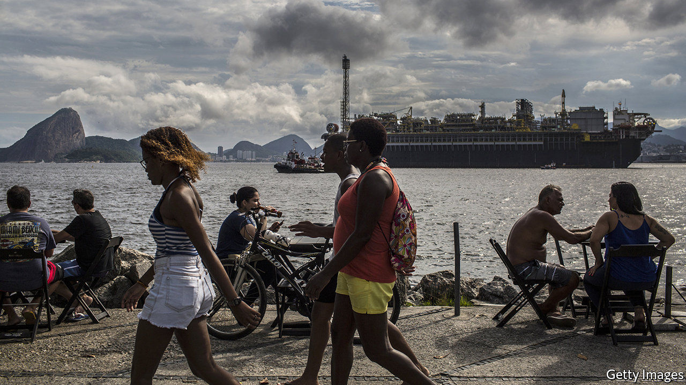

###### Petrol problems

# Why the sacking of Petrobras’s boss spooked markets 

##### It suggests that in Brazil liberal reforms are falling further down the agenda 

 

> Feb 27th 2021 


THE PRESIDENT of Brazil, Jair Bolsonaro, likes to call his University of Chicago-educated economy minister, Paulo Guedes, his “Posto Ipiranga”, a chain of full-service petrol stations. The nickname charmed markets during the election campaign in 2018, but Mr Guedes’s reform agenda has lost ground to populist moves aimed at winning re-election. When on February 19th Mr Bolsonaro fired Roberto Castello Branco, the boss of Petrobras, to appease lorry drivers upset about rising fuel prices, markets saw it as a sign of more meddling to come. The state-run oil firm’s share price dropped by 21%, wiping 100bn reais ($18bn) off its market value. Brazil’s benchmark stock index fell by 5% and the real lost 2.4% against the dollar(all have since recovered some of the losses).


What is unusual is not that Mr Bolsonaro intervened, but how he did so. With the oil price rising, the real falling and an election approaching in 2022, “no government could resist the populist temptation”, says a former executive of Petrobras, which has had 16 bosses in 30 years. But Mr Bolsonaro fired Mr Castello Branco, a friend of Mr Guedes, on Facebook, without consulting Petrobras’s board. To fans gathered outside the presidential palace, he mocked Mr Castello Branco for working from home during the pandemic and echoed a nationalist slogan: “Is petroleum ours, or does it belong to a small group of investors?”


Mr Bolsonaro has paid lip-service to the need for reforms to stabilise public debt, which is nearing 100% of GDP, but the former army captain and back-bench congressman never fully embraced a liberal agenda. Tax and public-sector reforms have stalled.Now, with inflation rising and the pandemic still crimping growth and employment, “the pendulum has swung in a more interventionist direction”, says Mário Mesquita of Itaú, a bank. The army general tapped to run Petrobras may stop short of price controls, in part because of new rules that protect minority shareholders, introduced after a corruption scandal and excessive intervention under Dilma Rousseff, a former president. But the firm’s plans to sell off unprofitable assets will suffer from greater uncertainty.


So will the Brazilian economy as a whole. Markets are getting less tolerant of Mr Bolsonaro’s heavy-handedness, says Ana Carla Abrão of Oliver Wyman, a consultancy. On February 25th Congress will start voting on a constitutional amendment that would allow it both to bypass a spending ceiling (in order to finance a new round of emergency payments for poor workers) and to enact measures to curb the growth of spending (such as by freezing public-sector salaries). Both are necessary, but politicians may approve the spending without the savings, delaying reforms to an elusive future date. That would increase the chances, already high, that the central bank raises interest rates next month for the first time since 2015.


Mr Guedes’s silence amid the turmoil suggests that he is holding on to hope that Congress, which recently elected allies of Mr Bolsonaro as heads of its two chambers, will pass the fiscal measures and slimmed-down versions of tax and public-sector reforms. He may reckon that ambitious reforms can follow Mr Bolsonaro’s re-election. That thinking seems wishful. Still, says Chris Garman of Eurasia Group, another consultancy, just as Mr Bolsonaro underestimated the cost of firing Mr Castello Branco, those who think Mr Guedes will be next underestimate the strength of their relationship. “Our Posto Ipiranga is irreplaceable,” Mr Bolsonaro said in November. The problem is that the lights are out, service has been suspended and Brazil’s economy is sputtering. ■

