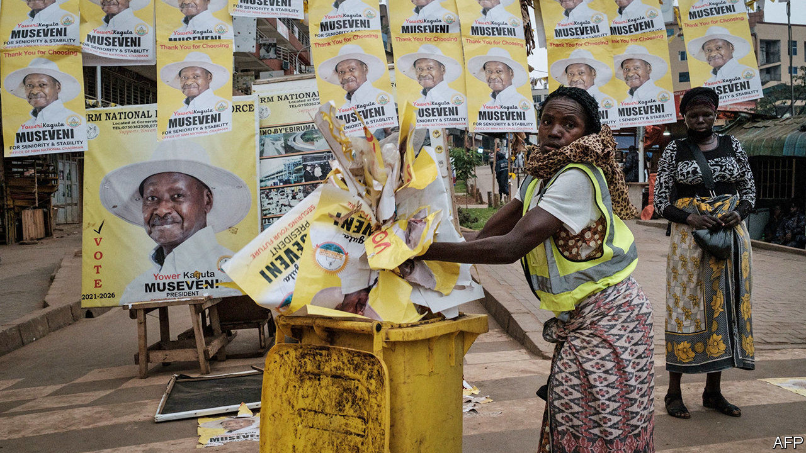

###### Big men, big money

# How to make African politics less costly 

##### Tackling patronage requires understanding how it works 

 

> Feb 27th 2021 


AYISHA OSORI, a Nigerian lawyer and author, has vividly described running for political office in her country. She twists the arms of party elders, flatters their wives and hands over wads of banknotes—the cleaner the better. “Without money”, she concludes, “most aspirations would evaporate like steam.”


Politics costs money everywhere, but the link between cash and power is especially corrosive in Nigeria and across much of Africa. In rich democracies parties choose candidates and subsidise their campaigns. In many African ones aspiring politicians pay vast sums to run on a party ticket and then shell out even more to cover their own costs. They give voters handouts, which serve both as bribes and as hints of future generosity. Once in office, they keep spending: on constituents’ school fees, medical bills, funeral costs and construction projects (see ). Individual politicians, in effect, act as mini welfare states. Some 40% of ambulances in Uganda are owned by MPs. Their spending often dwarfs their official salaries.


This is bad for Africa. When a life in politics costs so much, the impecunious and honest will be excluded. Many MPs will either be rich to begin with, or feel the need to abuse power to recoup their expenses, or both. Even if they are not corrupt, MPs are a poor substitute for a genuine welfare state. Their largesse may go to those who ask loudest, or to a favoured ethnic group.


So long as states are weak, it makes sense for voters to ask their MPs for handouts, rather than for better laws or help to navigate the bureaucracy. It is also rational for MPs to neglect legislative work in favour of gifts and pork, if this is what voters say they want. But as Africa develops, this should change. As voters grow richer, they will be harder to buy. As governments grow more effective, MPs will have fewer gaps to fill. Alas, these shifts could take decades.


Africans need something better, sooner. Outsiders often suggest tougher campaign-finance laws, but these seldom work. They are often ignored. And laws copied from the West tend to miss the point, by regulating spending by parties before elections, rather than by sitting MPs.


Better would be to take a different approach. One aim would be to strengthen institutions that expose and punish corruption. Last year Malawians booted out the graft-ridden regime of Peter Mutharika thanks, in large part, to independent judges. Politicians who see graft punished are more likely to stay clean.


Another aim would be to encourage parties to run on policies, rather than ethnicity or patronage. African NGOs, trade unions and business groups should nudge them in this direction—or help set up alternatives. New parties, such as Bobi Wine’s National Unity Platform in Uganda, are gaining popularity partly because they oppose the old rot. Philanthropists could give them money—and ask nothing in return.


The essential thing is to curb MPs’ informal role as sources of welfare. The long-term fix would be to make local governments work properly. A stopgap is to improve Constituency Development Funds. These are pots of public money to be spent largely at the discretion of MPs. More than a dozen African countries have them. They are not as grubby as they sound. Research from Kenya finds that voters judge MPs on how they use these funds, so they offer some accountability. With greater transparency, they would offer more.


Africa has grown more democratic in the past 30 years. Multi-party elections are common, albeit often flawed. Opposition parties are gaining ground. Most leaders leave office peacefully, rather than in coups. Politics is becoming more competitive. The next step is to make it less costly. ■

