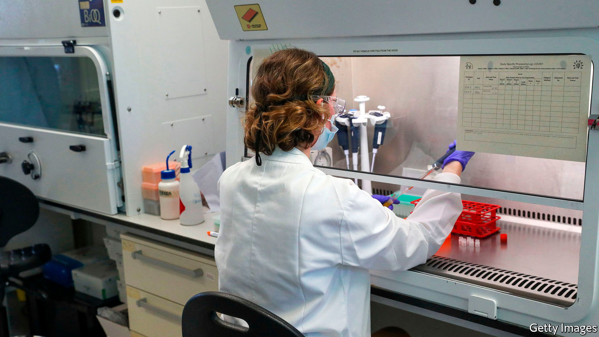
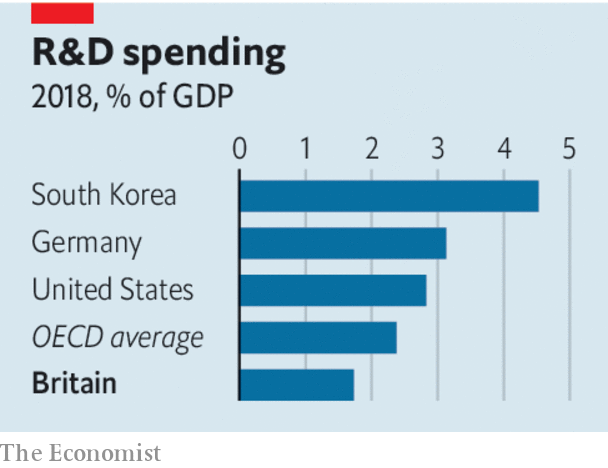

###### Sparks fly

# Lessons from Britain’s pandemic on promoting innovation 

##### Move fast and remove barriers are the best things the government can do 

 

> Feb 27th 2021 


“WHAT IS IMPORTANT is seldom urgent,” declared Dwight Eisenhower. “And what is urgent is seldom important.” Eisenhower did not have to lead America through covid-19. The urgency and importance of the task over the past year have banished pretty much everything else from most leaders' minds. But now that the vaccine is kicking in, Britain's government is once again beginning to think about the things that will matter later. Next week, along with a budget designed to deal with the fiscal strains on the country, it is expected to publish a “plan for growth” to boost productivity, with innovation at its centre.


The government is right to try to pull the innovation lever. The world may be on the threshold of a technological boom with life sciences, at which Britain excels, at its heart. Innovation is crucial to productivity, and on this front Britain's performance has lagged behind its competitors’ in recent years. Its low spending on R&amp;D—less than three-quarters of the OECD average, as a share of GDP—argues for a boost.


Those who remember the 1970s may regard this as a dangerous road to take. Promoting innovation can quickly turn into an exercise in picking winners—or, as is more often the case, losers. The government’s $500m purchase last year of a stake in OneWeb, a bankrupt satellite firm, suggests that it has forgotten the humiliating lessons of that dismal decade. A second danger is that policy agendas get mixed up. The government has promised to “level up” poorer areas of the country, so deprived towns are lobbying for more money for their universities. But trying to boost innovation by sending money to weak institutions is likely to lead to average universities producing unremarkable ideas. Britain's research-funding system is ruthlessly elitist. It should stay that way.

 


The government’s first move in boosting innovation was the announcement on February 19th of a plan for an Advanced Research and Invention Agency (ARIA), which is modelled on America’s Advanced Research Projects Agency. That is a promising start. ARIA’s purpose is to fund high-risk, high-reward research, probably by directly funding exceptional scientists. But money is not all that matters. The successful translation of life-science research into treatments during the pandemic (see ) suggests some inexpensive measures that can also make a difference.


One is to speed up governmental processes. The rapidity with which Britain's medical regulator moved during the pandemic is one reason the vaccine roll-out is racing through the population and drugs identified in Britain are saving lives around the world. Urgency is not unique to pandemics. Getting things done quickly can make an investment worthwhile and determine where an entrepreneur chooses as a base.


Another useful measure that the government should use is its unique ability to overcome barriers. At the beginning of the pandemic covid-19 researchers were, for instance, unable to gain access to different strands of health-service data. The government eased restrictions on existing data and allowed researchers to ask people who had tested positive for covid-19 to join trials. Both were crucial to the effort.


A last principle is the value of connections between the government and the private sector. Kate Bingham, a venture capitalist who led the vaccine-procurement effort, understood how to deal with drug companies. Many of the civil servants working with her had commercial experience. The government's closeness to business during the pandemic has been criticised, and perhaps some wasteful contracts were awarded to cronies. But without it, the vaccine effort would not have succeeded.


Innovation took human beings from caves to computers. It is elusive stuff. Good education, a welcoming immigration regime and a friendly business environment will do most to tend it. But a few sensible principles can help keep the flame burning. ■


Dig deeper


All our stories relating to the pandemic and the vaccines can be found on our . You can also listen to , our new podcast on the race between injections and infections, and find trackers showing ,  and the virus’s spread across  and .

