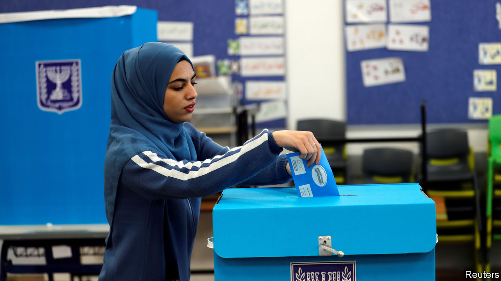

###### Abu Yair wants your support

# Binyamin Netanyahu appeals to Arab voters in Israel 

##### Despite years of alienation, some think the prime minister is their best bet 

 

> Feb 27th 2021 


ARAB ISRAELIS are voting “in droves”, said Binyamin Netanyahu, as he tried to scare his religious and nationalist base into voting in 2015. Four years later Mr Netanyahu, Israel’s prime minister, tried to place cameras in polling stations. Critics saw this as a ruse to scare off Arab voters. Last year he tried to deter his rivals from working with Arab lawmakers by calling the Joint List, an alliance of Arab parties, “supporters of terrorists”.


But in the run-up to the election on March 23rd—Israel’s fourth in two years—Mr Netanyahu sounds different. He has been visiting Arab towns, where he takes credit for a highly successful roll-out of covid-19 vaccines. His party, Likud, has placed an Arab Muslim on its list of candidates. The prime minister says he enjoys it when Arabs call him “Abu Yair” (father of Yair), reflecting their practice of referring to someone as the parent of their eldest son. “It brings tears to my eyes,” he says.


Facing another close race, Mr Netanyahu is courting Arabs, who are 21% of Israel’s population (excluding the occupied territories). Only 2% of them backed Likud in last year’s election, says Yousef Makladeh, a pollster. But that number is growing.


Nearly 90% of Arab voters supported the Joint List in 2020. It won 15 seats, making it the third-biggest bloc in the 120-seat Knesset (Israel’s parliament). Nearly two-thirds of Arab voters turned out, motivated in part by their opposition to Mr Netanyahu, who alienated them with actions as well as words. He signed a law that seemed designed to offend minorities and supported Donald Trump’s peace plan, which would have allowed Israel to annex large parts of the West Bank.


Arab voters have not forgotten these slights, but they want their politicians to deal with problems such as crime, poverty and discrimination. That is tough to do when Arab parties don’t sit in government. “People feel that if Arab parties can’t make a change, they may as well vote for whoever can,” says Mr Makladeh. Polls show the Joint List losing perhaps a third of its seats. A former member of the alliance, the Ra’am party, struck out on its own after talking with Mr Netanyahu, who promises more resources for Arab neighbourhoods.


The fracturing of the Joint List is not all that surprising. It includes communists, Islamists and secular nationalists. Ra’am, which is Islamist, hopes to win enough seats on its own to become something of a kingmaker. But it risks not winning the 3.25% of votes needed to secure entry to the Knesset. Even then, it may not be needed to form a coalition—or wanted. Mr Netanyahu has said he would not lead a government that relied on Ra’am’s support. “He can wear a galabiya and call himself Abu Yair from now until the election,” says Ahmed Tibi, a leader of the Joint List. “Whoever believes him, deserves him.”


Support for Likud among Arab voters has risen enough that it could mean a couple of extra seats for the party, potentially swinging the election. “We’ve always had a few people voting Likud, or whatever party is in power,” says Farouk Ibrahimi, a café owner in the Arab town of Abu Ghosh. “There are those who think it will bring more government funding.” Polls also show that fewer Arabs are planning to turn out than did last year. “I voted for the Joint List last time and I’m never going to vote for Netanyahu the racist,” says Khalil Abu Hamze, an out-of-work plumber who doesn’t plan on voting. Arab apathy means a greater share of votes will be cast by Jews. This tends to favour Likud and other parties that might join it in government.


Mr Netanyahu is not alone in courting Arab voters. Yair Lapid, whose centrist party is running second in the polls, has not ruled out forming a coalition with Arab parties. Left-wing politicians promise to work with them. Mr Netanyahu, ironically, has made such talk of collaboration more acceptable. But he may have an edge over his rivals. Though Israel has been criticised for not giving more vaccine to Palestinians in the West Bank and Gaza, it is available to all Arab Israelis (most of whom identify as Palestinian). Now that about half of Israel’s population is vaccinated, lockdown restrictions are being lifted. For Mr Netanyahu, the timing could not be better.■

