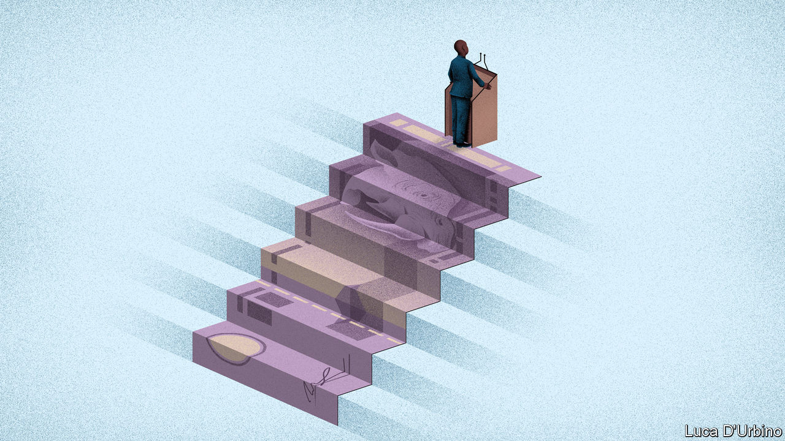
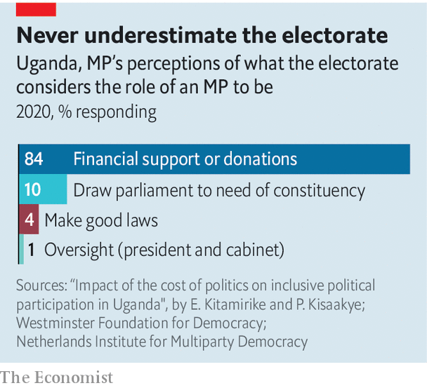
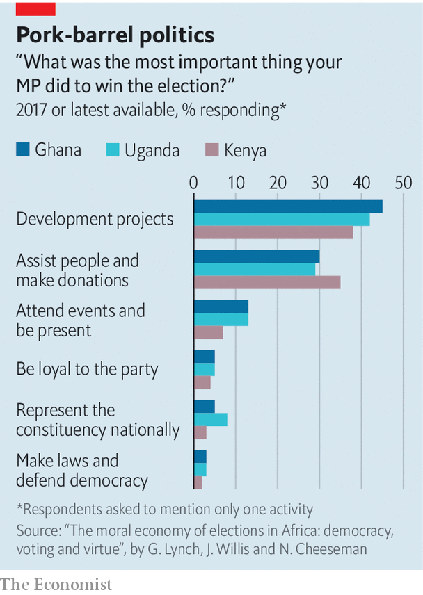

###### Pricey politics

# Why does it cost so much to be an African MP? 

##### In part, because politicians have to fill gaps left by the state 

 

> Feb 27th 2021 


ARINDA GORDON KAKUUMA had many reasons for running for office. It was his “passion”; he was keen to give back to his country, Uganda; and he wanted to help “my people”. It was also “to satisfy my ego”, the MP adds, with a laugh.


Self-esteem comes at a price. Mr Arinda, whose five-year stint in parliament ends in May, lists some of his expenses: 50,000 posters, 100 agents, radio spots, ten cars for every rally and, on occasion, 100 boda-boda (motorbike) drivers “if you want to do a bit of a convoy and scare your opponents”. Then there were the “donations”: “If you go to a village you have to leave something.” Mr Arinda estimates that to win a primary and an election costs at least $200,000, more than 200 times Uganda’s GDP per head.


After the votes are counted, the costs keep mounting. Mr Arinda reckons he gives $400 a day to his constituents for medical bills, school fees, funerals and so on. Every weekend a local organisation invites him to a fundraiser. “They bring a cow, you have to buy it; they bring goats, you have to buy them.” As an MP, “you lose money,” he says. “It’s a hell of a job.”


African parliaments are often dismissed as rubber stamps. But what MPs do in the legislature is only part of the job. In their constituencies, they fill gaps left by weak states; and this informal role matters more to voters than passing laws. This helps explain why politics is so expensive.


The Westminster Foundation for Democracy and the Netherlands Institute for Multiparty Democracy, which are funded by rich countries, have tried to measure it. Anonymous surveys of MPs in 13 African countries found they often spend more on their constituents than they earn through their salaries. One in Kenya spent nearly $5,000 a month just on funerals.

 


Such spending has historical roots. Post-colonial African states inherited strong executives. Most presidents wanted to sideline MPs and in systems with direct representation did so by giving them the role of serving constituents. Jomo Kenyatta, Kenya’s first president, fostered the system of harambee (“let’s pull together”), which charged MPs rather than central government with delivering projects.


These systems still shape expectations. More than 70% of voters in Ghana, Kenya and Uganda say that the most important thing their representative did to win election was “assist people and make donations” or create “development projects”, according to a new book, “The Moral Economy of Elections in Africa” (see chart). Just 2-3% said the key role was “making laws and defending democracy”.

 


“Being an MP is like being a bank,” explains Guy Mitokpè, as he scrolls through his WhatsApp messages at a hotel in Benin. “People keep asking for money.” Even though he is no longer an MP, the requests keep pouring in. On his phone is a plea to pay for an appendectomy. MPs give more than handouts; they provide public goods, too. Of the 440 ambulances in Uganda, 180 are owned by MPs. In rich countries with strong bureaucracies lawmakers can show their worth by contributing to a tax cut or a new social programme. That is harder in poor countries with weak administrations.


Where do MPs get the money? Most use savings or lean on friends and family. Many borrow. In Sierra Leone MPs regularly appear on lists of bad debtors. Others get money from patrons who want favours in return. More than a third of Africans believe political corruption is endemic.


The trouble for MPs seeking to recoup costs, whether through salaries or graft, is that few stay in office for long. Incumbent presidents win about three in four elections. MPs lose most of theirs. This is because of a “yawning gap” between what voters expect and what they get, notes Ken Opalo of Georgetown University.


Unrealistic expectations are encouraged by presidents keen to avoid responsibility for their own failings. Yoweri Museveni, Uganda’s authoritarian leader, often says that if an area is struggling, it is the fault of an MP who did not lobby him. During elections in 2016 he told crowds: “I have been told that there are many embeba [rats] that are stealing millet here,” implying that MPs were pilfering state funds.


Rival candidates try to show that they will do a better job by giving generous handouts on the campaign trail. These gifts are not just bribes, but signals of future generosity. In the Ugandan election of 2016 the average amount spent by a candidate was 465m Ugandan shillings ($136,000). Some 99% of respondents said the cost of running was rising every cycle. In Ghana the average cost of running in primary and general elections in 2016 totalled 390,000 cedi ($68,000 at current exchange rates), almost twice an MP’s salary. That was 59% more than in 2012. In Benin the typical handout in 2007 was $1-2. In 2015 sums of $10 were more common, rising in some cities to $100.


When politics is pricey it becomes an exclusive club. Though proof is hard to come by, African MPs seem to have got richer over time. In 2017 Dominika Koter of Colgate University analysed the former jobs of Beninese lawmakers since 1991, when it ditched dictatorship for democracy. Since then the number of MPs who were business people or customs officials (who can grow rich from bribes) has increased threefold; the number of academics has fallen. Wealthy MPs seem to do less work, notes Ms Koter, when measured by how often they turn up for votes or committees.


Political parties tend to make things worse. In many rich democracies they pick up candidates’ tabs. In many African countries the politician pays the party. And parties actively court wealthy candidates.


Among the many malign consequences is that female candidates face huge barriers. One in four MPs in sub-Saharan Africa is female, roughly the same as the global average. Quotas and all-female races have helped increase this share, but have perverse effects. When some races are reserved for women, male party bigwigs often think women should stay out of all others. And since female-only races often span large areas, they can cost a lot to run.


Broadly speaking, African countries have taken two approaches to the rising cost of politics. The first has been to pass laws about election spending, which are frequently broken. The second, adopted by more than a dozen countries, is to create pots of money, or Constituency Development Funds (CDFs), that can be used in constituencies by MPs with varying degrees of discretion. In effect, these funds tend to formalise their informal role.


One of the most extensive is Kenya’s. Every year 2.5% of government revenues are assigned to CDFs, which can be used for school bursaries or local infrastructure. For Patrick Musimba, the MP for Kibwezi West, three hours’ drive south-east of Nairobi, CDFs have been a boon. He says he spends less of his own money on paying school fees. He also argues that CDFs provide a way for voters to hold him accountable. Some 12,000 bursaries are paid for out of his fund every year, as well as money for dozens of new classrooms.


When Mr Opalo asked Kenyans in a survey to pick what they would prioritise when evaluating their MP, the most popular answer was the use of money from the CDF. Yet CDFs are unlikely to close the gap between expectation and reality. NGOs say they are slush funds. Even those that are well run are a small share of public spending. At a local secondary school in Mr Musimba’s constituency, pupils attending on bursaries sit in new classrooms. But the fund does not pay for teachers, so class sizes are still around 60.


Meanwhile the presence of CDFs does not seem to reduce MP turnover, suggesting that rival candidates are still able to outbid incumbents. Mr Musimba has not stopped giving money to constituents through his private office. Beneath a blown-up photo of Mr Musimba and Pope Francis, a field agent for the MP explains that he gets 1,000 letters a month. He pulls out one request from a family for more than 340,000 ($3,100) in medical expenses.


African voters, like voters everywhere, want roads, water, clinics, schools and other public goods. MPs have often taken the lead in trying to deliver these. Yet, however hard they work, they will never be a substitute for an effective state. ■

