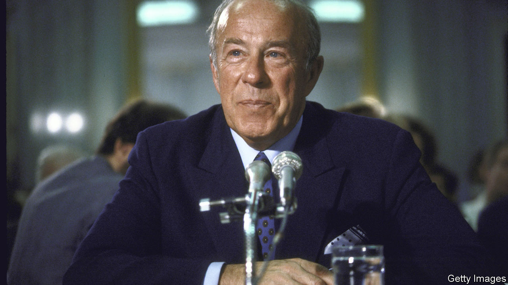

###### The secret persuader

# George Shultz died on February 6th 

##### The man who negotiated the first arms-control treaty was 100 

 

> Feb 27th 2021 


“I  RESENT THAT,” said the secretary of state. He spoke firmly. He had been accused in the Senate Foreign Relations Committee in 1986 of “lack of moral backbone” on economic sanctions against South Africa. “I hate to hear a senator of the United States calling for violence,” he told his young haranguer. “You may kick me around as secretary of state, but I’m a taxpayer.”


Members of the committee laughed out loud—with him, and against their fellow senator. George Shultz might be in the dock, but for all his free-market rigour, forged in the Chicago School, he was too experienced and too reasonable to be hectored by Joe Biden of Delaware. As they argued (not for the last time), he was serving in his fourth cabinet post under his second Republican president. Even after his retirement every president, treasury secretary and secretary of state, Republican or Democrat, sought his counsel. In 2021 Mr Biden wished he could do the same. 


Attacking Mr Shultz on race was anyway unwise. He was staunch on equality. Once, in Fort Worth, he neatly outwitted a hotel receptionist who insisted she had no room for the black colleague travelling with him. “Give him the other bed in my room,” he said. (His friend was quickly “found” a room after all.) As Richard Nixon’s secretary of labour, he marshalled his full federal power to force the Pennsylvania construction unions to take black members.


From Labour he had gone to the Office of Management and Budget, and from there to the Treasury Department, where he had some sharp run-ins with the president. First, he was pressed to use Treasury tax officials to harass names on Nixon’s “enemies list”—and refused. Then, after the president in 1973 reimposed price controls, he resigned. Along the way he chaired a White House oil-import task-force that warned, all too correctly, of rocketing oil prices as America’s production fell.


He remained a mystery to many. Across any table his face was expressionless and his gaze steely, the very image of the duty-driven marine he was. At home or in the office, at Stanford or the Hoover Institution, he listened more than he spoke. If what he heard was flabby, he would give a monosyllable back. Never acid, just brief. And only then: “Now, let’s discuss that.”


Yet underneath was a man of style and fun, who never denied that he had a tiger tattoo on his backside, and who danced with Ginger Rogers at a White House dinner (she told him she thought she was dancing with Fred). He and Australia’s prime minister, Bob Hawke, would party together. Year after year the likes of Helmut Schmidt and Lee Kuan Yew beat a path to his Stanford door, where he would cook them his “patented style” scrambled eggs for breakfast. In Washington his key friend was his tennis partner Kay Graham, owner of the Washington Post. After the grief of losing his first wife, Obie, to cancer, his second wife, Charlotte, was California’s official social whirlwind. Life with her was a ball.


When, in 1982, Nancy Reagan persuaded her husband to jettison the turbulent Al Haig from State and “call George” (who, since 1974, had been running Bechtel in California and teaching at Stanford) he was dining quietly in north London. Obie spent the evening in silent tears at the thought of leaving Stanford. He felt daunted himself. Foreign policy-making as such was not his beat, and just then it was a war zone of clashing opinions: especially on whether the icy stand-off between America and the Soviet Union could ever be unfrozen.


Unlike the CIA and Caspar Weinberger’s hawks at Defence, he believed that the Russians could be talked to and could even change. It would take time, but he was now applying his intensely deliberative method to foreign policy. At their twice-weekly private chats he steered Ronald Reagan round to his opinion. America should show its strength, and Nato’s cohesion, most forcefully by deploying Pershing ballistic missiles in Germany in 1983. Then it could simply outspend the Soviet Union on defence. At the same time it should slowly negotiate to get rid of nuclear weapons entirely. Trust was the key, a condition he prized over every other. (Among many reasons, he admired Reagan because he was as good as his word.) He talked every week, secretly, to the Soviet ambassador in Washington, and warmed at once to Mikhail Gorbachev as a man with whom he could have a proper, quiet conversation—one that led, in 1987, to a ban on intermediate-range nuclear forces. (Mr Gorbachev too became one of the friends who visited him at Stanford, declaring: “I see, George, that you have chosen to live in paradise.”) By the time he left State, he felt the cold war was all over bar the shouting. The fall of the Berlin Wall followed quickly, and with it Soviet suzerainty over half of Europe.


Back in California, he turned his full attention to the seeding and improving of government. He collected talent for Hoover, drawing Henry Kissinger from Washington, General Jim Mattis from the marines, and Milton and Rose Friedman, the stars of free-market teaching, from Chicago. From Stanford he sent to Washington Condoleezza Rice, the first black woman to be national security adviser and later secretary of state, and two young-Turk disciples, Mike Boskin and John Taylor, to drive economic policy. Meanwhile he lured the mighty to Hoover for his two-day think-sessions (and Charlotte’s parties), inviting them to grapple with his two final intellectual challenges: how to eliminate nuclear weapons, and how to build coherent governance as voices multiplied. After trust, his coin of the realm, cohesion mattered most. 


And he just liked reaching out. Back in 1980, over a Stanford weekend, he implacably persuaded the editor of The Economist that an ex-B-movie actor and right-wing ex-governor of California would make a great president. The resulting endorsement seemed so improbable that—at a tight moment in the race against Jimmy Carter—it was cited by hundreds of media outlets across the United States. When he was elected, Reagan invited the editor to supper to thank him. The editor accepted, but told him over coffee: “You should really be thanking George Shultz.” ■

