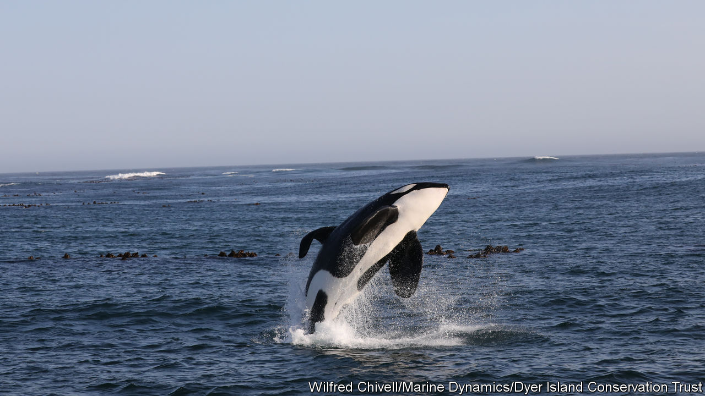

###### Meet the new boss

# Killer whales v great white sharks 

##### What happens when one apex predator elbows out another 

 

> Feb 24th 2021 


IT USED TO be a common sight. These days it is rare. On January 18th members of Shark Spotters, a South African charity, recorded a juvenile great white shark as it breached close to Strandfontein, a seaside resort in False Bay, not far from Cape Town. It was the first such sighting in over a year.


Great whites used to be common off the Cape of Good Hope. Tourists would pile into boats to watch them, with the bravest descending into underwater steel cages to see the sharks up close. But in recent years the great whites have been driven out by two representatives of an equally fearsome species—the killer whale. It is a striking example of a truism that is often under-appreciated in discussions about conservation: ecosystems can be changeable things.


The revolution began in 2015 at Castle Rock, a nearby marine reserve. In November of that year, divers tipped off marine biologists about dead broadnose sevengill sharks scattered across the ocean floor. All had suffered the same cause of death, namely a vertical gash down the abdomen. “It was like the opening scene of a horror film,” says Leigh de Necker, a researcher who works at the Two Oceans Aquarium in Cape Town. “Only the sharks’ livers had been removed.”


That precision led the researchers to wonder whether local fisherman might be to blame. But following a dive of their own, some different suspects hove into view. Two male killer whales surfaced to investigate the researchers’ vessel. Later post-mortems showed the sharks’ pectoral fins stamped with tooth marks. “The killer whales must have each grabbed one pectoral fin and pulled, until the sharks tore down the middle,” says Ms de Necker.


Killer whales are not unknown in the waters off the Cape. But they usually prey on other cetaceans, especially the dolphins that frequent the coast in the southern hemisphere's summer. The new pair—named "Port" and "Starboard" for their dorsal fins, which flop distinctively to different sides—bore a greater resemblance to the killer whales seen off British Columbia, which are known to hunt both large schools of fish and sharks.


The killer whales soon moved on to bigger prey. On May 3rd 2017 a great white carcass washed up on a beach in nearby Gansbaai. Once again, it sported a gash in its abdomen under the right pectoral fin, through which its liver had been removed. The following day a second great white washed ashore. It was followed, two days later, by a third. Autopsies revealed similar injuries. By July 4th six great whites had washed up dead, at times that matched sightings of Port and Starboard nearby.


Sightings of great white sharks began dropping sharply. Between 2005 and 2015 Shark Spotters averaged 205 sightings a year off the beaches in False Bay. By 2018 that number had dropped to around 50. In 2020 not a single great white was seen. “There is only one variable that has substantially changed in that time,” says Sarah Waries, Shark Spotters’ boss. “That is the arrival of Port and Starboard.”


The changes at the top of the food web have rippled through the rest of the ecosystem. Among the great white's favourite prey were Cape and Brown fur seals. In the great white's absence other species, including sevengills and bronze whaler sharks, appear to be moving in to fill its niche. But seal populations are rising. That, in turn, is making life hard for African penguins, an endangered species which the seals like to eat. Since other marine species are much harder to monitor, other changes are likely going unnoticed.


Humans are part of the ecosystem, too. The killer whales may simply be opportunists that have found an ecological niche more comfortable than their previous one. But some marine biologists wonder if their arrival is a consequence of human activity—specifically heavy fishing farther offshore, which may have depleted the sorts of fish the killer whales are more accustomed to eating. Whether or not they are the cause, the humans—like the penguins—are feeling the consequences. Cape Town’s once-thriving shark-tourism industry used to host thrill-seekers, wildlife enthusiasts and documentary film-makers. Today it is struggling. ■

