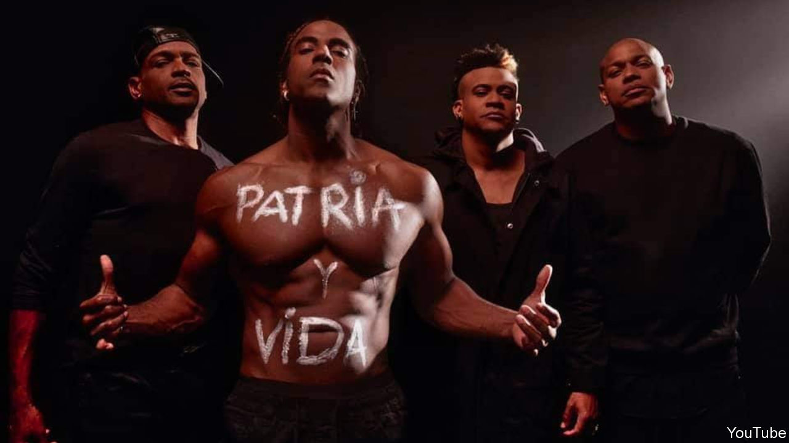

###### Reggaeton rebellion

# A music video rattles Cuba’s regime 

##### Rappers rewrite the revolutionary slogan 

 

> Feb 27th 2021 


IN 2018 GENTE DE ZONA, a Cuban reggaeton band based in Miami, performed in Havana for 350,000 people. The duo’s front man, Alexander Delgado, encouraged them to clap for Cuba’s newly inaugurated president, Miguel Díaz-Canel, who was in the audience. Cuban-American musicians and politicians in Miami were furious.


Now it is Mr Díaz-Canel’s turn to fume. In a video released on February 16th, Gente de Zona join other famous reggaetoneros, rappers and hip-hop artists to perform “Patria y Vida” (“Homeland and Life”), which excoriates Cuba’s communist dictatorship and makes common cause with dissidents. Alongside Yotuel and Descemer Bueno, Grammy-winners who live outside Cuba but have strong links to it, Gente de Zona liken the 62 years since Cuba’s revolution to a game of dominoes—a popular pastime on the island—that is blocked, so no player can take a turn. The track’s title is a take-off of the revolutionary slogan “Patria o Muerte” (“Homeland or Death”), which appears on billboards and banknotes.


The performers, some shirtless and body-painted, sing about Cuba’s food shortages, families unable to see their relatives abroad and Cuba’s weak peso. Maykel Osorbo and El Funky, who belong to Movimiento San Isidro, a growing movement of dissident artists and intellectuals in Havana, make a daring appearance to rap about the government’s repression of the group. In November security agents dressed as health-care workers arrested 15 of its members, who were on a hunger strike to protest against the arrest of a rapper accused of disrespecting authority. The video shows clips of demonstrations by supporters of the movement. It has been watched nearly 2m times on YouTube, mostly outside Cuba. On the island, where access to the internet is expensive, people are sharing it on USB sticks.


The regime is rattled. Two days after the song’s release, Cuban state television interrupted normal prime-time programming to encourage citizens to clap and sing the national anthem, “La Bayamesa”, which proclaims that “to die for one’s country is to live”. State newspapers and websites published long articles claiming that anti-Cuban mafias in Miami were manipulating the musicians. “Patria y Vida” is musical propaganda that can never replace the revolutionary slogan, declared Abel Prieto Jiménez, president of Casa de las Américas, a cultural institution. The spirit of Patria o Muerte led to the development of Soberana 02, a Cuban covid-19 vaccine that is expected to enter phase-three trials in March, said Eduardo Martínez, president of BioCubaFarma, the jab’s inventor. Perhaps the tagline Patria y Vida seemed too obvious for a vaccine.


In this life-and-death struggle, death still has the upper hand. A member of the San Isidro movement painted Patria y Vida on his house in Havana. On February 22nd a pro-government mob covered the graffito with officially approved slogans in electric blue. Although the government recently expanded the number of trades open to self-employed entrepreneurs, art, music and intellectual rumination are still subject to strict state control. The domino-players are becoming more animated, but the game remains frozen. ■

