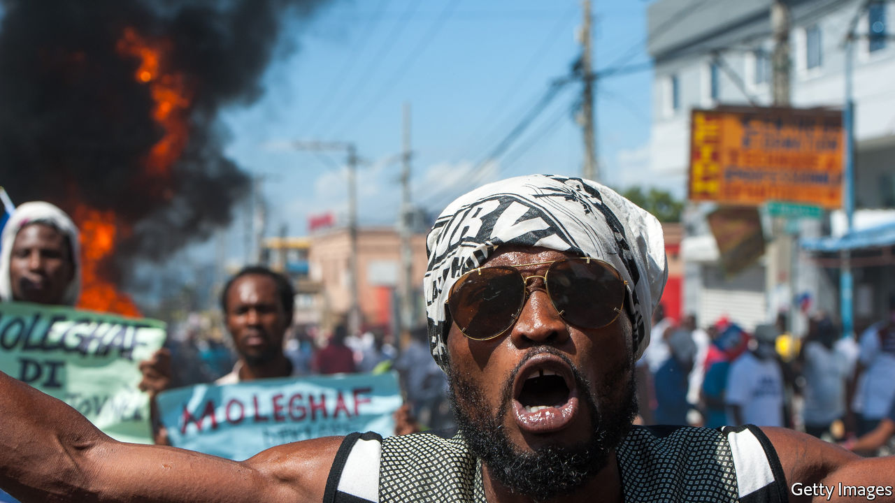
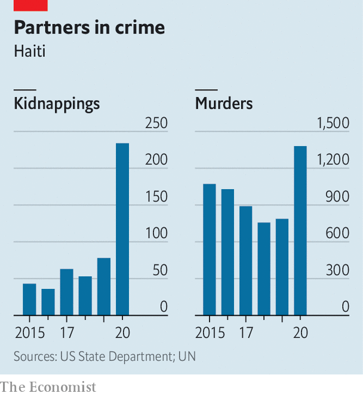

###### Hoping against hope

# Can Haiti rid itself of Jovenel Moïse? 

##### The country needs a new leader. It is not clear when it will get one 

 

> Feb 27th 2021 


NIXON BOUMBA used to take morning jogs through the prosperous Pacot neighbourhood in Port-au-Prince, Haiti’s capital. The area has steep, tree-lined streets and “gingerbread” houses. (These wooden-lattice structures, built in the early 1900s, survived a devastating earthquake in 2010.) But Mr Boumba does not jog any more. A surge of kidnappings and murders has kept him indoors (see chart). The gangs responsible for those crimes often have links to the police and politicians. The true number of attacks is probably far higher than the reported one. “We are living in a time of terror,” says Mr Boumba, a human-rights activist.


Terror has not stopped him from joining protests against President Jovenel Moïse. These have been going on for more than two years, provoked initially by economic hardship and allegations of corruption. Since January this year crime, and the fear that Mr Moïse is setting himself up as a dictator, have sparked a new wave. The protesters contend that his term ended on February 7th this year. They want his immediate departure.


Those making that demand are divided into two broad groups. They are as much at odds with each other as they are with the president. Pro-democracy idealists like Mr Boumba are mainly activists, professionals and young people. They have no political parties or elected officials. The established opposition is led by former office-holders. Some have been allies of Mr Moïse. They join the anti-Moïse agitation, but are regarded by the idealists as being just as corrupt as the regime. They seem interested only in taking power, says Rosy Auguste Ducena, a human-rights lawyer. Haiti’s hope lies with the new generation. But the three-way fight makes it harder to predict who will steer the country’s future.

 


Mr Moïse, a former plantation manager who calls himself “Banana Man”, exemplifies the failings of recent Haitian presidents and has added to them. Popular anger flared in 2017 after reports, which he denies, that he had stolen millions of dollars from PetroCaribe, an aid programme paid for by Venezuela. These allegations, plus fuel shortages and high inflation, provoked demonstrations in the following year. In 2019 a peyi lock (internal blockade) closed schools and businesses for months. This deepened a recession that had already started. Today 35% of Haitians are suffering acute hunger, according to the UN. In the pandemic’s first wave around 120,000 Haitians lost jobs in the neighbouring Dominican Republic, increasing the misery.


Mr Moïse’s alleged use of violence against opponents and his flouting of democratic norms remind some people of “Baby Doc” Duvalier, Haiti’s last despot, who was overthrown in 1986. His foes accuse him of overseeing Haiti’s “gangsterisation”. Politicians have long had links to criminals, but Mr Moïse’s seem especially strong, his critics say. (He denies these claims.) In January Jimmy “Barbecue” Cherizier, a former police officer and leader of G9 and Family, an alliance of gangs, led a march in defence of Mr Moïse. Last year the United States imposed sanctions on Mr Cherizier and on two senior officials in Mr Moïse’s administration for planning a massacre by police of at least 71 people in 2018 in La Saline, in Port-au-Prince. The motives are unclear. Many gangs are widely thought to have agreements with the government to silence opposition neighbourhoods in exchange for impunity. Mr Moïse disputes this, too.


Within the government, it is Mr Moïse himself who enforces compliance. In the absence of a functioning legislature, he has been ruling by decree since January 2020. Legislative elections were not held on schedule because parliament failed to pass an election law during the peyi lock. Just ten members of the 30-seat Senate still hold electoral mandates and none of the lower house’s 119 seats is occupied. There are no serving mayors.


In November Mr Moïse created an intelligence agency, answerable only to him, and widened the definition of terrorism to include acts of dissent. In February this year he forced three Supreme Court judges into early retirement and ordered the arrest of a score of his most prominent detractors, accusing them of plotting a coup.


Mr Moïse disputes the opposition’s claim that his term is already up. He took office in 2017, after a re-run of a flawed election held two years earlier. His five-year term thus expires next February, he reasons. His foes doubt he will leave office even then. In a referendum to be held in April, Mr Moïse plans to seek approval for amendments he wants to make to the constitution. These might include giving him the right to run for a second term. Under the constitution, a president cannot exercise powers that he introduces into it. Mr Moïse’s foes doubt that he will comply.


Beyond a shared desire to remove him from power, the two currents of opposition have little in common. Established opposition politicians are as bad as the president, activists say. Youri Latortue, a former senator who is one of the old opposition’s most prominent figures, was once described in an American diplomatic cable as one of the most “brazenly corrupt of leading politicians”. (He denies this characterisation.) Some opposition leaders are backed by anti-government gangs, which differ little from pro-government outfits.


The new opposition aspires to reinvent politics. “This is about starting something new, this is about respect of human rights, this is about organising fair and credible elections,” says Emmanuela Douyon, a leader of Nou Pap Dòmi (We Will Not Sleep), a social movement. She and her allies know that will require ending the political instability that began with Duvalier’s fall. Election results since then have nearly always been disputed by the loser. The opposition almost invariably demands the president’s resignation, says Michael Deibert, author of two books on Haiti. In 2016 less than 20% of eligible voters turned out in the election that Mr Moïse won. The constitution, adopted in 1987, has never commanded broad respect. A Creole saying holds that “constitutions are paper, but bayonets are steel”, says Robert Fatton of the University of Virginia. The opposition acknowledges the need for constitutional change, but does not want Mr Moïse leading it.


Civil-society groups are planning to hold a huge march on February 28th. After that, the route is uncertain. Most opposition forces want to install a transitional government as a prelude to holding free elections. But they disagree on how to do that. The old guard want a forcibly retired judge, Joseph Mécène Jean-Louis, to be interim president. Activist groups want someone outside the political elite in that job. That person may be in power for a while. The interim authority would need to take substantial time to prepare for credible elections, says Ms Douyon. Meanwhile, she hopes, new politicians will offer themselves as candidates, drawing new voters.


Unifying opposition groups behind a single proposal will be difficult. Obtaining Mr Moïse’s co-operation will be impossible. The United States, which is home to 1m Haitians whose remittances sustain Haiti’s economy, fears that his immediate removal would lead to chaos. On February 5th the State Department backed Mr Moïse’s claim that his term ends in 2022, a decision that outraged protesters, who remember with bitterness the United States’ repeated military interventions in Haiti. It is “putting their foot on the scales”, argues Brian Concannon, a long-time Haiti-watcher. Many Haitians, including some in the diaspora, suspect that the United States doubts that Haiti can handle democracy.


The activists confronting Mr Moïse hope to prove that view wrong. Haiti’s well-wishers are cautious. “Maybe we’ve reached the bottom, and the only way is up,” speculates Mr Fatton, who was born in Haiti. But he has thought that before. ■

