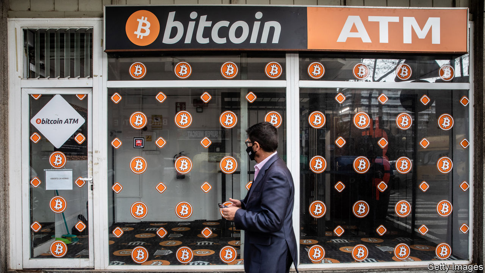
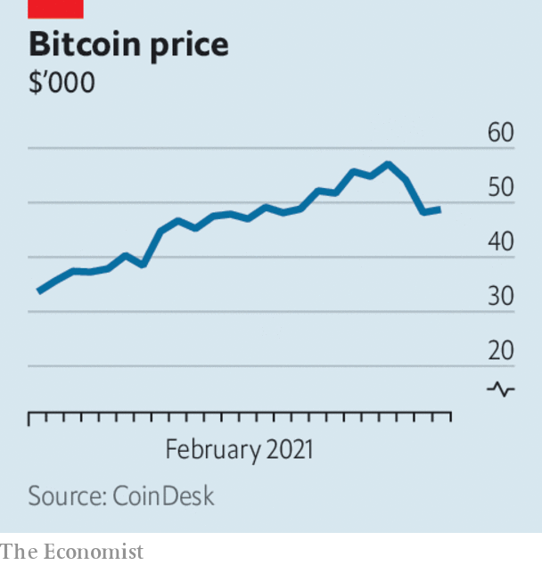

###### 

# Business this week 

#####  

 

> Feb 27th 2021 

 


Bitcoin speculators had a jittery week, pushing the cryptocurrency down from a record high. Janet Yellen, America’s treasury secretary, added to the febrile atmosphere when she described bitcoin as an “extremely inefficient way of conducting transactions”. Meanwhile, New York state’s attorney-general branded Tether “fraudulent” and barred the stablecoin—commonly used to buy bitcoin on crypto-exchanges—from trading in New York. Tether long claimed its coin was backed one-to-one by the dollar, but New York concluded that it overstated its reserves and is “a stablecoin without stability”. See .


The knock to bitcoin was a factor behind a sharp fall in Tesla’s share price. The electric-car maker made a controversial $1.5bn investment in bitcoin recently. Shortly before the cryptocurrency plunged, Elon Musk mused that its price seemed “too high”. The drop in Tesla’s stock at one point wiped $15bn off his fortune. See .


Oil prices extended their gains, with Brent crude closing above $67 a barrel for the first time in 13 months. The covid-19 vaccine roll-out in rich countries has given rise to hope among traders that as restrictions are phased out, the demand for energy will increase.


The Australian government passed its new law requiring social-media companies to pay for news content, after reaching an agreement with Facebook in their dispute over the legislation. Facebook had blocked all Australian news publications from its platform, claiming the law punished it for content shared by users. The government amended its bill, adding arbitration measures that would set the fees social-media firms have to pay for news if they cannot reach commercial deals with publishers. Facebook is to pay $1bn to Australian media firms over the next three years, a similar amount to that pledged by Google. See .


Britain’s unemployment rate hit 5.1%, the highest level in five years. The rate is expected to increase over the coming months, once the government starts withdrawing its support for workers on furlough.


Boeing 777 wide-bodied jets powered by Pratt &amp; Whitney engines were grounded, after an engine failed on a United Airlines plane shortly after it took off from Denver airport. Boeing’s 737 MAX fleet has only recently been allowed to fly again following a 20-month grounding. See .

Updating a contract


Britain’s Supreme Court delivered a final blow to Uber in a long legal battle with its drivers about their employment status in the country, when it ruled that the drivers are “workers” and not “independent third-party contractors”, and are therefore entitled to benefits and protections. Britain is a big market for Uber, but it has come up against many regulatory problems, especially in London. The implications of the court’s decision could put the brakes on Britain’s wider carefree gig economy, too.


Kevin Sneader was ousted as the head of McKinsey according to reports, following a rebellion against his effort to implement greater scrutiny of its work amid a number of missteps. It is the first time in decades that a global head of the management consultancy has not been given a second term by the firm’s partners, who get to choose their leader. See .


Wells Fargo struck a deal to sell its asset-management arm to two private-equity firms for $2.1bn. It is part of an ongoing overhaul of the bank under Charles Scharf, who took over as chief executive in 2019.


The pain the pandemic has caused the hotel industry was laid bare in annual earnings from Accor, Europe’s largest chain and owner of the Ibis and Novotel brands, and InterContinental, which counts the Crowne Plaza and Holiday Inn names among its assets. Both stressed that they expect bookings to pick up in the second half of the year. The chief executive of InterContinental described soothsayers’ predictions about the end of business travel as “highly exaggerated”, though he recognised it would take a while for it to bounce back.

Seeking some fun in the sun


The great British holidaymaker may give the travel industry reason to cheer. Britons flocked to hotel and airline websites after the government published its road map out of lockdown, which lifts all restrictions by midsummer. Tui reported that summer bookings were up by 500% overnight. EasyJet said flight bookings took off by 337% compared with a week earlier.


Travelling farther afield, the first pictures were beamed back from NASA’s Perseverance rover on Mars, following a successful touchdown. The cold planet has become a hot destination of late for spacecraft. The United Arab Emirates’ Hope orbiter has been circling since early February, as has China’s Tianwen-1; its rover will attempt to touch down in the next few months. See .

