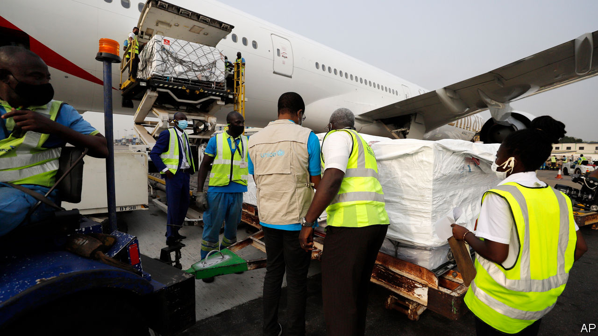
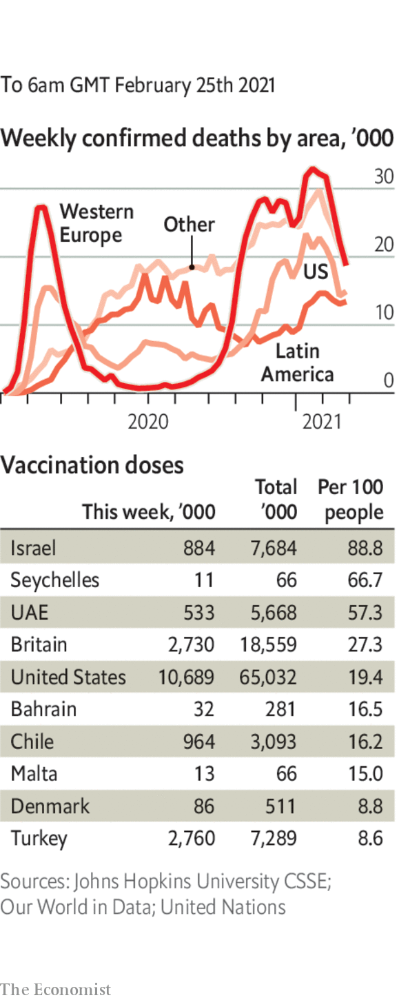

###### 

# Politics this week 

#####  

 

> Feb 27th 2021 


Ghana became the first country to receive vaccine for covid-19 through the COVAX programme, a global coalition which distributes free doses to poor countries and is backed by the World Health Organisation. Ghana’s shots were provided by India. Amid calls to speed up the delivery of jabs outside the rich world, the leaders of the G7 pledged more funding for COVAX. America is providing $4bn, but it is resisting calls to share its stock of vaccine, until it finishes its inoculation drive. See .


Italy’s ambassador to the Democratic Republic of Congo was shot dead near Goma after a UN food convoy he was travelling in was ambushed.


Mohamed Bazoum, a former foreign minister, was declared the winner of a presidential election in Niger.


The UN’s nuclear watchdog reached a deal with Iran that will allow it to continue monitoring the country’s nuclear activities for up to three months. Iran, however, said it would no longer allow snap inspections by monitors and would restrict their access to data at nuclear sites, violations of the deal it signed with world powers in 2015.


A German court sentenced a former Syrian intelligence officer to four-and-a-half years in jail for helping to arrest protesters who were then tortured and murdered by the regime of Bashar al-Assad. It was the first of what could be a series of trials of Syrian officials under the principle of “universal jurisdiction”, which allows serious atrocities to be tried anywhere.


Israel said it would begin easing lockdown restrictions. Over half its population has received at least one shot of vaccine. An inoculation drive began in the Gaza Strip, following the delivery of doses donated by Russia and the United Arab Emirates.


Boris Johnson, Britain’s prime minister, presented his “one-way” road map out of England’s lockdown, listing five dates on which rules may ease if the pandemic recedes. A poll found just half of English people thought it likely that all lockdown restrictions would be lifted by June 21st, the government’s target date. See .


Police in Georgia arrested the country’s main opposition leader, Nika Melia, in a raid on his party’s headquarters. Earlier, the country’s prime minister resigned over the order to arrest Mr Melia, which was issued by a court. He warned that it would destabilise the country.


A leaked email showed that Amnesty International, a watchdog, had decided that Alexei Navalny was not, after all, a “prisoner of conscience”. The Russian opposition leader has just been locked up on bogus charges. However, several years ago he made some xenophobic comments. Amnesty’s much-derided move followed a lavishly funded Kremlin campaign to discredit Mr Navalny.


Armenia’s army told the government to resign. The prime minister, Nikol Pashinyan, called it an “attempted coup” and urged his supporters to take to the streets. Armenia was humiliated in a recent war with Azerbaijan.


Hong Kong's government said it planned to require candidates for election to the territory's political bodies to swear an oath of loyalty to the government in Beijing. A senior official, Erick Tsang, said the aim was to ensure that “patriots govern Hong Kong”. Patriotism, he said, involves acceptance of Communist Party rule over China. See .


China revealed that four of its soldiers were killed during a border clash with Indian soldiers last June. An Indian army officer said more than 60 Chinese were killed or injured in the incident. India has acknowledged that 20 of its soldiers died.


Protests against the recent military coup gathered pace in Myanmar. A general strike was widely observed. Many civil servants have stopped work, disrupting government services. The army has arrested at least 720 politicians and activists and is threatening protesters with long prison sentences.


Nepal's Supreme Court ruled that parliament, which the government dissolved in December, must reconvene. The prime minister, K.P. Sharma Oli, had ordered the dissolution to paper over divisions within his coalition. He will now probably face a no-confidence vote.


Brazil’s president, Jair Bolsonaro, sacked the head of Petrobras, the state oil company, and replaced him with a general. His apparent intention was to placate lorry drivers, who are threatening to strike over rising fuel prices. Brazil’s stockmarket fell, reflecting fears that Mr Bolsonaro will adopt more populist economic policies.


Colombia’s “special jurisdiction for peace”, founded after the end of a 52-year war between the state and the FARC guerrilla group, said that the army murdered at least 6,402 people from 2002 to 2008 whom it had falsely claimed were combatants. The killings, known as the “false-positives scandal”, were supposed to show that the army was succeeding in the war.


Nicaragua created a ministry for outer space. It will be run by the army, which does not have a space programme.

Coronavirus briefs

 


America passed the tally of 500,000 deaths. Life expectancy at birth in the United States fell by a whole year in the first six months of 2020, to 77.8 years. See .


Johnson &amp; Johnson’s one-shot vaccine is very effective in combating severe infections, including in South Africa, according to America’s drug administration.


Studies in England, Israel and Scotland found that mass-vaccination programmes are reducing deaths, transmissions and hospitalisations.


A survey by Nigeria’s disease-control centre suggested that cumulative cases in the country are in the millions, and not the 150,000-odd that have been officially recorded.


The World Bank threatened to suspend financing for Lebanon’s vaccination drive, after it was reported that politicians got jabs while priority groups were still waiting.

