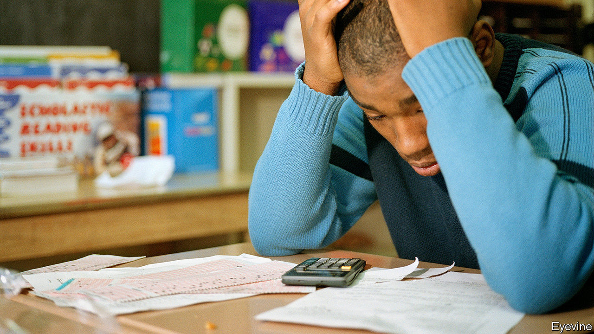

###### Stop writing

# Covid-19 has boosted the campaign against exams in American schools 

##### The virus has suspended standardised tests, delighting those who would scrap or reform them 

 

> Feb 27th 2021 


TO THE DELIGHT of campaigners and some parents, covid-19 has put a wrench in school exams. With support from the Trump administration, all 50 states cancelled accountability testing last March, freeing 51m public-school pupils from the annual rigmarole. The SATs optional essay-writing section and separate subject tests were discontinued this year. The Programme for International Student Assessment, an exam measuring the academic performance of OECD member countries, and the National Assessment of Educational Progress (NAEP), a nationwide exam administered to a sample of American pupils, have been postponed too. With opposition building for years against standardised testing in public schools, could this be the end?


On February 22nd the Biden administration said exams had to take place, but that the results would not be used to grade schools. Ordinarily the federal government obliges states to hold schools accountable for their pupils’ test scores. Schools with poor results may see their budgets reduced, as part of that exchange of exam results for dollars. Some states and districts have used results to close schools and fire teachers. Teachers in tough places often think this is unfair. And covid-19 has strengthened the point that much of what goes into a test score is, frankly, well beyond the control of teachers.


Abandoning testing could be disastrous, warns the Fordham Institute, a think-tank, in a recent report. Cancelling tests again would make it hard to know how schools fared during the pandemic. “I would personally be in favour of more effort to get as many kids as possible tested, so that we know what is going on,” explains Cory Koedel, who co-wrote the report. “I think some kids are actually probably doing OK. And some kids are doing really terrible. And I don’t think we know exactly who’s who.” Others disagree. Derek Briggs of the University of Colorado Boulder’s School of Education questions the benefit of testing students during these trying times. “Isn’t it reasonable to assume that every student probably has had a suboptimal learning experience?…All students are going to need some serious help over the next year to make up for what’s been a pretty tough year and a half,” he says.


That thought delights those parents and teachers who have been waging war against standardised exams for years. The Opt Out movement gained national attention in 2015 when New York State participation dropped by 20 percentage points because families refused the exams. Thirteen states received warning letters from the Obama administration for failing to test at least 95% of pupils that same year. The activists in the Opt Out movement want to see others held responsible for student learning, not just teachers. “The notion that we can ascertain…the extent to which [pupils are] doing poorly as a function of what’s happening in schools, as opposed to everything else that’s going on in their lives right now is absurd,” says Daniel Koretz of Harvard’s School of Education.


One compromise would be for a representative sample of children to sit the tests. One group could be selected to take maths and American history, while another group took English and science. Each group would take two exams, the burden of testing would be reduced, but schools and the government would gain reliable information on four subjects, at least. ■


Dig deeper


All our stories relating to the pandemic and the vaccines can be found on our . You can also listen to , our new podcast on the race between injections and infections, and find trackers showing ,  and the virus’s spread across  and .

