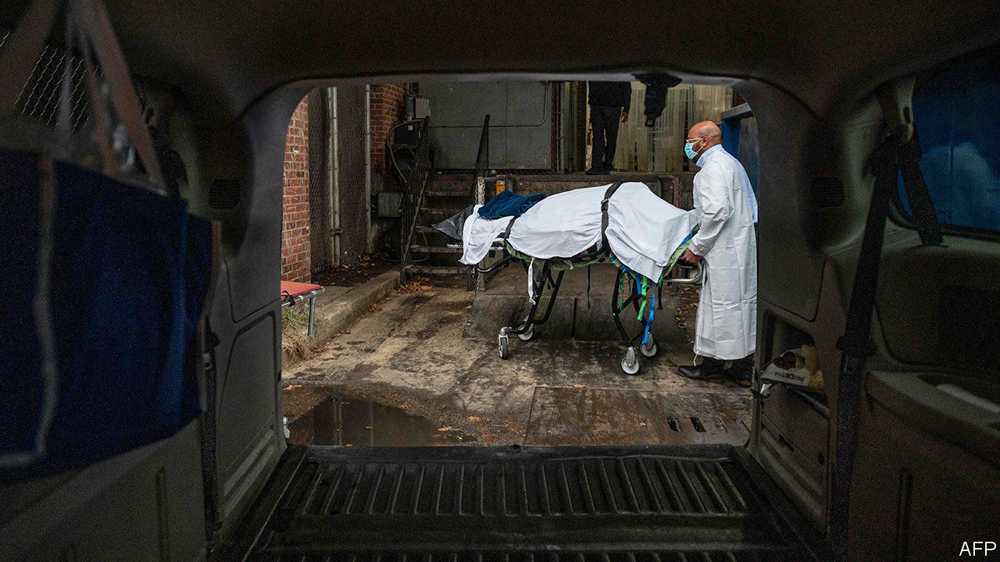
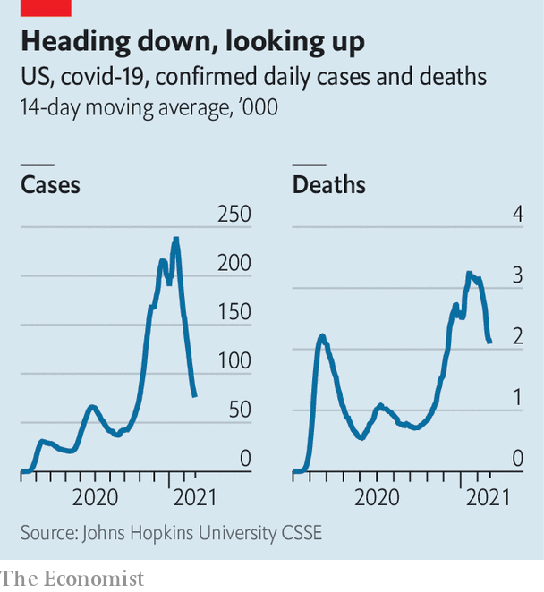

###### Covid-19

# Now America has passed 500,000 deaths, what next? 

##### There are plenty of reasons to be hopeful. But the virus is not beaten yet 

 

> Feb 27th 2021 


IN A SENSE 500,000 is just a very big number. It is not even accurate, given that perhaps 100,000 American deaths from covid-19 were never counted. And yet every one of them was someone: grandpas and great aunts, old friends and new, neighbours and workmates. Many of them died alone.


Grief was President Joe Biden’s theme at the White House on February 22nd, as he remembered 500,071 Americans lost to the pandemic. Warning his compatriots against seeing “each life as a statistic or a blur”, he said that there was “nothing ordinary about them”. At five o’clock the Stars and Stripes was lowered to half-mast for five days while 500 votive candles flickered on the steps of the South Portico.


In just over a year the pandemic has killed Americans on the scale of a world war or a decades-long catastrophe, like the opioid crisis (see chart). In absolute terms no country begins to compare—Brazil, which comes next, has yet to log its 250,000th death. In relative terms America has recorded 151 deaths per 100,000, fewer than Belgium, Britain, Italy and Portugal, but among the most severe.

 


One question is what went wrong. America is home to many of the best medical scientists and, in the Centres for Disease Control and Prevention, the world’s most respected public-health institute. 


Politics was partly to blame. Donald Trump helped turn science and public health into an arena for partisan combat. Successes, like the Warp Speed vaccine programme, were undermined by failures such as making face-masks a test of political affiliation. But politics alone cannot explain why fatalities in America are so much higher than in Japan, a country full of old people that has registered only six deaths per 100,000. A full accounting will also have to weigh other factors, including diabetes, obesity, care for the elderly, public health in an unequal country and genetics (see ).


The other question is whether the worst is past. Recorded infections in America are 70% below their peak in January. Deaths, which lag behind by a few weeks, are down by about 40%. The rapid fall is hard to grasp because it is governed by the same exponential dynamics as the sudden climb in cases in November. Again, complex factors are at play, including immunity acquired through infection and vaccination, and the precautions people take as infections mount, both because they are required to and because they sense that it is not the best time to need a bed in hospital.


There are reasons for optimism. Vaccination of the most vulnerable is proceeding apace, which should further reduce deaths and hospital admissions. The emptying of intensive-care wards will lower fatalities among those who do succumb. Treatments are improving. But the virus is not done yet. Modelling for the San Diego area, reported recently in the journal Science, suggested that, owing to the spread of a more transmissible variant of the virus first found in Britain, immediately relaxing social distancing there would cause a vicious surge in cases.■


Dig deeper


All our stories relating to the pandemic and the vaccines can be found on our . You can also listen to , our new podcast on the race between injections and infections, and find trackers showing ,  and the virus’s spread across  and .

