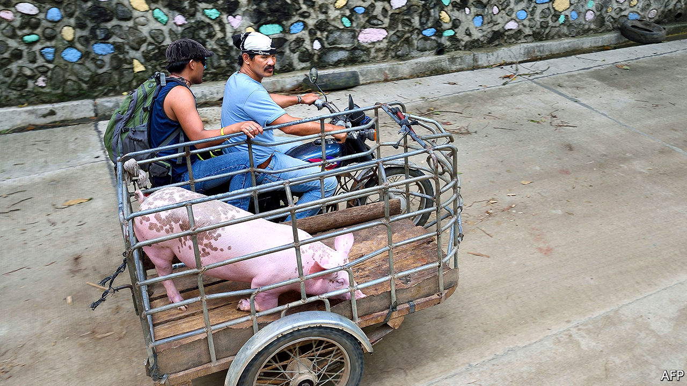

###### Pig mistake

# Retailers in the Philippines have been refusing to sell pork 

##### They consider the government’s price cap unworkable 

 

> Mar 6th 2021 


LAST MONTH retailers in Manila went on a two-week “pork holiday”. That was not a fad diet, nor even a few days off scarfing sausage and bacon. They simply refused to sell the stuff, in protest at a price cap imposed by presidential decree.


Pork is a staple in the Philippines. Prices have recently soared, to over 400 pesos ($8.25) for a kilo of pork belly, more than double the norm. The rise has spurred inflation, which hit a two-year high in January of 4.2%. Both houses of Congress have held hearings on rising food prices. On February 1st the harried government instituted a 60-day price cap on pork of 300 pesos a kilo in Manila. It swiftly vanished from shops’ shelves, and a pricey black market emerged.


The fiasco stems from an outbreak of African swine fever, a contagious disease that is deadly to pigs, which arrived in the archipelago in 2019. It has devastated the backyard farms where most pigs in the Philippines are raised. Last year the government launched the Integrated National Swine Production Initiatives for Recovery and Expansion, or INSPIRE, to replace the animals that had expired. It will provide piglets and feed to farmers—but it will be some time before those little piggies get to market.


In the meantime, the authorities have promised to “go after” smugglers and profiteers. They have shipped trucks of live hogs to the capital from islands to the south, notes Fermin Diaz, the editor of Livestock and Meat Business, or LaMB, magazine. And they have increased quotas for certain categories of imports.


What the government has not yet done is reduce tariffs on imported pork. The lowest rate is 30%, which works against the expansion of the quota, says Ramon Clarete of Building Safe Agricultural Food Enterprises, or B-SAFE. He suggests a uniform 5% rate—something the government is said to be considering, but that farmers oppose. If pork adobo (slathered in a sweet, vinegary sauce), is to remain the national dish, the taxman will need to go the whole hog.

