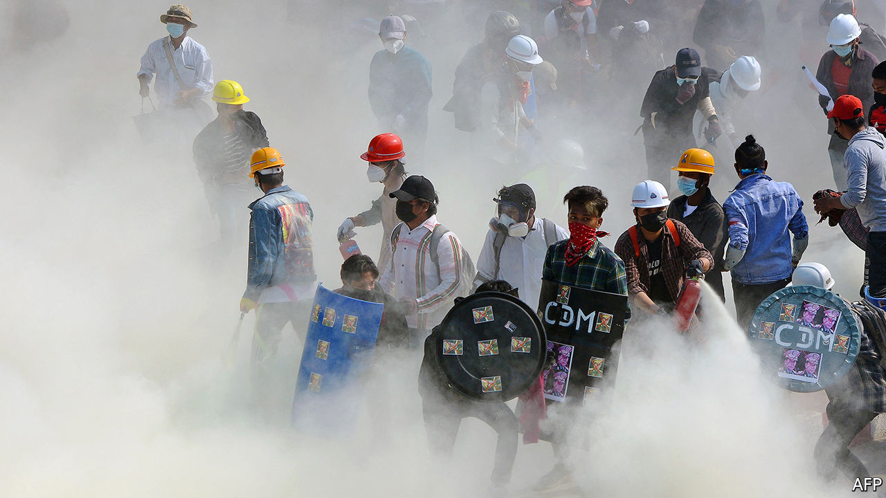

###### The shooting starts

# The army’s response to protests in Myanmar is growing more brutal 

##### But popular resistance to the recent military coup remains strong 

 

> Mar 6th 2021 


GONE IS THE carnival atmosphere that pervaded Yangon, Myanmar’s biggest city, during the first weeks of protests against a military coup on February 1st. The protesters have exchanged tongue-in-cheek placards for home-made shields and tiaras for hard hats, the better to fend off the increasingly violent security forces. For most of the past month the army—notorious for violently crushing past democracy movements—had responded with water cannons, rubber bullets and tear gas, but nothing worse. But as the demonstrations have worn on, the junta has grown more vicious. Soldiers have begun firing live ammunition into crowds. On March 3rd, the bloodiest day so far, at least 38 people were killed, according to a UN official. 


The army, or Tatmadaw as it is known, clearly hopes the shootings will persuade the protesters to go home. Some have: the streets are no longer thronged with hundreds of thousands of them, as they were in late February, but they are far from empty. Young protesters are just as likely to be demonstrating as older, hardened activists. A giggly 17-year-old university student who was consumed by her passion for K-pop until the coup says she became a “little bit afraid” after her friend was tear-gassed. Despite the danger, she insists, “I have to protest.” She is still doing so most days. 


Opponents of the coup are steeling themselves for a long fight. They hope that, by convincing enough workers to go on strike, they can throw a spanner in the machinery of state. Teachers, doctors, railway workers, truck drivers, customs agents and other bureaucrats have not been going into work for weeks. Neither have many employees at banks, whether state-owned or private. As a result, most of the country’s 2,000 private bank branches have been shut since February 8th, according to Frontier, a local magazine. Banks have also placed caps on withdrawals from cash machines or suspended them altogether.


There are other signs of economic distress. Over the past month the kyat has depreciated by at least 6.5% against the dollar. Imports of fuel, on which Myanmar relies heavily, have stalled. The World Bank is no longer disbursing funds for $350m-worth of projects. Some foreign investors, especially those in business with conglomerates owned by the army, are packing their bags. Lim Kaling, a Singaporean businessman, is relinquishing his stake in a tobacco company in which one such conglomerate, Myanmar Economic Holdings Limited (MEHL), is the biggest shareholder. Kirin, a Japanese brewer, has also withdrawn from a joint venture with MEHL. 


The civil-disobedience movement “is starting to paralyse the state”, writes Richard Horsey of the International Crisis Group, a think-tank. There are doubts about how long the generals will be able to pay wages. This is particularly embarrassing since Min Aung Hlaing, the commander-in-chief, would like to be seen as a better manager of the economy than Aung San Suu Kyi, the civilian leader he overthrew. The longer the strike goes on, the more inept and weak he looks.


The rising death toll is not the only sign of the junta’s mounting frustration. The security services have been trying to force workers back to their jobs. In mid-February, notes Anthony Davis, a security analyst, the exhausted police were reinforced by light-infantry divisions—battle-hardened troops typically dispatched to fight ethnic militias on the country’s periphery. One of the units in question was implicated in a pogrom in 2017 against the Rohingya, a persecuted ethnic minority. There have been reports of violent rampages through neighbourhoods with especially persistent demonstrations. The army is also using surveillance drones and shutting off the internet between 1am and 9am.


The top brass may be hoping that the damage to the economy cuts both ways. Some participants in the civil-disobedience movement are running out of money. Htay Win, who owns a roadside tea shop in Yangon, has almost no savings left. His business was closed for seven months last year, owing to covid-19 restrictions. He closed it again in early February so that he could join the protests. Given his parlous finances, he thinks he will have to re-open soon, at least part-time.


Many other demonstrators have no intention of giving up the fight. Almost a month after the start of the civil-disobedience movement, the number of people participating continues to grow, says Moe Thuzar of ISEAS, a think-tank in Singapore. Aye Thidar Oo, a typist at a municipal office in Yangon, declares, “It might be a year, two years, ten years: I will carry on striking until the end.” Nann Yin Htwe, a worker at a garment factory, says her salary was so low that she has nothing to lose by striking. She is receiving food and contributions to her rent from several of the many grassroots aid organisations that have sprung up to help striking workers. She is proud to be out of work, she says.


Mr Davis suspects there are hardliners in the army who advocate swifter, harsher repression to stem the erosion of morale. Two previous agitations for democracy, in 1988 and 2007, ended in massacres. In both cases the army hesitated for over a month before crushing the protests. ■

