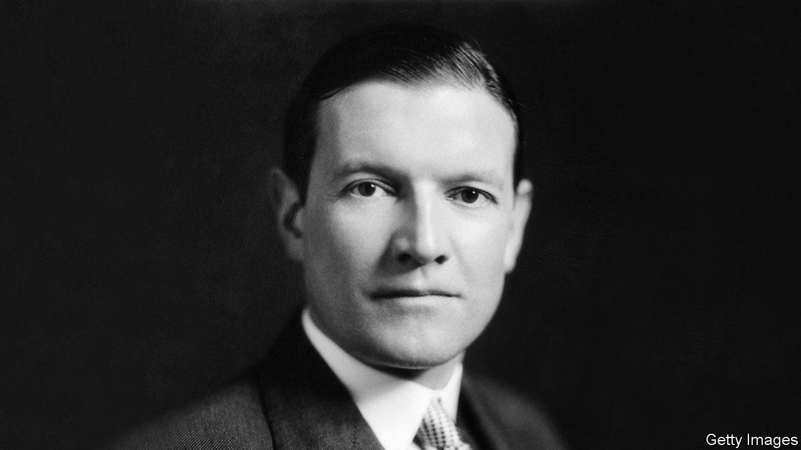

###### Nazi parties

# A chronicle of the British establishment’s flirtation with Hitler 

##### An unexpurgated edition of Chips Channon’s diaries has finally been published 

 

> Mar 4th 2021 


IN AUGUST 1936 Henry “Chips” Channon and his wife, Lady Honor Guinness, went on an official visit to the Berlin Olympic games along with a bunch of other British grandees. They had a simply wonderful time. They didn’t pull off the ultimate social coup of having dinner with Hitler—the closest they got to the Führer was when he visited the Olympic stadium and “one felt as if one was in the presence of some semi-divine creature”. But the rest of the Nazi elite went out of their way to entertain the visiting Britons.


Hermann Göring was “flirtatious”, “gay” and “charming”. Frau Göring was “tall”, “handsome” and “nearly naked”. The Ribbentrops’ party lent “dignity to the new regime”. Just as thrilling was the spectacle of daily life. Everyone kept raising their arms and saying “Heil Hitler!” in a thoroughly captivating manner. And what about the rumours of terrible things going on in labour camps? Being a responsible MP Chips took a trip to one such camp and was impressed by what he saw. It looked “tidy, even gay”. The purpose of the camps was to wipe out “class feeling”—not something Chips was normally in favour of getting rid of—and such feeling “has become practically non-existent in Germany”. Chips concluded that “England could learn many a lesson from Nazi Germany”.


These vignettes are all taken from the first of what promises to be three volumes of the diaries of Channon, a rich American who climbed the heights of British society in the 1920s and 1930s and also became a Tory MP. The diaries were first published in 1967 in heavily redacted form: many of the subjects of Chips’s indiscretions were still alive and able to sue. Simon Heffer, a journalist and historian, has taken advantage of the passage of time to produce an unexpurgated edition.


The diaries do more than merely titillate. They demonstrate just how many members of the British upper classes were either infatuated with Hitler or at least regarded him as a useful bulwark against Bolshevism. In one entry, Chips described a visit by his uncle-by-marriage, Lord Halifax, a Tory grandee, to Germany to go fox-hunting with the leading Nazis. “He liked all the Nazi leaders, even Goebbels!…He thinks the regime fantastic, perhaps too fantastic to take seriously. But he is v glad that he went and thinks nothing but good can come of it”. (Halifax almost messed up the occasion by mistaking Hitler for a footman.) The diaries also provide yet more evidence of the vital role Winston Churchill played in saving Britain from the pro-Hitler sympathies of the upper classes and the cynical calculations of appeasing politicians. “That…farceur would stir up trouble anywhere”, Chips wrote, “luckily for England and the peace of Europe he has no following whatsoever in the House [of Commons]”.


It is becoming fashionable on the left to dismiss Churchill as a racist. A vandal spray-painted the word on his statue in Parliament Square. During a recent discussion on “Churchill and race” held in, of all places, Churchill College, Cambridge, panellists competed to denounce him as a racist, white supremacist and eugenicist. Churchill certainly said some repugnant things about race. But by the standards of his time he was relatively moderate: he was much less enthusiastic about eugenics, for example, than many heroes of the left such as Sidney and Beatrice Webb, H.G. Wells, George Bernard Shaw and Harold Laski. He was mercifully free of the common vice of anti-Semitism. And as Channon’s diaries make clear he led the battle against the worst racist in history at a time when other members of his party and class thought labour camps wonderful innovations. ■

