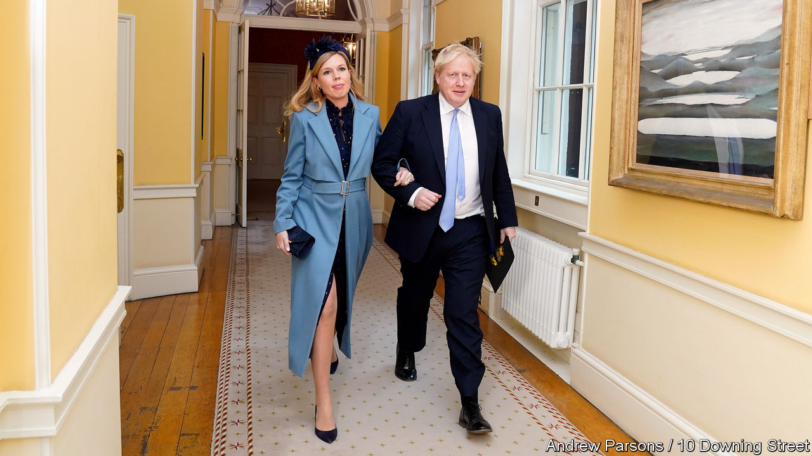

###### Downing Street

# Carrie Symonds has grand plans for Downing Street 

##### Boris Johnson’s fiancée is keen to spruce up the prime-ministerial abode 

 

> Mar 6th 2021 


ON FEBRUARY 14th 1962, the American people fell in love with the White House. Jackie Kennedy, with some help from CBS News, guided 56m of them through her renovations. The tour made such good television that the first lady won an Emmy; and, as Mrs Kennedy intended, the smartened-up White House came to embody the grandeur of American democracy.


Carrie Symonds, Boris Johnson’s fiancee, may have a harder time getting the British public to buy into her plan for sprucing up the prime ministerial quarters in Downing Street. According to a profile in Tatler magazine, she wants to get rid of the “John Lewis furniture nightmare”—a dangerous reference to the department store that is a mecca to the British middle classes—and replace it with something more upmarket. The Daily Mail reports that the plan is to pay for the refurbishment through a privately funded charity.


The plan would offer a solution to a particular problem. Number 10 is a venue for hosting world leaders but prime ministers get only £30,000 a year from the public purse for redecorations, and a parliamentary expenses scandal over claims for duck-houses and moat-cleaning 12 years ago means that Britons are hawk-eyed when it comes to their politicians’ expenses. Angela Rayner, Labour’s deputy leader, was derided this week when it emerged she had the audacity to claim expenses for Apple AirPods and an iPad. Britons would rather their prime ministers lived in a hovel and their MPs communicate by carrier pigeon than pay for such extravagances as curtains and computers from the public purse.


An alternative would be for Mr Johnson to follow the example of Barack Obama and Donald Trump, who reportedly paid for $1.5m and $1.75m of refurbishments respectively out of their own pockets. That is unlikely to happen. Mr Johnson’s salary, at £160,000, is modest for a world leader, and with a couple of divorces behind him and at least six children, he has a lot of mouths to feed. In the year before he took the current job he earned £829,255, mostly from writing. He had a contract for a book on Shakespeare, which was due to be published last April, four years late; but even the famously productive prime minister has presumably had little time recently to devote to the Bard. Mr Johnson’s publishers are evidently taking a realistic view of his attitude to deadlines, for Amazon now gives its publication date as 2035.

