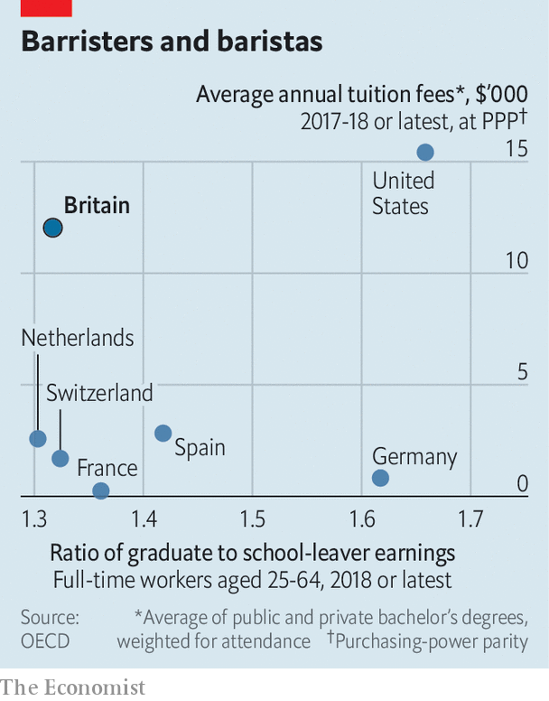

###### Bottom of the class

# English higher education’s value-for-money problem 

##### High fees and living away from home are a bad combination in a pandemic 

 

> Mar 4th 2021 


OVER THE past year rent strikes have swept British universities, and even a pandemic hasn’t stopped the finest traditions of student protest. A building has been occupied, barricades stormed and manifestos drawn up. The short-term aim is “a few quid in a student’s pocket,” campaigners say, with many currently paying to rent empty dorms. The grander aim, though, is “resistance to marketisation of both universities and, more importantly for the working classes, housing.”


Left-wing activists instinctively dislike the market; many other students simply feel they get a rough deal from it. On March 8th a small number will return to in-person teaching, with more to follow after the Easter break, a year after the disruption started. They are not a happy bunch. A recent survey by Yonder, a pollster formerly known as Populus, finds that just 36% of British students believe they get value for money. Of the 21 countries polled on behalf of Chegg, an ed-tech firm, only South Koreans feel they get a worse deal.


In Scotland tuition is free and in Northern Ireland it is heavily subsidised but elsewhere students face some of the highest sticker prices in the world. Most of those in England pay £9,250 ($12,900) a year for tuition. Since four-fifths of British students leave home to study, their living costs are high, too. Many do not foresee a strong return on their investment. Graduates in Britain enjoy relatively low wage premiums (see chart), and the Institute for Fiscal Studies, a think-tank, has found that a fifth of them would have been richer ten years after leaving university had they skipped the experience altogether.

 


In reality, this is more of a problem for the state than those at university. Students receive generous loans to cover tuition, which are not repaid until the recipient earns more than £26,575, with any remaining sum written off after 30 years—something which will soon become costlier still if student numbers rise as suggested by demographic trends. At the moment, only a fifth are expected to repay in full. Yet perceptions matter and graduates still face what are, in effect, higher tax rates, which can endure for most of their careers.


The pandemic has left students paying just as much for a worse time. Some have wrangled a rent cut from universities, aided by strikes. Private landlords have been less forthcoming. When it comes to fees, the government is “ducking the problem,” says a vice-chancellor. It shows little sign of giving into appeals for refunds; simply directing students to an independent adjudicator if they feel their teaching hasn’t been up to scratch. Nor are universities willing to take the financial hit refunds imply—after all, nearly half of their income comes from student fees. ■

