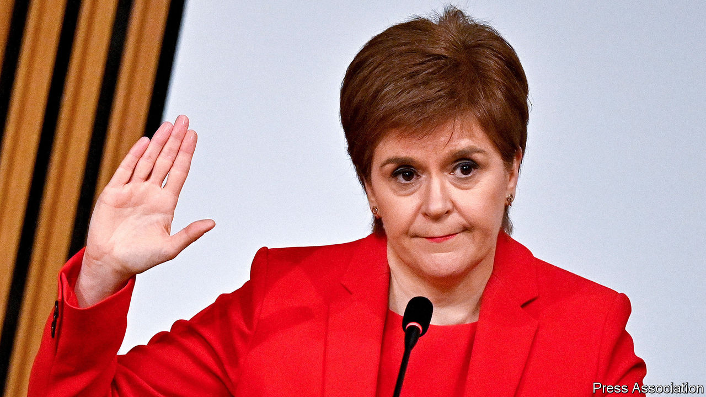

###### He said, she said

# Nicola Sturgeon is a little sorry for the Alex Salmond debacle 

##### The leader of the SNP gives evidence to lawmakers 

 

> Mar 4th 2021 


“THERE’S something going on. I can’t prove it, but I can smell it,” said Gordon Jackson QC, as he concluded the defence of Alex Salmond last March. Mr Salmond, the former first minister of Scotland, was on trial for 13 charges of sexual assault, including an attempted rape, against nine women. Mr Salmond, his lawyer conceded, could be a “bad boy”, but the allegations of criminality were the product of a “murky, murky world” of Holyrood intrigue. Mr Salmond was cleared by the jury. The previous year, he had overturned an internal Scottish government probe into claims by two women, after a judge found procedural errors left the process “tainted by apparent bias”.


The smell lingers, and the proof remains elusive. On March 3rd Nicola Sturgeon, Mr Salmond’s successor, gave evidence for eight hours to a committee of the Scottish government investigating her role in the affair. She faces three broad charges. The most serious, and least credible, is Mr Salmond’s claim that he is a victim of a “malicious and concerted” plot by Ms Sturgeon’s inner circle to send him to jail. The others are more damaging: that she misled the Scottish Parliament about her knowledge of the allegations against Mr Salmond, and that her government wasted public money by pushing on with contesting the judicial review when her lawyers regarded the case as unwinnable.


The inquiry has revealed flaws in Ms Sturgeon’s government, including a dangerous blurring of the lines between party business, government work and the prosecutor’s office. But her performance revealed the rhetorical dexterity that has kept her at the top of Scottish politics since becoming Mr Salmond’s deputy in 2004.


She apologised profusely for the original botched probe. The legal advice on whether to push on was more nuanced than had been portrayed, she said. An out-of-court settlement, for which Mr Salmond had begged in text messages, would have been improper. She shared lawmakers’ frustration at delays in producing documents and wished “her memory was more vivid” of certain meetings. The suggestion of collusion with the police was “stretching the credulity of the most devout conspiracy theorists”. But this was about him, not her. Mr Salmond was a “man I had revered since I was 20 years old”. He had confessed to “deeply inappropriate behaviour”. She regretted that he had no regrets.


The Scottish Conservatives are planning a vote of no confidence in Ms Sturgeon, although no date is yet fixed. She is likely to survive. Her Scottish National Party is on track for a majority in the Scottish election in May, which it hopes will open the door to an independence referendum; even her bitterest internal critics will not jeopardise the “project”. The outcome may hinge on the votes of pro-independence Green MSPs, who under Scotland’s two-vote electoral system risk being punished if they bring Ms Sturgeon down.


Focus groups are said to be sympathetic to her defence: that in the wake of the #MeToo movement, when complaints were raised, her government threw the book at her former mentor. “As first minister I refused to follow the age-old pattern of allowing a powerful man to use his status and connections to get what he wants,” she said. Her main regret, really, was that its aim was off. ■

