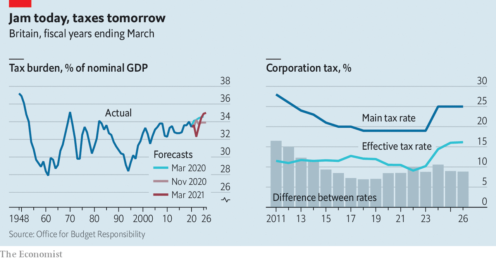

###### The British budget

# Rishi Sunak’s budget offers big giveaways for business 

##### ...but promises big tax rises later 

 

> Mar 6th 2021 


RARELY HAS supposedly bitter medicine tasted so sweet. For weeks, the Treasury has been briefing journalists that Rishi Sunak, the chancellor, was set to “level with the people” and embark on a programme of tax rises to repair the public finances. This, it turned out, was expectations management: the budget, delivered on March 3rd, was loaded with sugar. The nastier stuff has been pushed back by at least two years.


The explanation lay in the forecasts which the Office for Budget Responsibility (OBR), the government’s fiscal watchdog, publishes with the budget. A lot has changed since it released its previous set in November. A spike in covid-19 cases in December and January prompted a stringent third lockdown, which depressed expected growth further in 2021. Lower growth this year means an even larger bounce-back in 2022. The OBR now reckons that the economy will grow by 4% in 2021, down from 5.5% in the previous forecast, but then motor forward by 7.3% in 2022, the fastest rise in eight decades.


This year’s difficult start means that government schemes to keep people solvent are being extended. The Coronavirus Job Retention Scheme, under which the government pays 80% of the wages of furloughed employees, was due to end in April. It will now stay until September. Grants and cheap loans to firms have been rolled forward too, as have lower levels of value-added tax for hospitality businesses. Spending has been increased by almost £35bn ($49bn) and taxes cut by £24bn in the coming financial year. Taken together, these measures represent a giveaway worth some 3% of GDP.


Every budget must contain a surprise for the chancellor to unveil. The uncertainty after the Brexit referendum in 2016, followed by the pandemic, has depressed business investment. So the centrepiece of Mr Sunak’s stimulus was the “super-deduction”, which will allow companies to set 130% of the value of new investment in plant and equipment against their taxable income for two years from April. The government is hoping that this generous tax-break will spur firms to use some of the record-high cash piles on which they are sitting to bring forward capital spending. An IMF study of such incentive schemes last year found that they tend to produce a strong response from firms by increasing the rate of return on investment.


With the economy buoyed by more fiscal support, the OBR thinks the output gap (the difference between the current level of GDP and its potential) will close more rapidly over the next couple of years than it previously believed. In other words, the cyclical recovery in the economy should proceed at a faster clip than expected. 


A speedier cyclical pickup, though, will not eradicate the structural damage wrought by the pandemic. The OBR reckons that the economy will be 3% smaller in five years’ time than it would have been in a universe without a pandemic. That is bleaker than the Bank of England’s 1.75% estimate but broadly in line with Britain’s peers. The German budgetary authorities, for example, reckon their country will take a similar hit.


Lasting economic damage will have an impact on the public finances. Although Britain is currently operating without a formal set of fiscal rules, Mr Sunak has indicated that he wants to balance the current budget while borrowing for long-term investment. Given the blow to growth, achieving that aim means adopting some combination of spending cuts and tax rises once the immediate crisis has passed.


Mr Sunak has chosen to lean heavily on taxes, undoing the reductions in both personal and business tax that George Osborne introduced a decade ago. The tax take, as a share of the overall economy, is now forecast to rise to its highest level since the late 1960s (see chart).

 


Some of the extra revenue will come directly from workers. From 2023 income-tax thresholds will be frozen in cash terms, increasing the tax burden as incomes grow. But most of the cash will come from a striking rise in the headline rate of corporation tax, which is set to jump from 19% to 25% by 2023. According to the OBR, corporation-tax receipts will rise to their highest share of GDP since 1990 by 2024, though Mr Sunak was keen to emphasise that only around three in ten firms are likely to face the full increase. The small companies’ exemption will rise while firms will be able to carry forward up to three years of losses to reduce their bills. In effect, Mr Sunak is signalling a windfall tax on the companies that have done well during the pandemic, without calling it such.


Announcing the largest increases in corporation tax in a generation might have been expected to elicit more than a few groans from Britain’s boardrooms. Business trade bodies have, however, been quick to welcome the overall budget package. No doubt that is in part because of the large giveaways over the coming two years; but it is probably also because they suspect the tax rises will never fully materialise.


One reason to doubt that corporation tax will actually shoot up after 2023 is the cliff-edge that would create. The end of the super-deduction followed by an immediate and steep hike in headline rates would lead the effective rate, inclusive of allowances, to increase by more than five percentage points between 2023 and 2025 (see chart). That would be historically unusual. Mr Sunak will be hoping that as economic activity rebounds the OBR will revise down its view of the lasting hit from covid-19, and as the fiscal targets become easier to meet the mooted tax rises can then be scaled back. “It’s smart politics,” says a business leader. “If you say you are putting up tax by 6% and then only put it up by 3% everyone is grateful instead of horrified.”


Mr Sunak has announced a plan to balance the budget because that’s what Conservatives do. But it is far enough away that he has plenty of space for more giveaways in the future if the economy performs better than expected. ■

