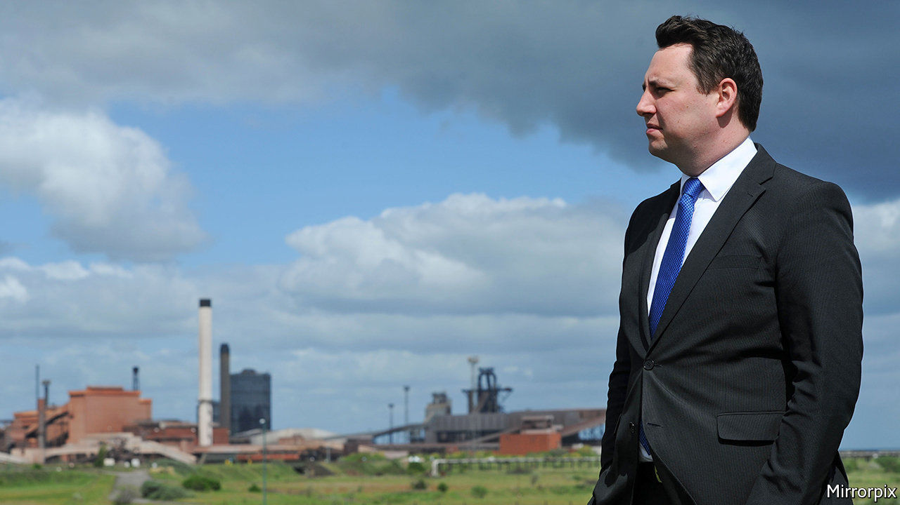
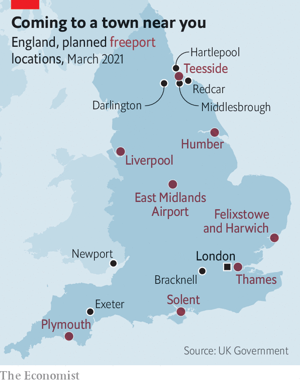

###### Levelling up

# Rishi Sunak’s plans for Darlington and Teesside 

##### What is good for north-east England is less good for Britain 

 

> Mar 4th 2021 


BEN HOUCHEN, the Tees Valley Mayor, is a persuasive man. For more than a year he lobbied the chancellor of the exchequer to create a low-tax “freeport” in his bailiwick and move lots of civil servants there. On the eve of Rishi Sunak’s budget speech he ratcheted up the rhetoric. “The question is,” he wrote in the Northern Echo, a local newspaper, “does Rishi have the strength to stand up to the Whitehall mandarins that have held our region back for so long?”


The answer is yes. On March 3rd Mr Sunak announced that many civil servants from business-oriented departments will move to a new campus in Darlington, west of Teesside. Mr Houchen will get his freeport—a zone where normal customs rules and tariffs are suspended. The mayor (a Conservative like the chancellor, who faces re-election in May) got everything he asked for. But what is good for Mr Houchen is less good for Britain.


Moving civil servants to an area tends to boost its economy. Giulia Faggio, an economist at City, University of London, estimates that a dispersal programme under the last Labour government created 11 private-sector jobs for every ten public-sector workers who arrived in an area. But the effect is localised. Private-sector employment swells in a small ring around the relocated civil servants and diminishes slightly a few miles away, as local businesses rush for the honeypot.

 


Darlington, which is already better-off than nearby towns and cities such as Hartlepool, Middlesbrough and Redcar, seems an odd place to favour. In 2018 its gross value-added per head (a measure of output) was 92% of the British average, compared with 72% for the north-east region as a whole. “It’s thriving already,” says Chris Hunter, the chief operating officer of Darlington Building Society. When not closed by covid, town-centre shops sell Farrow &amp; Ball paint and expensive bicycles. Tess Wheeler, who used to work in the local steelworks, guesses that a middle-class Londoner posted to the town will find it “quaint”. It may owe its good fortune in part to its status as a Tory marginal; out of the 56 constituencies that will benefit from the first tranche of money from a “towns fund”, 47 are held by the Conservatives.


The civil servants may not want to move. In 2003 the Meteorological Office managed to relocate 82% of its staff from Bracknell in the Thames Valley to Exeter. But a few years later only 10% of the Office for National Statistics’ London-based staff agreed to follow their employer to Newport in Wales. The difference was probably that the ONS’s economists had plenty of other buyers for their skills, whereas the weather forecasters did not. Ominously for Darlington, Treasury staff look more like the first group.


It is especially hard to winkle senior civil servants out of London. Two-thirds of them are based there, compared with only a fifth of the civil service overall. Philip Rycroft, who was permanent secretary of the Department for Exiting the EU until 2019, says they are glued to London because the politicians are there, and expect to be able to summon them quickly. Mr Sunak might occasionally work in Darlington—his constituency is nearby. But if the next chancellor is from Cornwall, the new campus will feel like a backwater.


The Teesside freeport should fare better, although not for the advertised reasons. Imports to freeports are tariff-free, so components can be brought in and assembled into something else; tariffs are then paid when the finished goods are brought into the country. That is a big advantage in high-tariff countries, but in Britain tariffs are generally low. Julia Magntorn Garrett and Peter Holmes, economists at the University of Sussex, have looked for tariff structures that might draw a company to a British freeport. They find only one big opportunity: dog food.


Yet Mr Sunak has thrown many bones to the eight freeports that will be created in England. They will be given breaks on business rates, property taxes and national insurance contributions. That should be enough to persuade some businesses to move there—if only from other parts of Britain. “We’ve got investors lined up,” promises Mr Houchen. It is, after all, not his job to worry about the country beyond the Tees Valley.■

