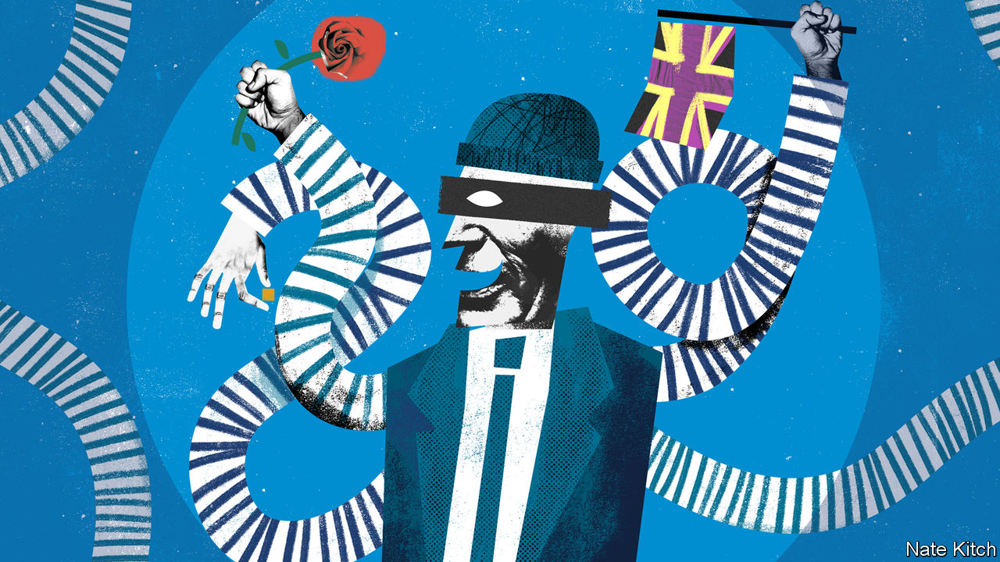

###### Bagehot

# The Tories are world-beaters when it comes to stealing ideas 

##### The tradition of Disraeli, Churchill and Blair lives on 

 

> Mar 4th 2021 


THE LIST of great prime ministers Britain never had includes Joseph Chamberlain, Rab Butler and Michael Heseltine. It does not include Ed Miliband. He flunked the big test that the British traditionally impose on anyone who aspires to the highest office in the land—retaining your dignity while eating a bacon sandwich. The one election campaign he fought as leader, in 2015, was a double disaster for his party: David Cameron won with a solid majority and a dejected Labour Party turned to Jeremy Corbyn for solace. Yet when it comes to public policy Mr Miliband continues to exercise considerable influence. We live in the age of Miliband more than we live in the age of Cameron or Corbyn.


In the budget on March 3rd Rishi Sunak, the chancellor, stole three of Mr Miliband’s ideas: gradually raising the corporation tax rate from 19% of profits to 25%, opening a national infrastructure bank in the provinces and encouraging corporate investment using tax incentives. This is not the first time Mr Sunak has followed Mr Miliband’s advice. He has already rewritten Treasury rules on the grounds that their narrow definition of costs and benefits favours investment in London.


The chancellor is only the latest in a succession of Tory smash-and-grab artists. Theresa May capped energy prices, clamped down on high-interest loans, tightened labour regulations and even flirted with the idea of putting workers on boards. Boris Johnson raised taxes on and restricted advertising of unhealthy food and drink, and renationalised Northern Rail; all policies that, as a right-wing newspaper columnist, he would have derided.


There is nothing unusual about politicians lifting ideas from other parties. Benjamin Disraeli’s winning formula was to find where the liberals were bathing and steal their clothes. He defined the ideal government as “Tory men and Whig measures”. Winston Churchill and Harold Macmillan repeated the trick by consolidating Labour’s welfare state; Tony Blair and Gordon Brown did the same with Margaret Thatcher’s free-market reforms. It is not the stealing that is interesting, but the choice of ideas and the dexterity with which the trick is performed.


The theft of Mr Miliband’s ideas is evidence of a leftward turn in British politics. Tory newspapers vilified Mr Miliband as “Red Ed” who wanted to turn Britain into the sort of left-wing utopia his Marxist father favoured. The Economist advised voting against him on the ground that he was too much of a risk. Mr Cameron saw his enthusiasm for capping energy prices as proof that he was living in a “Marxist universe”. Today Red Ed’s Marxist deviations have magically transformed into Boris’s common sense.


Mr Corbyn likes to take credit for this by insisting that he won the battle of ideas even if he lost the general election. But almost without exception the ideas that have survived from that era were generated by Mr Miliband and his leadership team. Mr Miliband is a policy wonk who, in the wake of the financial crisis, came to the conclusion that Labour needed to be bold. He surrounded himself with other wonks, notably Stewart Wood (who now sits in the House of Lords) and Torsten Bell (who now runs the Resolution Foundation, a think-tank). Their ideas initially found little purchase because the Conservatives did such a good job of blaming the financial crisis on Labour’s management of the public finances. A combination of austerity fatigue and covid-19 has created an appetite for state activism.


The great theft is also proof of something that is less comforting to the soft left: the Tories are the world’s most accomplished political thieves. They have not only merrily stolen economic policies from a man they dubbed a deranged Marxist but also stolen nationalist ideas from a man they vilified as a “swivel-eyed loon”, Nigel Farage. They have killed off his UK Independence Party (UKIP) by embracing a Brexit that leaves Britain outside the customs union and the internal market; something Mr Farage once regarded as too extreme. And they have kept ex-UKIP voters happy by giving prominent positions to hardliners such as Priti Patel, the home secretary, and Suella Braverman, the attorney-general.


Stealing ideas from both the left and the right has allowed the Tories to adjust to a new world in which the liberal verities that were at the heart of Mr Cameron’s premiership have lost their popularity. It has also allowed them to change their political coalition, losing some voters from the professional classes, but more than making up for their loss by increasing their support among the working classes, particularly in the north.


The biggest worry for the Tories is whether they have drifted too far in each direction. They are confronted with potential quarrels between the party’s core voters in the prosperous south and its new recruits in the north: will stockbrokers really pay higher taxes to improve rail transport to Grimsby? They are also plagued by contradictions between, say, spending more money on infrastructure and balancing the books, which Mr Sunak suggests he regards as a sacred Tory duty. The trouble with a melange of ideas—something old, something new, something borrowed, something red—is that they pull in opposite directions.

Appropriate appropriating


But you can have worse problems in a country that is recovering from a pandemic and heading towards a period of growth. Mr Johnson does not seem to worry much about logical contradictions: he would happily build a blue-red-green coalition so long as it kept him in power. And Mr Sunak is less concerned than he pretends to be: though he hints that he would love to return to the Conservative low-tax, small-state orthodoxy, he is happy to cast aside ideology for the time being. The party that really suffers from the Tories’ theft is Labour. It’s hard to decry everything a government does when it is implementing your ideas. The brilliance of the trick the Tories have pulled off is that it leaves Labour with nowhere to go. ■

