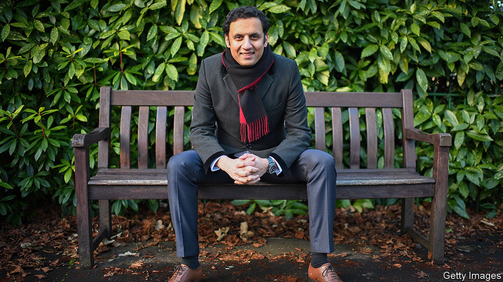
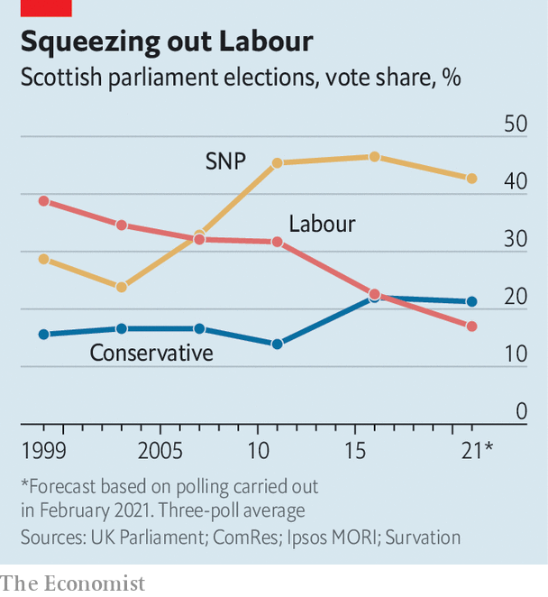

###### Stopping the rot

# The future of Britain rests on reviving the Scottish Labour Party 

##### A new leader seeks to reverse 20 years of decline 

 

> Mar 4th 2021 


NO PERCH OFFERS an insight into the health of a society like a dentist’s stool. As a young practitioner in Paisley, an old weaving town outside Glasgow once famed for its teardrop-patterned scarves, Anas Sarwar would from time to time be called upon to perform “full clearances” on patients in their late teens, and fit them with dentures. The problem was methadone, a heroin substitute prescribed to addicts which is both acidic and sticky “and would pretty much fry the dentition”. The regional health board has the highest drug death rate in Scotland, which in turn has the highest in Europe.


Alleviating such misery was the historic mission of the Labour Party in Scotland, which Mr Sarwar was elected to lead on February 27th. Towns like Paisley were its firmest strongholds, reliably returning Labour MPs since the war. At its zenith 20 years ago it ran Britain. Scots filled the Cabinet, in the form of Gordon Brown, Robin Cook, John Reid and Alistair Darling, and the ranks of advisers. In 1999, the party created Scotland’s devolved government, and then ran it. It was downhill from there. In 2007, the Scottish National Party took power in Edinburgh. In the 2015 general election, Labour was swept away in a nationalist surge, losing 40 of its 41 Westminster seats. Among them was Mr Sarwar’s in Glasgow Central, a seat previously held for 13 years by his father Mohammad (who now serves as Governor of Punjab, Pakistan’s most populous province). The party is now third in the Scottish Parliament, behind the Tories.


The biggest problem for Mr Sarwar, Labour’s seventh full-time leader in Scotland since 2007, is the constitutional cleavage. The independence referendum of 2014, in which Labour campaigned to keep the United Kingdom together, was a centrifuge. The nationalist vote has consolidated behind the SNP, and unionists behind Tories. Labour bled at both ends, just as the party split over Brexit in the rest of Britain.

 


A senior Tory compares Mr Sarwar favourably to Ruth Davidson, who revived the Scottish Conservatives. Like Sir Keir Starmer’s election to Labour’s leadership last year, it is a tack to the centre following the lacklustre tenure of Richard Leonard, who fired and then rehired Mr Sarwar to the shadow cabinet. “We didn’t join the Labour Party to be a protest movement,” says Mr Sarwar. An exodus of disgruntled Corbynistas helped him win.


Mr Sarwar’s first big test comes in the elections to the Scottish Parliament in May. Scottish voters say the constitution is the most important factor in determining their vote, before covid-19. “They are now polarised in their party choice between independents versus non-independents in a way they’ve not previously been to anything like the same extent in Scottish politics,” says John Curtice, professor of politics at the University of Strathclyde. That’s a problem for a party for whom “politics is about left versus right.”


Mr Sarwar, who as a dentist enjoyed soothing fearful patients, seeks a détente. “For ten years, we have had politicians who have presented binary choices to the public, and forced them to pick a side,” he says. The Scottish Parliament’s focus should be on the country’s recovery from covid-19, rather than a struggle to split from London. Labour is toying with ideas to revive devolution, which nationalists think inadequate and Tories regard as a failed strategy for quenching separatism. Mr Sarwar favours more powers for local authorities. Gordon Brown has called for Scotland to take a greater share of the powers previously wielded by Brussels, an overhauled House of Lords, and a new constitutional text declaring the “mission” of the UK’s four nations. Reforms must be bold, for Scots have little appetite for tinkering. In a three-way referendum, most would favour either independence or no change, while fewer than one in five would settle for more financial powers for Edinburgh, according to Panelbase, a pollster.


The party brand isn’t wrecked and can be saved, for Scottish Labour is the preferred second-choice of both Conservatives and nationalists. Whether Mr Sarwar succeeds may well determine the future of Britain. The party’s weakness produces a brutal feedback loop. If Scottish Labour cannot recover because of constitutional polarisation, it will be near-impossible for the Labour Party to win a majority in Britain. The Conservatives will continue to spook English voters with the prospect of a rickety Labour-SNP coalition, cementing their dominance south of the border. (In 2019, they ran ads featuring a tiny Jeremy Corbyn in Ms Sturgeon’s top pocket.) The SNP can continue to tell left-leaning Scots that the only alternative to perpetual Tory rule is independence. Conservatives know that the stalemate which has profited them handsomely is eroding the union. For it to survive, they must lose, now and again. ■

