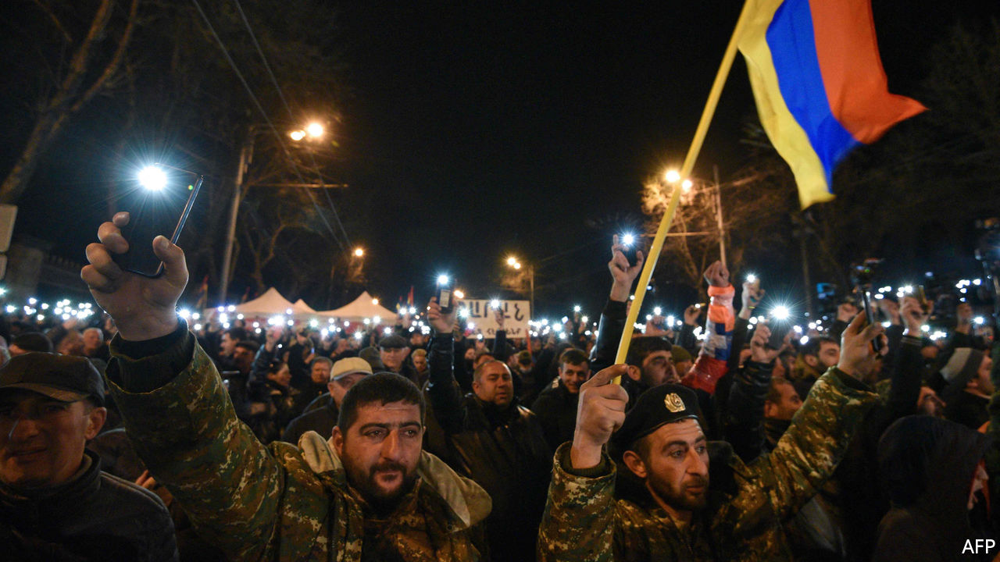

###### After the war

# Armenia’s army turns on its prime minister 

##### But he refuses to resign 

 

> Mar 4th 2021 


FOR A MAN in his own army’s cross-hairs, Nikol Pashinyan, the Armenian prime minister, seems unfazed. As long as the Armenian people have the final say, “there will be no coup,” he told The Economist this week. The only way out of the crisis consuming his country, he says, leads through the ballot box and early elections.


There are no tanks on the street in Yerevan. But Mr Pashinyan is fighting for his political life. On February 25th dozens of officers, including the country’s top soldier, Onik Gasparyan, demanded the prime minister’s resignation, accusing him of incompetence. Mr Pashinyan called this an attempted coup, refused to step down and ordered Mr Gasparyan to do so instead. (So far, he has not.)


Tensions in Armenia have been brewing since November, when Mr Pashinyan signed an armistice with Azerbaijan, ending a war over Nagorno-Karabakh, a separatist ethnic-Armenian enclave inside Azerbaijan. More than 6,000 people died in the fighting. Armenian defences were pummelled by Turkish drones and overrun by Azerbaijani ground forces. Under the ceasefire agreement, Armenia gave up control of swathes of land which it had captured around Karabakh three decades earlier. The enclave’s status remains unresolved. Some 2,000 Russian troops have been deployed there to keep the peace.


To many Armenians, persuaded by the army and the government that the fighting was going their way, the surrender came as a shock and a betrayal. Mr Pashinyan immediately came under fire. The opposition blamed him for provoking the war and losing the peace. Protesters stormed government buildings. The army (and the Kremlin) bristled after Mr Pashinyan claimed that Russia’s Iskander missiles, which Armenia used at least once during the war, had turned out to be duds. He backtracked after a phone call with Russia’s president, Vladimir Putin.


The protests have attracted no more than a few thousand people. But those who turn up seem to be spoiling for a fight. “Pashinyan sold out my homeland and my people,” says Hrachya Abramyan, a veteran of both Karabakh wars, at a rally in front of the parliament. “If he does not resign, we will grab him by the ears and throw him out like a dog.” The opposition parties have not warmed to an offer of snap elections, presumably because they continue to trail in the polls. Instead they propose a transitional government. Some appear on the verge of endorsing an actual coup. “I don’t like the idea,” says Davit Harutyunyan, a former minister. “But if I feel that without taking the next step we risk losing the country and civil war, then definitely.”


Mr Pashinyan, a former journalist, came to power in 2018, when exasperation with decades of cronyism overflowed into mass protests, bringing down the government of Serzh Sargsyan, his predecessor. Yet the tide that propelled Mr Pashinyan into power has ebbed. In elections two years ago, he won 70% of the vote. Today only 39% of Armenians want him in charge. He had already faced criticism for his handling of the economy and the covid-19 crisis. He has made no new friends by shrugging off the blame for the lost war.


Many see a Russian hand in the army’s move against Mr Pashinyan. Yet Russia may not want the Armenian leader gone, so much as tamed. Mr Pashinyan was once eager to loosen Armenia from Russia’s grip and to improve relations with Western powers. That is no longer possible. Hobbling from a lost war, squeezed between two old enemies and frustrated by Western inaction, Armenia now depends on Russia’s security guarantees more than ever, no matter who is in charge. ■

