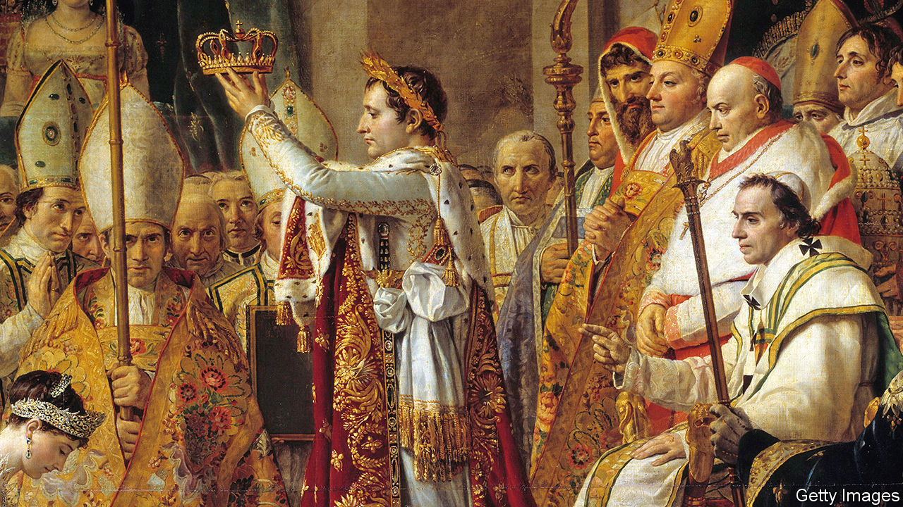

###### An emperor’s clothes

# Despot, genius or both? France argues about Napoleon 

##### As his bicentenary approaches, tempers rise 

 

> Mar 6th 2021 


TO SOME HE was a military genius, strategic mastermind and visionary leader who bequeathed to France a centralised modern administration and sense of gloire. To others he was a tyrant and a butcher who squandered French supremacy in Europe on the battlefield of Waterloo. Napoleon Bonaparte, who died in captivity on the British island of Saint Helena at the age of 51, has long inspired both admiration and distaste, even in France. Now, ahead of the bicentenary of his death on May 5th 1821, those rival passions have been revived.


Alexis Corbière, a deputy from Unsubmissive France, a left-wing party, declared: “It is not for the republic to celebrate its gravedigger.” On the right Jean-Louis Debré, formerly head of the constitutional council, said that “overdoing it” would be “a provocation”. The Black Lives Matter movement has emboldened those who reject any celebration of a leader who reintroduced slavery to the French West Indies in 1802. Nicolas Mayer-Rossignol, the Socialist mayor of Rouen, says he wants to replace the imposing bronze statue of the emperor on horseback that stands outside his Normandy town hall.


Yet the French also acknowledge that they owe much of their modern state, and its institutions, not to mention their country’s aspiration to grandeur, to the “little Corsican”. As first consul, Napoleon created the French legal code, the Bank of France, the administrative system of préfets, high-school lycées, the légion d’honneur and much more. In a poll in 2016 he was listed as the second-most-important Frenchman in history, after Charles de Gaulle. His red quartzite tomb in Les Invalides, lying in splendid isolation in a crypt beneath the dome, receives over a million visitors a year. This spring scores of new books are promised, says the Fondation Napoléon, as well as conferences and a big exhibition in Paris. “We have every reason to be proud of him,” said Patrice Gueniffey, a historian, who considers him a historical figure on a par with Alexander the Great or Julius Caesar (both of whom also killed a lot of people).


President Emmanuel Macron has not yet shown his hand. In 2005 Jacques Chirac, a Gaullist predecessor at the Elysée Palace, refused—amid protests at the time—to commemorate the bicentenary of Napoleon’s victory at Austerlitz. Talk shows have been debating what to do this year, and whether his legacy is damaging or beneficial for France. An adept of “en même temps”, or the improbable art of reconciling opposing views, Mr Macron has his work cut out.

