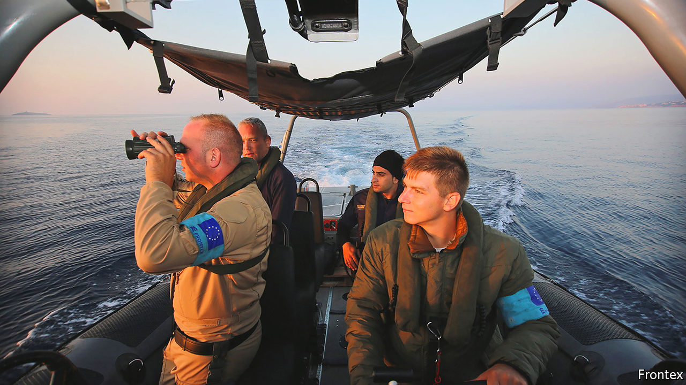

###### New kings of the wild frontier

# Frontex, the EU’s border force, swells in size 

##### And runs into trouble 

 

> Mar 3rd 2021 


FOR MOST of its history, the European Union commanded no troops. It was not that sort of outfit. The idea of gun-toting Euro-soldiers was more a Eurosceptic bogeyman than a serious scheme. Yet on January 11th the bloc tweeted proudly that “[f]or the first time, the European Union has its own uniformed service”. A video, set to rousing music, showed a blue-clad, side-capped guard with the insignia not of any member state, but of the star-circled flag of Europe—a member of the new standing corps of the European Border and Coast Guard Agency, more commonly known as Frontex. But if the agency’s rise exemplifies the union’s march towards something resembling a state, it also illustrates how unsteady, and occasionally ugly, that advance may be.


When the idea of a joint border force was first mooted around the turn of the millennium, EU member states balked at the idea. Many had just abolished their national currencies and adopted the euro; pooling yet more sovereignty in a highly sensitive area was a step too far. Frontex eventually came into being in 2004, with a tiny budget and meagre staff, after a surge of irregular migration into the Canary Islands. But it was the migration crisis of 2015 that would transform its fortunes.


Politicians, desperate to shore up their borders, shovelled money and power at Frontex. Its budget leapt from under €100m ($123m) in 2014 to €280m by 2017, reaching almost €400m last year. Under the EU’s budget for 2022-29, Frontex is due to get €5.6bn for the seven-year period—half of what it originally hoped for, but a tidy sum nonetheless. The agency has also been given the right to recruit personnel and buy equipment directly, rather than borrowing both from member states. Its standing corps is on track to grow to 6,500 staff this year, with the aim of reaching 10,000 by 2027.

 


Its existing guards have already fanned out across Europe’s land and sea borders, where their job is largely to reinforce and support national border forces. But they have also ventured farther afield. Frontex personnel have deployed to “pre-frontier” areas such as Albania and Montenegro, and civilian officials to Niger, Turkey, Senegal and Serbia, where they monitor migrant flows headed towards Europe.


Those without uniforms need not worry about missing out. As well as patrolling borders, Frontex is now responsible for running a new European Travel Information and Authorisation System (ETIAS), which will screen and authorise non-EU citizens entering the borderless Schengen zone without a visa, including Britons. Around 250 staff in Warsaw will eventually run the system around the clock. It also runs the European Border Surveillance System (EUROSUR), which fuses data from drones, ships, social media and the EU’s Copernicus Earth-observation satellites to build up a picture of migrant flows.


As its coffers have grown, Frontex has set its eyes on fancier kit. Last year the agency signed contracts with Airbus and Israeli Aerospace Industries, and Elbit, another Israeli firm, to buy €100m-worth of advanced drones to be based in Greece, Italy and Malta. It is also pouring money into other technology, including artificial intelligence. “I think the European Commission sees that as a way of muscling into the sort of core defence sphere, like dual-use and border technologies,” says Roderick Parkes of the German Council on Foreign Relations. “They've really got Europol in their sights,” he adds, referring to the EU’s law-enforcement agency.


But whereas Europol is regarded as a pocket of administrative excellence, Frontex has a more chequered reputation. On December 7th the EU’s anti-fraud office, OLAF, raided the offices of Fabrice Leggeri, Frontex’s director, and his chef de cabinet as part of a probe into misconduct, including the “pushback” (illegal deportation) of migrants. In October an investigation by Bellingcat, a digital-forensics group, and several news outlets said that Frontex vessels were either “actively involved” or present during several such efforts on the Greek-Turkish border (Frontex denies this). On January 27th Frontex said it had suspended operations in Hungary, after the EU’s top court criticised that country’s forcible return of migrants to Serbia.


Many of these problems are “growing pains”, says Hanne Beirens of the Migration Policy Institute Europe, a think-tank. One issue is that Frontex’s central administration is too small to supervise the growing number of far-flung staff and their compliance with human-rights rules. In the past, member states were partly responsible for their officers on secondment with Frontex. The new standing corps severs this national chain of accountability, says Raphael Bossong of SWP, a think-tank in Berlin. “Ultimately, the EU would directly become responsible for these executive actions, including those with potentially lethal consequences.”


Yet more management would not solve the problem. The larger issue, says Ms Beirens, is the clash between the EU’s spiralling ambitions—it has expanded Frontex’s mandate thrice in the space of five years—and the agency’s limited powers on the ground. If officials see abuse occurring, they have few options to stop it other than to pull out, as in Hungary. In some cases, local border forces conduct the most unsavoury activity when Frontex is not looking.


Other problems will need ironing out too. As Frontex expands, it risks drawing recruits away from the EU’s existing pool of 100,000 or so border guards, leaving gaps in national forces. And the pattern of recruitment might also show up deeper faultlines. Frontex’s foot soldiers are drawn from low-wage eastern and southern European countries, but its leadership comes from wealthier north-western ones “who haven’t guarded a land border in the last 30 years”, observes Mr Parkes.


Meanwhile, Frontex’s purview is growing wider still. In December, as part of post-Brexit wrangling, Britain and Spain agreed that the border between Gibraltar and Spain would be abolished, with the British territory effectively being folded into the EU’s Schengen zone. Britain objected to the idea of Spanish border guards taking over ports it had controlled for 300 years. So Frontex will do the job, at least for the next several years. “There's hardly anything more controversial than who guards your borders,” notes Christian Kaunert of the University of South Wales. “It’s the most symbolic aspect of statehood.” ■

