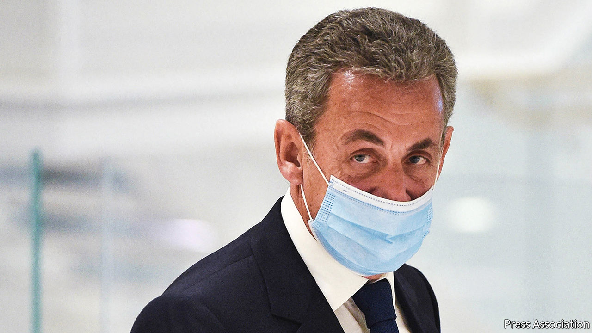

###### An end to impunity

# Nicolas Sarkozy’s jail sentence shocks France’s political class 

##### The former French president is convicted of corruption, but appeals 

 

> Mar 1st 2021 


FOR MUCH of France’s Fifth Republic, the modern state established by Charles de Gaulle in 1958, criminal cases against elected politicians have often failed either to reach court or to end in a conviction, let alone a prison sentence. On March 1st a Paris court took a step closer to ending an era of impunity. It found Nicolas Sarkozy, a centre-right president from 2007 to 2012, guilty of corruption and influence-peddling. He was sentenced to three years in prison, two of them suspended.


The decision has sent a shockwave through the French political class. This is the first time an ex-president has been handed an irreducible prison sentence. In 2011 Jacques Chirac, another centre-right former president, was handed a two-year suspended sentence for the misuse of public funds, dating to his time as mayor of Paris in the 1990s. Mr Sarkozy has denied all the allegations, and has appealed.


The case against him dates back to 2013. Investigators tapped his mobile phone while looking into allegations that Muammar Qaddafi, the former Libyan leader, had helped finance the French candidate’s campaign in 2007. They stumbled upon conversations between Mr Sarkozy and Thierry Herzog, then his lawyer. These exchanges, which the pair thought were protected by lawyer-client privilege, concerned separate illegal party-financing allegations then circulating. The case against Mr Sarkozy in that affair had been dropped. But, prosecutors said, he wanted information linked to other inquiries.


During these conversations, ruled the court this week, a “corruption pact” emerged. In return for information, Mr Sarkozy offered to help secure for Gilbert Azibert, an appeals-court magistrate, a plum job in Monaco. (Mr Azibert never got the job.) The court also gave Mr Herzog and Mr Azibert prison sentences of three years each, two of them suspended. Both deny the accusations. Mr Sarkozy, the judge said, who was “the guarantor of the independence of the judiciary, used his status as former president to reward a magistrate for having served his personal interest.”


Mr Sarkozy is unlikely to end up behind bars. The court said he could wear an electronic tag instead. He has in any case appealed, a process that could take many months, if not years. Christian Jacob, head of his Republicans party, called the sentencing “absolutely disproportionate”. Mr Sarkozy called it a “profound injustice”, and stressed that no money changed hands: even the judge said the ruling was based on a “faisceau d’indices” (a body of indications), not proof. Friends say that magistrates were out to bring the ex-president down. On March 17th Mr Sarkozy is due in court to face separate charges of exceeding campaign-finance caps. He denies these accusations too.


In recent years, courts have convicted a string of French politicians. This has begun to erode the sense that they are untouchable. Last year a court sentenced François Fillon, Mr Sarkozy’s former prime minister and a presidential candidate, to five years in prison, three of them suspended, for embezzlement. He is awaiting his appeal. Others include Jérôme Cahuzac, a Socialist ex-budget minister, Claude Guéant, Mr Sarkozy’s former chief of staff, and Patrick Balkany, an ex-deputy from Mr Sarkozy’s party and former mayor of Levallois-Perret, a Paris suburb.


In one of those twists at which the French excel, the once-hyperkinetic Mr Sarkozy has become more popular since he left office than when he was president. Despite the judicial tangles, time and defeat at the ballot box in 2012 appear to have softened opinion towards Mr Sarkozy. A recent poll, taken before the verdict, found him to be France’s sixth-most-popular politician. He continues informally to oversee matters relating to the Republicans, ahead of the presidential election in 2022. Some of those close to him suggest that, before this week, he had not given up hopes of running again.


This verdict surely puts paid to those ambitions and could open up the centre-right field, perhaps even to Michel Barnier, a former French foreign minister who ran the EU’s Brexit negotiations. It may serve a broader purpose too. The second conviction of an ex-president stands as a powerful sign that French politicians are held to the same standards as ordinary citizens—even those at the very top. ■

