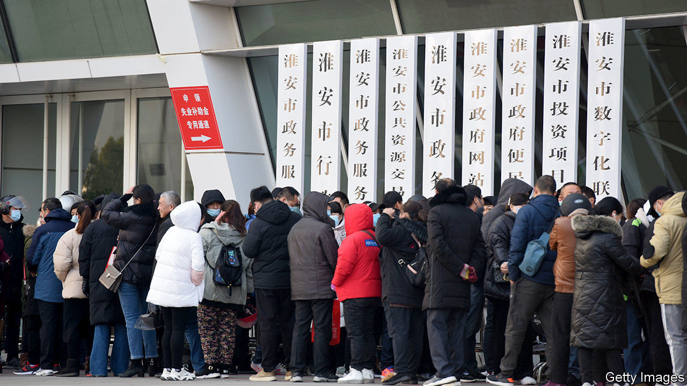

###### Taper test

# With growth on track, China starts to unwind stimulus 

##### Its exit will offer a partial preview for others 

 

> Mar 6th 2021 


THE PHRASE “first in, first out” has become shorthand for China’s experience of the covid-19 pandemic: it is both where the virus started spreading and the first large country to control it. Its early failure and subsequent success will be studied by epidemiologists for years to come. But for economists and investors, it is another “first in, first out” that matters more at the moment. China was the first country to open its lending and spending taps in the face of the coronavirus downturn. Now, it is the first to start to close them, giving others a partial preview of what the end of stimulus will look like.


Parallels between countries are, of course, imperfect. China required less stimulus because its workers went back to factories and offices nearly a full year ago. But a few general conclusions can still be drawn about its return to more normal monetary and fiscal policies.


The most notable is its gradualism. On March 5th, after The Economist went to press, the government was set to announce its budget for 2021. It was widely expected to target a smaller fiscal deficit this year, probably about 3% of GDP, down from last year’s 3.6%. Factoring in other quasi-fiscal measures such as spending by government-linked companies, China’s true fiscal deficit will be about 12% of GDP, compared with a record high of 15% last year, according to Morgan Stanley, a bank. That is a retrenchment, but still higher than its deficit in 2019, of roughly 10% of GDP.


The central bank has also been cautious. It has withdrawn liquidity to guide up market interest rates and to slow the growth in bank lending. But both the price and quantity of credit remain more generous than before the pandemic struck. “They are aiming to avoid a sharp turn in the policy orientation,” says Zhu Ning of the Shanghai Advanced Institute of Finance. With 2021 marking the start of a new five-year plan for China, officials will be racing to launch infrastructure projects. The new plan—an important part of the policy process in China—promises big expansions of railways, power lines and more. That, Mr Zhu says, should help offset the end of the coronavirus stimulus.


The tightening, however gradual, is bound to be bumpy. In the past couple of weeks global markets have been roiled by the rise in Treasury yields in America. China went through a similar squeeze in late January when the central bank was far stingier in its open-market operations than expected, leading to a spike in overnight borrowing rates. Stocks fell sharply, though recovered when the central bank eased up. Officials may have wanted to put investors on notice. They have also sounded warnings about asset prices. On March 2nd Guo Shuqing, the top banking regulator, warned of bubbles in the Chinese property market and global financial markets.


As well as China has done in taming covid-19, its policy normalisation still depends on the course of the pandemic globally. Domestic travel remains limited amid lingering concerns about the virus and international travel is largely blocked. A slow roll-out of vaccines in China means there is no chance that it will fling open its doors to the world soon.


Nevertheless, given how rough last year was, China’s rebound is likely to be big—something else that other countries will also enjoy. Many analysts think growth could be 9% in 2021, up from last year’s 2.3%. That puts the government in a slightly awkward position. At the same time as announcing its budget, it typically sets a GDP target. Were the government to aim for 9% growth—realistic but higher than any previous annual target—markets might conclude that it is not so serious about ending stimulus. Were it to shoot for lower growth, markets might fret that the unwinding would be harsher than expected. As far as dilemmas go, it is a happy one. ■

