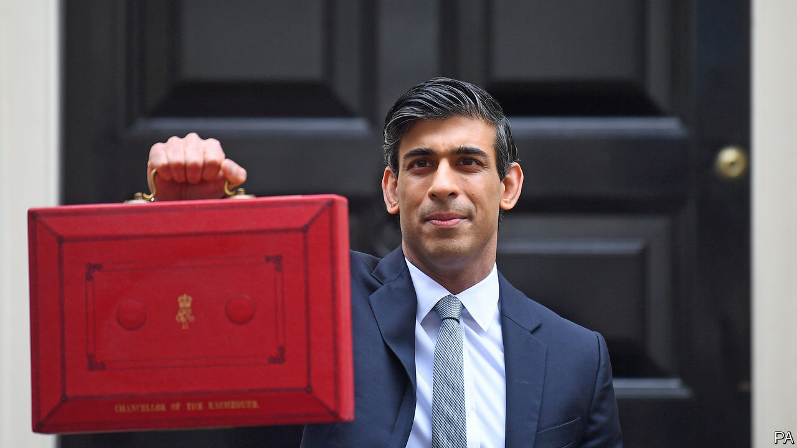
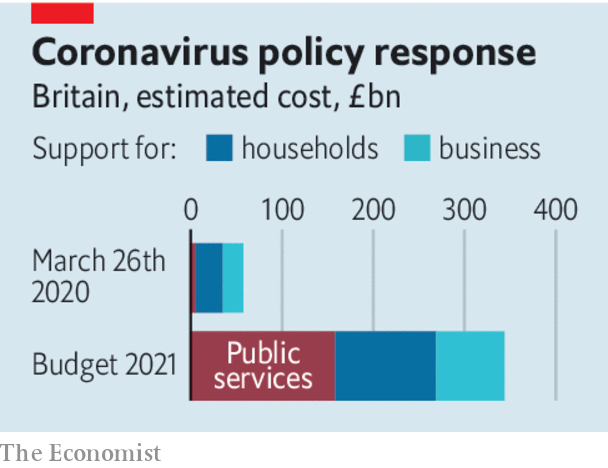

###### St Augustine’s economics

# Britain’s expansionary budget 

##### Rishi Sunak wants fiscal rectitude, but not yet 

 

> Mar 3rd 2021 


BRITAIN HAD a particularly bad bout of covid-19 and took an especially large economic hit as a result. In response the government provided more fiscal stimulus than almost any other in the world, paying millions of people’s wages and bailing out businesses to the tune of 16% of GDP. As Britain slowly lifts its lockdown the conversation has turned to balancing the books, and ahead of the budget on March 3rd the Treasury briefed that fiscal austerity was in store. Yet Rishi Sunak, the chancellor of the exchequer, will wait to turn the screws. He delivered a surprisingly generous budget, and has postponed tax rises. Like a fiscal St Augustine, he wants continence—but not yet.


The budget represents the synthesis of two opposing forces. On the one hand Mr Sunak wants to placate a range of hawkish constituencies, such as Thatcherite backbench Tory MPs who would rather the government keep taxes low and bond traders who in recent weeks have sold their investments in sovereign debt. On the other hand he is rightly concerned not to repeat the mistake of his predecessor-but-two: after the financial crisis in 2007-09 George Osborne cut spending and raised taxes too soon, thereby delaying the recovery.


Policies in this budget are designed to help Britain out of its deep economic hole (see ). The extension of the furlough scheme from April to September will put money in people’s pockets, helping power a recovery in household spending. A highly unusual proposal to allow firms to write off 130% of investment expenses against their tax bills is designed to supercharge Britain’s perennially low rate of business investment.

 


At the same time, the budget has blind spots. Extending the furlough is better than nothing, but it would have been wiser to focus resources on boosting working-age welfare, currently at its least generous level ever. This would have helped workers move from dying sectors to up-and-coming ones without seeing a sharp drop in their take-home income. And a government that likes to trumpet its green credentials should not be buying off voters by freezing taxes on fuel.


A bigger difficulty is that there is no credible strategy for righting the fiscal ship. True, Mr Sunak promised to raise corporation tax in 2023 from 19% to 25%. Politically that is astute. It puts the opposition Labour Party into a tricky position, forcing it to decide whether it wants to support the rise (and thus implicitly back austerity) or oppose it (and thus appear to be taking the side of Britain’s corporate fat cats).


In economic terms, however, Mr Sunak is being evasive. The yield from even large rises in corporation tax is low. Moreover, will he actually impose such a tax rise just when the 130% investment write-off ends and when an election is likely to be just around the corner? It is more probable that the chancellor hopes the coming investment boom is so large that he can cancel most of the tax increase and that he will be able to pass a smaller rise as, in effect, a “cut”.


At some point, however, politics will catch up with him. That is in part because of Britain’s rapidly ageing population, and in part because the government has bizarrely made no provision whatsoever for virus-related costs beyond next year. Britain is on an inexorable trend towards higher budget deficits. It is hard to find much waste in the public sector, which limits the scope to cut spending. The chancellor will have to fall back on higher taxes. He will have to consider slaying sacred Tory cows, including a pledge not to increase income tax. He should consider reform of property and value-added taxes. Hawkish rhetoric is all very well, but eventually Mr Sunak will have to follow St Augustine onto the path of fiscal virtue. ■


Dig deeper


All our stories relating to the pandemic and the vaccines can be found on our . You can also listen to , our new podcast on the race between injections and infections, and find trackers showing ,  and the virus’s spread across  and .

