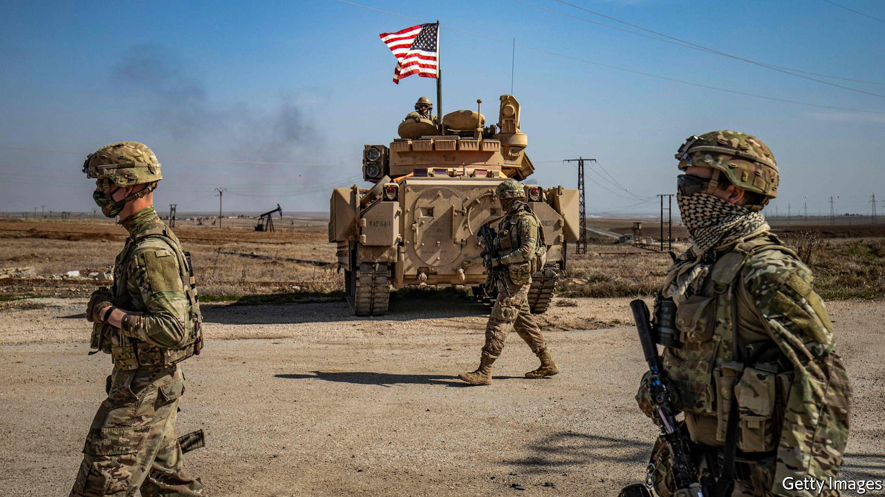

###### Into the hornet’s nest

# What should Joe Biden do in the Middle East? 

##### America must stop oscillating between war and retreat 

 

> Mar 6th 2021 


JOE BIDEN has made no secret of his frustration with Saudi Arabia. A “pariah” with “very little social redeeming value”, he called its government in 2019. One of his first acts as president was to end American support for the Saudi-led war in Yemen. Last week he released an intelligence report that blamed the kingdom’s crown prince, Muhammad bin Salman, for the murder of a journalist in 2018. But at that point Mr Biden’s ideals collided with America’s national interest. The prince may be a brute, but he is also in charge of an important American ally. In the end Mr Biden decided that the cost of punishing him would have been too high.


This is all part of a larger cost-benefit analysis taking place in the White House. Mr Biden has signalled that he wants to make the Middle East less of a priority. He has good reason to pull back. America has thousands of soldiers spread across Arab countries, yet its interventions have produced dismal results. Many Americans argue that their country should instead focus on countering China’s growing global influence. The question facing the Biden administration is how to lighten America’s burden in the Middle East while still protecting its vital interests there. That will not be easy.


It helps that those interests are not what they were. For decades America focused on the flow of Gulf oil and the survival of Israel. Last year America was a net exporter of both oil and natural gas. And Israel, the best-armed country in the region, now has formal ties with many of its Arab neighbours.


Yet vital interests remain. Terrorist groups that find havens in Iraq, Syria or Yemen may end up striking the West. If the government in Iran seeks a bomb it risks setting off an arms race that would blow apart the global non-proliferation regime and permanently put the Middle East on a nuclear knife-edge.


In the past America has sought to impose magical solutions. George W. Bush attempted to decree a democracy in Iraq. Donald Trump wielded sanctions to force capitulation or a change in regime in Iran. As these approaches failed, American policy swung between interest and apathy, and war and retreat.


Mr Biden should instead try to bring stability by getting the region to take responsibility for itself and discouraging leaders from being so dependent on armed force. America’s big arms sales to the region’s despots are a source of trouble. And they do little to help the region’s people, who suffer from poor government and abusive regimes, which in turn foster extremism. RAND, a think-tank, recently noted that America spends roughly as much on Egypt’s armed forces as it does on aid to the entire region. Mr Biden should cancel the blank cheque for mischief-making and repression.


The second leg to this strategy is to enhance the Middle East’s capacity for diplomacy. The deals known as the Abraham Accords, which the Trump administration helped broker between Israel and several Arab states, are a tentative start towards upgrading the region’s diplomatic machinery. Mr Biden should encourage more such talking. Saudi Arabia and the United Arab Emirates were shocked when Mr Trump failed to come to their defence after attacks by Iran and its proxies. Iran is suffering under American sanctions. Their anxiety gives Mr Biden leverage in asserting that lowering tensions is in everyone’s interest.


Encouraging diplomacy does not mean withdrawing all American troops. They have helped suppress Islamic State and al-Qaeda, which are still active. And soft power tends to be more effective when hard power lurks in the background. For example, the air strike on an Iranian-backed militia in Syria last month was retaliation for an attack on Americans in Iraq—and a signal to the government in Tehran that Mr Biden would not roll over in negotiations to revive the Iran nuclear deal. Talking is not easy but, if America wants to focus less on a troubled part of the world, it is the only way ahead. ■

